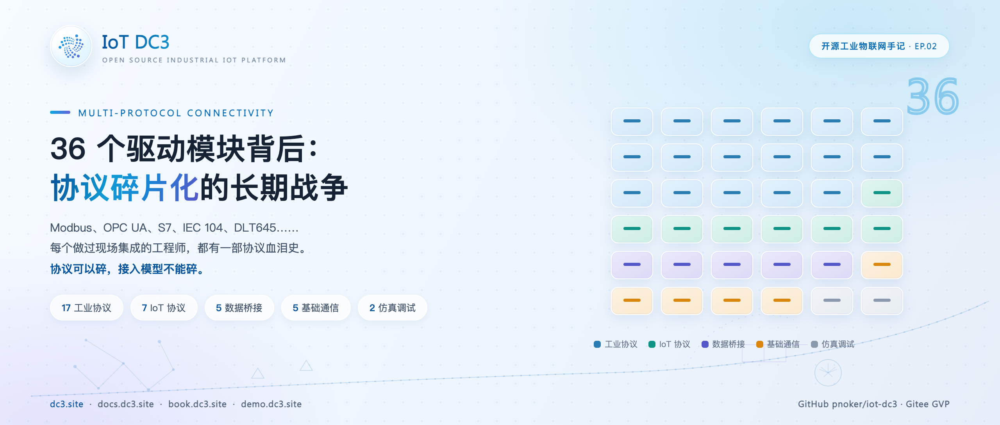
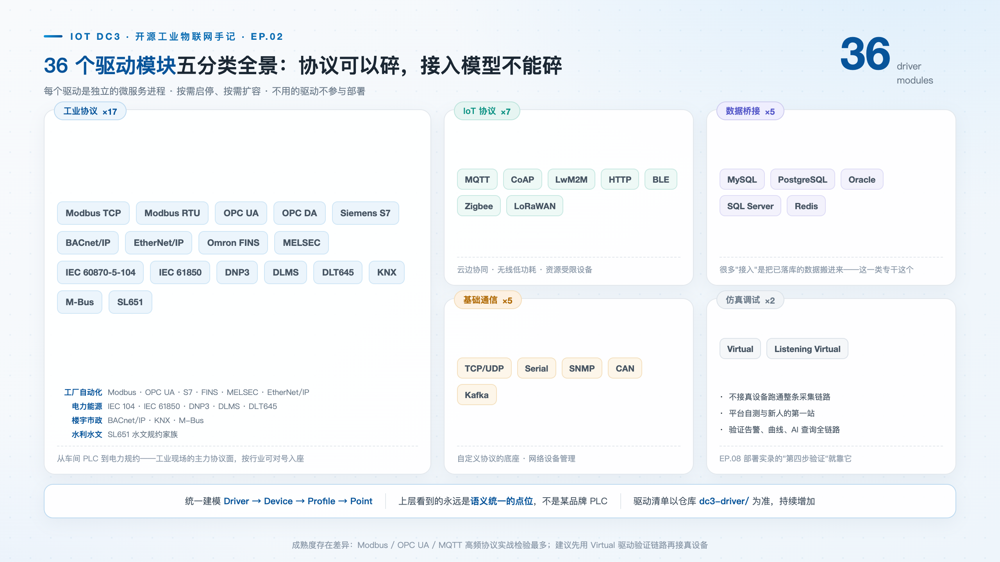
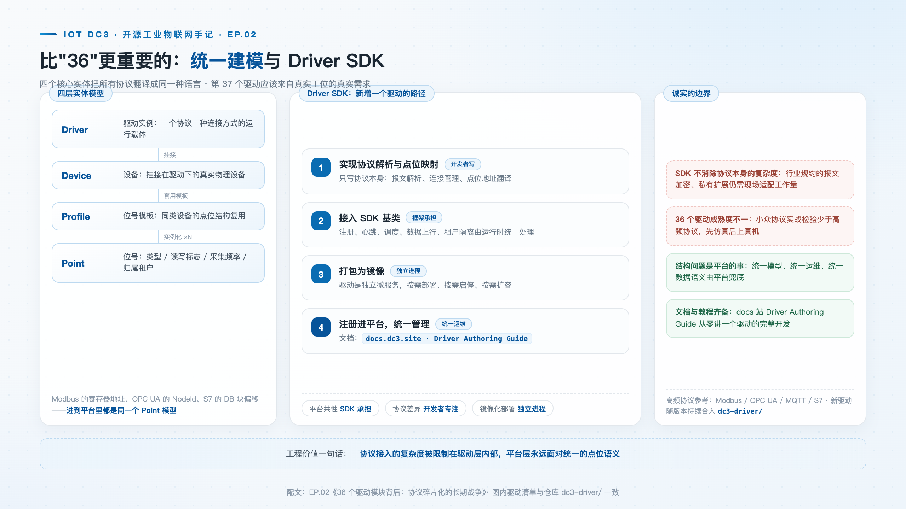

# 36 个驱动模块背后：协议碎片化的长期战争

> **摘要**：Modbus、OPC UA、S7、IEC 104、DLT645……协议碎片化是工业现场集成的长期难题。DC3 以 36 个驱动模块和统一的 Driver SDK 应对这一问题：协议实现可以各不相同，接入模型必须统一。本文拆解五类驱动各自解决的接入问题、Driver SDK 的开发契约，以及"第 37 个驱动"的工作量边界。

**热点挂钩**：设备接入碎片化长期痛点 · 新型工业化
**建议发布**：第 1 周五 20:00
**配图**：`images/cover.png`（封面）、`images/driver-landscape.png`（36 驱动五分类全景）、`images/driver-sdk.png`（统一建模与 Driver SDK）

---

在产线数据采集的工程实践中，最耗时的问题通常不是并发或存储，而是**协议适配**。

同一个车间里，温度传感器说着 Modbus RTU，PLC 是西门子 S7，电表跑着 DLT645，环保监测设备用 HJ 212（SL651 同源的水文规约家族），新采购的网关又是 MQTT。每接一类设备，就要重新学一套报文格式、一套连接管理、一套异常语义。这种碎片化在工业物联网领域已存在二十余年——各协议诞生于不同年代与行业，服务于不同的技术约束，难以彼此取代。设备生命周期以十年计，老仪表不会因为新协议出现而退役，碎片化因此不是待消灭的错误，而是必须长期共存的现实。

平台层的职责，是屏蔽协议差异对上层业务的影响。这句话说起来轻巧，落到工程上要回答三个问题：几十种协议怎么组织、接入之后怎么统一建模、新的协议怎么低成本地长出来。DC3 的答案是 36 个驱动模块，加一套 Driver SDK。

## 五类驱动，五种接入问题

DC3 仓库里的 `dc3-driver/` 目录下有 36 个驱动模块，按场景分五类。分类不是目录学游戏——每一类对应一种真实存在的接入问题。

**工业协议（17 个），解决存量现场怎么进。** Modbus TCP / Modbus RTU、OPC UA / OPC DA、Siemens S7、BACnet/IP、EtherNet/IP、Omron FINS、三菱 MELSEC、IEC 60870-5-104、IEC 61850、DNP3、DLMS、DLT645、KNX、M-Bus、SL651——从工厂自动化到电力楼宇，从抄表到水利。这一类的特点是设备先于平台存在：产线上的 PLC、变电站的远动装置、楼宇里的 KNX 总线，都不会为一次数字化改造而更换。平台要么讲它们的语言，要么放弃这批数据。

**IoT 协议（7 个），解决新部署的无线低功耗场景怎么进。** MQTT、CoAP、LwM2M、HTTP、BLE、Zigbee、LoRaWAN，面向电池供电、无线组网、云边协同的增量设备。与工业协议相反，这一类的难点不在兼容历史，而在语义对齐——同一批传感器，不同接入方式在会话保持、传输开销、报文组织上各有约定，平台要为它们保留一致的采集与下发语义。

**数据桥接（5 个），解决数据不在设备上怎么办。** MySQL、PostgreSQL、Oracle、SQL Server、Redis——很多"接入"其实是把别处已落库的数据搬进来：老系统的关系库、第三方平台的缓存，设备数据早已存在，缺的只是把它纳入统一点位模型的那一跳。

**基础通信（5 个），解决自定义协议与网络管理怎么进。** TCP/UDP、Serial、SNMP、CAN、Kafka——私有规约的传输底座与网络设备的纳管通道。现场永远存在说不上名字的私有协议，这一类不给协议语义，给的是把任意字节流接进平台的起点。

**仿真调试（2 个），解决没有设备怎么开发。** Virtual 与 Listening Virtual 不接真设备也能把整条链路跑通——Virtual 驱动按位号类型生成随机值，布尔位号给出随机真假值，数值位号在 0 到 100 之间取随机数，是平台自测与新人上手的脚手架。

需要说明：36 个驱动的成熟度存在差异，它们均为独立部署的微服务——每个驱动是单独的进程，按需启停、按需扩容，不需要的驱动不参与部署，不占运行资源。"独立进程"不只是资源问题，更是隔离问题：一个驱动里的连接泄漏或内存异常被限制在自己的进程内，不会顺着调用链拖垮其他协议的采集。

## 统一建模：协议差异的收敛

驱动多本身不是壁垒，真正的设计在模型层。DC3 用四个核心实体把所有协议"翻译"成同一种语言：

**Driver（驱动）→ Device（设备）→ Profile（位号模板）→ Point（位号）**

无论底层是 Modbus 的寄存器地址、OPC UA 的 NodeId 还是 S7 的 DB 块偏移，进到平台里都是同一个 Point 模型：有数据类型、有读写标志、有采集频率、有归属租户。协议差异被封装在两层"配置属性"里：驱动级属性描述怎么连接（Modbus TCP 的 host 与 port），位号级属性描述读哪里（从站号 slaveId、功能码 functionCode、偏移量 offset）。上层数据中心、告警引擎、AI 工具面看到的从来不是"某品牌 PLC"，而是一组语义统一的点位。

这就是"协议可以碎，接入模型不能碎"的含义，也是 36 个驱动还能被有效维护的原因——如果每个驱动各带一套上层语义，36 个模块就是 36 个维护分叉。

## Driver SDK：新增驱动的开发契约

协议世界永远比驱动仓库长得快，所以 DC3 提供了 Driver SDK 与配套的开发指南（[docs.dc3.site](https://docs.dc3.site) 的 Driver Authoring 一章）。SDK 的契约可以用一句话概括：**驱动只拥有协议 I/O 与面向用户的属性元数据，其余平台共性——注册、调度、元数据刷新、健康上报、命令处理、数据分发——全部由 SDK 与运行时承担。**

落到接口上，SDK 定义了一组能力接口：生命周期（启停钩子）、元数据事件监听（设备与位号的增删改通知）、健康检查、读写协议、命令与配置校验。功能完整的驱动实现聚合接口即可；只需要部分能力的驱动，可以只挑小接口实现。

Modbus TCP 驱动是一个现成的标尺：整个模块的 Java 源文件只有两个——一个 Spring Boot 启动类，一个协议服务实现类。后者做的事全部属于协议本身：维护设备连接缓存，校验 host/port 与 slaveId/functionCode/offset 配置，按功能码 1–4 读线圈与寄存器、按功能码 1/3 写线圈与保持寄存器，外加一个务实的细节——同一设备连续 3 次连接失败后进入 60 秒退避，避免一台不可达设备拖垮整个调度周期。

由此，新增一个驱动的工作量边界相当清楚：实现协议解析与点位映射，在模块配置文件里声明驱动编码与属性元数据（属性编码、类型、默认值），打包成镜像、起服务，注册进平台就能被统一管理——不必碰调度器、不必碰消息发送、不必碰租户逻辑。

对社区贡献者而言，新驱动应来自真实工位的真实需求——这也是接入层保持开放结构的原因。

## 适用范围与限制

- **成熟度有差异。** 仓库的驱动 README 明确列出一批标注"进行中"的驱动（CAN、DLMS、EtherNet/IP、IEC 104、LwM2M、MQTT、OPC DA、Zigbee），其协议 I/O 尚不完整，生产使用前需核对实现；Modbus、OPC UA 这类高频协议经过的实战检验远多于小众协议。选型时建议先用 Virtual 驱动验证链路，再接真实设备；
- **SDK 不消除协议本身的复杂度。** SL651、DLT645 这类行业规约通常还伴随报文加密、私有扩展等现场适配工作量，SDK 解决的是工程结构问题，协议内部的坑仍要开发者自己踩；
- **清单以仓库为准。** 驱动清单以仓库 `dc3-driver/` 目录为准，新驱动在持续增加。

## 结语

36 这个数字会过时，五分类也可能长出第六类，但"协议可以碎，接入模型不能碎"这条约束不会变。对接入层而言，真正耐用的资产从来不是驱动清单本身，而是让一个新驱动只需一个启动类、一个协议实现类和一份属性元数据就能长出来的那套契约。相关仓库与文档入口见文末。

> **仓库**：GitHub [pnoker/iot-dc3](https://github.com/pnoker/iot-dc3) · Gitee [pnoker/iot-dc3](https://gitee.com/pnoker/iot-dc3)（GVP）
> **文档**：[docs.dc3.site](https://docs.dc3.site)（Driver Authoring Guide）· [book.dc3.site](https://book.dc3.site) · [demo.dc3.site](https://demo.dc3.site)
