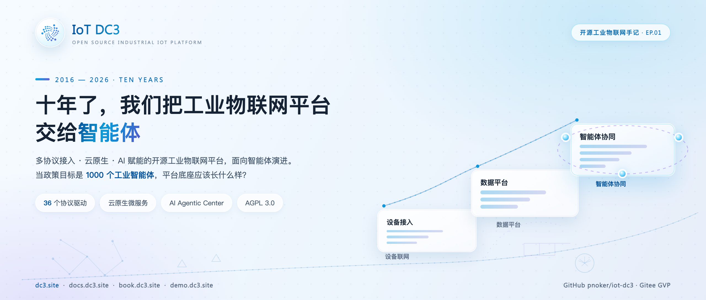
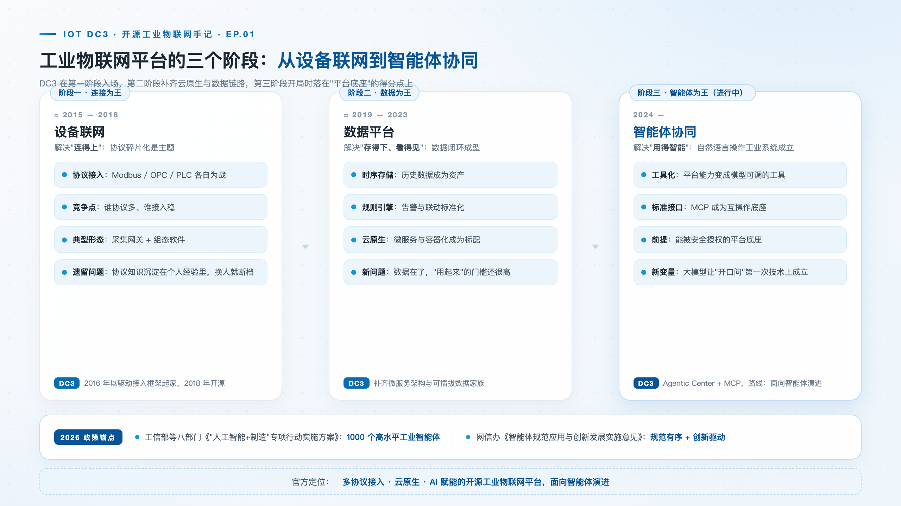
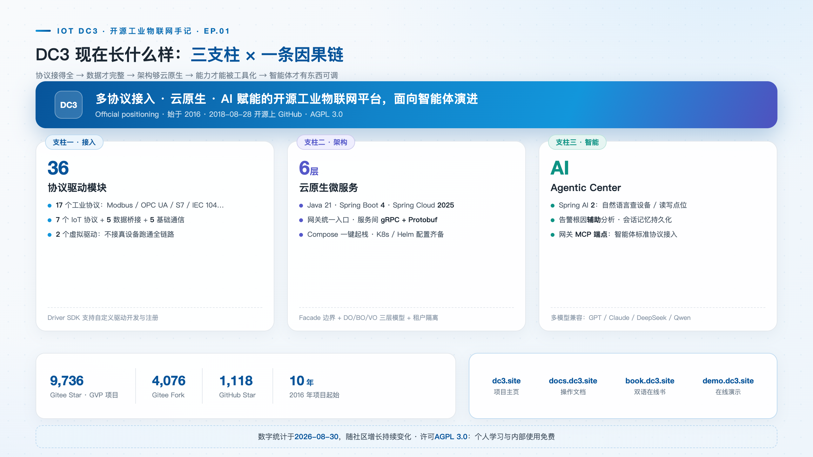

# 十年了，我们把工业物联网平台交给了智能体

> **摘要**：2026 年 1 月，工信部等八部门印发《"人工智能+制造"专项行动实施方案》，提出推动 1000 个高水平工业智能体落地。始于 2016 年的 IoT DC3 至今已演进十年。本文回顾工业物联网平台三个阶段的行业脉络，拆解"智能体接口"为何必须是安全授权与工具化调用兼备的平台底座，并交代 DC3 的现状与能力边界。

**热点挂钩**：八部门"人工智能+制造"专项行动（2026-01）· 项目开源十年（2016—2026）· 系列开篇
**建议发布**：系列首发，周二 20:00
**配图**：`images/cover.png`（封面）、`images/evolution.png`（平台演进三阶段）、`images/positioning.png`（项目定位卡）

---

IoT DC3 始于 2016 年，GitHub 仓库创建于 2018 年 8 月 28 日，至今已演进十年。判断一个开源项目是否仍有生命力，有一个朴素的办法：看它最近的提交在解决什么问题。DC3 近期合并的提交正与主线相关——一批针对 OAuth 令牌校验的测试补丁，其目标是让智能体能够安全地调用工业平台。单看只是例行的质量加固，放进十年的跨度里却别有意味：令牌校验是外部调用者进入平台的第一道关卡，而今天最重要的外部调用者，已经不是人，而是智能体。

把时间倒回 2026 年 1 月，工信部等八部门印发《"人工智能+制造"专项行动实施方案》，里面有一个值得所有工业软件从业者记住的量化目标：推动 3–5 个通用大模型在制造业深度应用、推出 **1000 个高水平工业智能体**。随后 5 月，国家网信办发布《智能体规范应用与创新发展实施意见》，给智能体的落地应用立了治理框架；北京的"人工智能赋能工业互联网"行动计划，则把"多智能体协同编排"写进了攻关方向。

三份文件从产业目标、治理规范到技术攻关各管一段，但指向同一个判断。政策的用词很克制，方向却已经说得很直白：**工业互联网平台的下一轮竞争，不在"能不能连上设备"，而在"智能体能不能用起来"。**

## 平台三阶段：每一阶段的矛盾与淘汰逻辑

回看工业物联网平台这十年，大致走了三步，每一步都有自己的核心矛盾，也都有自己的淘汰逻辑。

**第一阶段，解决"连得上"。** Modbus、OPC UA、PLC 及各类串口总线并存，协议碎片化是这个阶段的核心问题，协议覆盖度与接入稳定性构成平台的主要竞争力。设备先于平台存在，产线上的 PLC 与各类仪表不会为了一次数字化改造而更换，平台要么讲它们的语言，要么放弃这批数据。这一阶段最终淘汰的，是"单一协议网关 + 私有上位机"的作坊式方案——当多协议接入逐渐成为通用能力，靠人力堆协议栈的团队失去了溢价。

**第二阶段，解决"存得下、看得见"。** 时序数据库、规则引擎、可视化大屏成为标配，数据从设备侧流向平台侧，形成闭环。竞争焦点从"接入了多少种设备"转向"数据进来之后能做什么"。淘汰逻辑同样清晰：当存储与可视化被基础设施厂商做成标准件，只在"存和看"上做文章的平台，差异化空间被迅速压缩。

**第三阶段，正在发生：解决"用得智能"。** 大模型第一次让"用自然语言操作工业系统"在技术上成立，前两个阶段沉淀的数据与控制能力，第一次有了被自然语言直接触达的可能。但大模型不会自己连工厂——它既不知道一台设备归属哪个租户，也不应该未经授权就改写现场的寄存器。它需要一个能被安全授权、能被工具化调用的平台底座——这就是"智能体接口"的含义。

值得注意的是，三个阶段是叠加而非取代：连得上是存得下的前提，存得下是用得智能的前提。跳过前两阶段直接做"智能体平台"的尝试，最终都会卡在同一个地方——智能体没有可信的数据可读，没有可控的链路可写。

## 智能体接口：安全授权与工具化调用，缺一不可

"智能体接口"这个词容易被简化成一个对外 API，但拆开看，它实际包含两件缺一不可的事。

第一件是**安全授权**。智能体是程序化调用者，它持有的是令牌而不是登录会话，授权体系必须围绕令牌重建。以 DC3 的网关为例：MCP 端点挂在网关上，智能体客户端先通过 OAuth 端点完成注册与令牌获取；此后每一次工具调用，平台都要先校验令牌，解析出这是哪个租户下的哪个主体、这条连接被授权使用哪些工具，高风险操作还要经过确认与幂等检查，调用本身落一条审计记录。这四步——校验、解析、授权、审计——任何一步缺失，"让智能体操作工厂"就从效率工具变成安全事故。近期合并的那批 OAuth 令牌校验测试补丁，守的正是第一道关卡。

第二件是**工具化调用**。授权解决"能不能动"，工具解决"怎么动"。大模型不能直接执行 SQL 或协议报文，它面对的应当是一组语义清晰、边界分明的工具。DC3 的 AI Agentic Center 内置了一组覆盖平台资源的工具面——驱动、设备、位号、位号值、模板、命令、事件各自成工具——模型在对话中决定调用哪个工具、传什么参数，平台在访问控制之下执行。智能体因此操作的不是裸接口，而是与人在管理界面里同一套受控语义。

这两件事共同解释了为什么智能体接口必须长在平台底座上，而不是长在某个应用里：授权依赖平台的租户与权限模型，工具依赖平台的统一数据模型。脱离底座单独做一个"AI 网关"，两条腿都是断的。

## 十年历程：一条连贯的路线

DC3 于 2016 年以驱动接入框架起步，解决的是"连得上"；2018 年 8 月 28 日仓库在 GitHub 创建并开源，项目进入公开演进的轨道；随后几年逐步补齐云原生架构与时序数据链路，覆盖"存得下、看得见"；进入第三阶段，智能体中心作为独立的服务模块出现在仓库中，官方定位语中的"面向智能体演进"明确了未来数年的技术路线。三个阶段不是推倒重来，而是同一套设备与数据底座上的能力叠加——这也是十年演进能够持续摊薄成本的原因。

## DC3 的当前能力

多协议接入是第一根支柱。36 个驱动模块覆盖五类接入场景：工业协议（Modbus、OPC UA、Siemens S7、IEC 104 等 17 个）、IoT 协议（MQTT、CoAP、LoRaWAN 等 7 个）、数据桥接（直连关系库 5 个）、基础通信（5 个）与仿真调试（2 个）。协议覆盖度决定了数据完整性——接不进来的设备，后面的存储、告警与智能体都无从谈起。

云原生是第二根支柱。Java 21 + Spring Boot 4 + Spring Cloud 2025 的微服务架构，网关统一入口，服务间 gRPC 通信，Compose 一键起栈，也给了 Swarm / Kubernetes / Helm 的部署配置。架构的云原生程度决定了能力能否被工具化——单体黑盒很难把内部能力安全地拆给外部调用者，而清晰的服务边界天然就是工具的边界。

AI 赋能是第三根支柱。内置 AI Agentic Center（基于 Spring AI 2），支持用自然语言查询设备、读写点位、辅助命令下发与告警根因分析；网关提供 MCP 端点，智能体客户端可以按标准协议调用平台能力。

开源是底色：AGPL 3.0，Gitee GVP 项目，9,700+ star。

这四项能力构成一条因果链：**协议接得全，数据才完整；架构够云原生，能力才能被工具化；能力被工具化了，智能体才有东西可调。**

## 适用范围与限制

选型之前，三条边界值得先摆在桌面上。

其一，DC3 不是设备管理 SaaS，不开箱提供行业套件。它提供的是平台底座——接入、建模、存储、告警、AI 调用面，行业逻辑需要你在上面搭。这条边界划在"平台"与"应用"之间；什么都想做的通用平台，往往两头都做不深。

其二，AI 的角色目前是**辅助**。告警根因由 AI 辅助分析、命令由 AI 辅助构造，但都在访问控制之下，处置动作依然走平台的命令链路与人确认。工业现场对误操作的容忍度极低，AI 从辅助走向自主，需要的不只是模型能力，还有可验证的授权与审计体系——前者正在快速成熟，后者正是平台层的职责所在。

其三，AGPL 3.0 意味着个人学习与内部使用免费，但闭源商用需要商业授权——我们希望清楚地说在前面。

## 结语

十年前，这个项目要回答的问题是"怎么把一台 PLC 的数据读上来"；今天，它要回答的是"怎么让一个智能体安全地读懂并操作一整个工厂"。问题变了，答案的底层却是同一套东西：完整的设备接入、干净的数据模型、可验证的授权边界。政策窗口把工业智能体推到了台前，但真正决定成败的，是这些不在聚光灯下的底座工程。DC3 的第十一年，从把第一道关卡守到位开始。相关仓库与文档入口见文末，欢迎关注与参与。

> **仓库**：GitHub [pnoker/iot-dc3](https://github.com/pnoker/iot-dc3) · Gitee [pnoker/iot-dc3](https://gitee.com/pnoker/iot-dc3)（GVP）
> **文档**：[docs.dc3.site](https://docs.dc3.site) · 在线书 [book.dc3.site](https://book.dc3.site) · 演示 [demo.dc3.site](https://demo.dc3.site)
