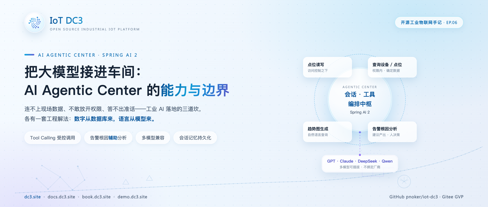
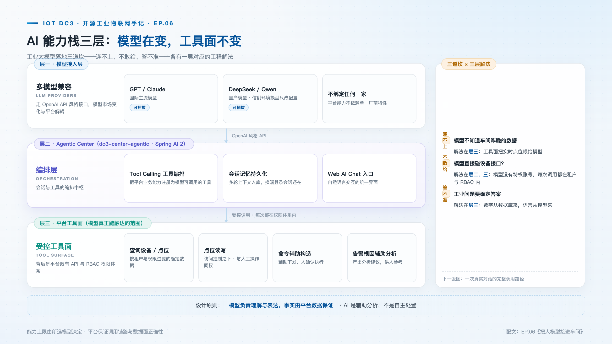
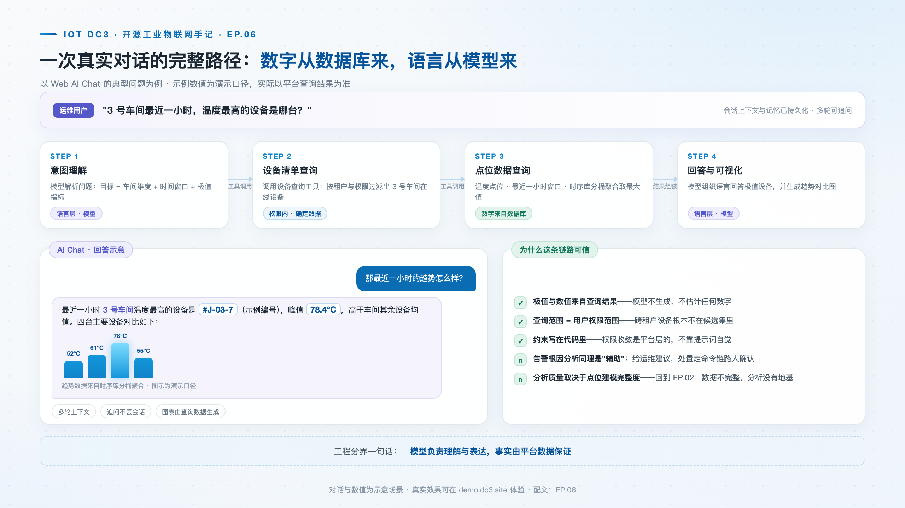

# 把大模型接进车间：DC3 AI Agentic Center 的能力与边界

> **摘要**："AI 进工业"喊了一年多，落地卡在三件事上：连不上现场数据、不敢放开权限、答不出准话。这篇拆 DC3 Agentic Center 的设计：基于 Spring AI 2 的多模型接入、Tool Calling 的受控调用面如何一步步工作、写操作为什么必须人工确认、会话记忆持久化解决了什么，以及哪些事刻意没让 AI 做。

**热点挂钩**：大模型工业化落地 · Spring AI 生态
**建议发布**：第 3 周五 20:00
**配图**：`images/cover.png`（封面）、`images/ai-stack.png`（AI 能力栈三层）、`images/ai-chat-scene.png`（一次真实对话的调用路径）

---

大模型在工业场景的落地障碍，可以具体化为三个失败模式。**连不上**：模型对现场一无所知，让它分析设备状态，它只能基于训练语料泛泛而谈；**不敢给**：即便接上了接口，把设备控制权交给一个概率模型的输出，没有哪个运维团队敢签字；**答不准**：工业问答要的是"3 号窑炉当前温度"这样的确定数值，而模型的本质是生成，不是检索。

这三个障碍指向同一个结论：工业 AI 的关键不在模型能力，而在**工程边界**——数据怎么进来、权限怎么约束、确定性怎么保证。DC3 的 AI Agentic Center（`dc3-center-agentic`，基于 Spring AI 2）就是围绕这三条边界设计的：领域逻辑在 `dc3-common-agentic`，服务壳只做装配；对上游以 OpenAI 兼容接口与 Anthropic 接口两类协议接入模型，对下游把平台业务能力注册成模型可调用的工具。

## 能力栈：模型可换，工具面不变

整个能力栈分三层，各层的变化速率完全不同。

**模型接入层。** 提供方分两类：OpenAI 兼容协议与 Anthropic 原生协议。GPT、Claude 走各自协议直连，DeepSeek、Qwen 等以 OpenAI 兼容接口接入。模型与提供方的配置本身是平台数据库里的管理数据（`ChatClientFactory` 按租户解析配置并缓存客户端实例），替换模型是配置变更而非代码变更；配置按租户隔离，每个租户可以选自己的模型与默认项，未配置时回退到环境变量定义的默认模型。值得说明的是一个诚实降级：请求准备阶段会检查所选模型是否声明支持工具调用，不支持时这一轮对话退化为纯对话，而不是把工具调用发给一个接不住的模型。

**编排层。** Agentic Center 负责会话管理、上下文组装、记忆加载与工具注册。模型只看到一份组装好的提示与一份工具清单，不感知平台内部结构。

**工具面。** 模型真正能触达的范围是十个工具类：设备、驱动、点位、位值、模板、命令、事件、用户、租户、系统。以设备工具为例，模型可以按 ID 精确查、按名称或编码模糊搜索、按驱动或模板列出设备，每页数量被钳制在上限之内——分页保护写在工具签名里，不依赖模型自觉。位值工具提供取最新值与取窗口历史两个读法。关键在于这些工具**不是为 AI 单独造的第二套 API**——每个工具方法背后是平台既有的门面接口（`DeviceFacade`、`PointValueFacade` 等跨服务调用），与运维人员在管理台操作走同一套权限与租户体系。模型没有特权账号。

在工具面之下，数据中心还提供了一组面向分析的只读端点：查最新、查历史、统计画像、时段对比、活跃排名、趋势分析、阈值报告、序列相关、数据质量九个。这组端点带有专门的 AI 元数据标注，会进入平台的智能体工具目录（下一篇展开）；它们的约束方式值得注意——租户从鉴权主体注入，请求体里没有租户字段可伪造；单次调用最多 20 条序列、每序列最多 5000 个样本、窗口最长 90 天，超限直接结构化拒绝并附收窄建议，发生截断时在返回里如实标注。

## 一次对话的走查：从自然语言到确定数值

以 Web 端 AI Chat 里一个典型问题为例："3 号车间最后一小时温度最高的设备是哪台？"拆开看每一步平台做了什么。

**第一步，准备上下文。** 请求进入后，平台先从鉴权主体提取租户 ID 与用户 ID，连同会话 ID 一起注入工具上下文。这个注入发生在平台侧，不由模型决定，也不由客户端声明。

**第二步，模型选择工具。** 模型理解意图后发起工具调用——先查车间内的设备清单，再查温度点位的近期数据。工具调用经过追踪回调记录轨迹，前端可以看到模型用了哪些工具、传了什么参数。

**第三步，权限与租户约束。** 每个工具方法的第一行都强制提取租户上下文：上下文缺失直接抛出未授权异常，查询范围自动收窄到当前租户。模型不存在绕过这条检查的路径——它调用的是与人类操作同源的门面接口。

**第四步，取数。** 设备查询经设备门面按租户过滤分页返回；位值查询走平台的数据读取路径。模型拿到的是**数据库里的确定数值**，不是生成出来的估计。工具的返回是结构化的五种状态之一（成功、空结果、未找到、参数无效、错误）——工具失败不会被伪装成成功，模型必须面对"查不到"再决定怎么回答。

**第五步，组织回答。** 模型把确定数值组织成自然语言；历史类查询还会附带可视化规格（折线图与统计卡片，含均值标注）——图表数据同样来自数据库。

这是对"答不准"的工程解法：**数值来自数据库，语言来自模型。** 模型负责理解意图与组织表达，事实由平台数据保证。告警场景同理：AI 辅助根因分析把相关设备的点位数据与命令历史通过同一套受租户约束的工具提供给模型，产出的是分析建议，供运维决策参考——是辅助，不是裁决。

## 写路径：构造在 AI，决定权在人

读与写的边界设计是这个中心最值得展开的部分。读点位时，模型通过命令门面提交读命令，命令来源被明确标记为来自 AI 侧，走的是平台既有的命令下发链路。而**写路径强制经过一道人工闸门**：模型调用写点位工具时，平台不是直接下发，而是创建一条待确认的动作记录并返回"等待用户确认"；管理界面列出这条待确认动作，运维人员确认后才真正执行，拒绝则动作作废。确认与拒绝本身也是带审计的接口。

也就是说，AI 的角色止步于"把命令构造好"——设备写值的参数由模型组织，执行决定由人做出。这一边界与网信办《智能体规范应用与创新发展实施意见》（2026-05）的"规范有序"要求一致：智能体可以辅助，处置权留在人。

## 会话记忆持久化

多轮对话的上下文不是塞在内存里的易失状态。每条消息——用户的、助手的、工具调用的轨迹——都持久化到数据库；每次新请求时按窗口加载近期历史（默认窗口内最多 30 条）参与组装，附件则先行摘要为文本并入上下文，摘要失败只降级不影响主流程。会话 ID 在持久层被改写为"租户 + 用户 + 会话"三元组作用域：换一台终端重新登录，同一会话能接上之前的上下文；不同用户即使起了同名会话，也绝不可能串扰。这解决的是工业场景的真实需求——运维交接班时，上一班的对话记录就是现场情况的一部分。

记忆持久化还有一层不那么显眼的收益：工具调用的轨迹随消息一起落库，事后可以回放一次回答背后模型查了什么、拿到了什么。当 AI 的回答需要向人解释时，这不是附加功能，而是前提。

## 适用范围与限制

- **AI 不自主执行处置。** 停机、启停等命令动作由 AI 辅助构造，下发走平台命令链路并由人工确认，如前文所述；
- **不做无权限的裸调用。** 每次工具调用都在调用者身份与租户上下文内进行，能查什么、能写什么，与这个人在平台上能做的完全一致；
- **不绑定模型。** 模型可插拔，平台能力不依赖特定厂商特性。

此外，AI 能力上限由所选模型决定，平台保证的是调用链路与数据面的正确性；根因分析的质量取决于点位建模的完整度——数据不完整时，分析缺乏基础。

## 结语

把这几条放在一起看，Agentic Center 的设计取向很清楚：**模型被当作一种新的交互界面接入，而不是当作一个新的权限主体引入。** 界面可以换成任何模型，权限始终只有一套——这大概是"AI 进工业"目前最稳妥的落点。

> **仓库**：GitHub [pnoker/iot-dc3](https://github.com/pnoker/iot-dc3) · Gitee [pnoker/iot-dc3](https://gitee.com/pnoker/iot-dc3)（GVP）
> **文档**：[docs.dc3.site](https://docs.dc3.site) · [book.dc3.site](https://book.dc3.site) · [demo.dc3.site](https://demo.dc3.site)（在线体验 AI Chat）
