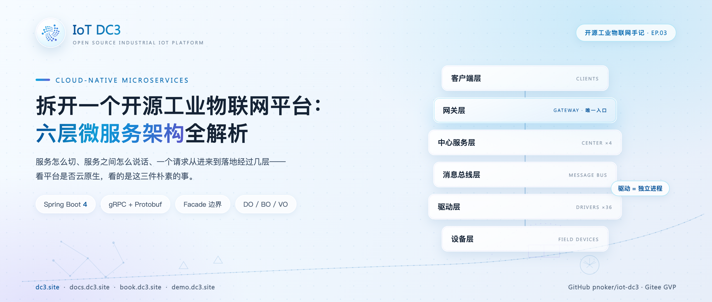
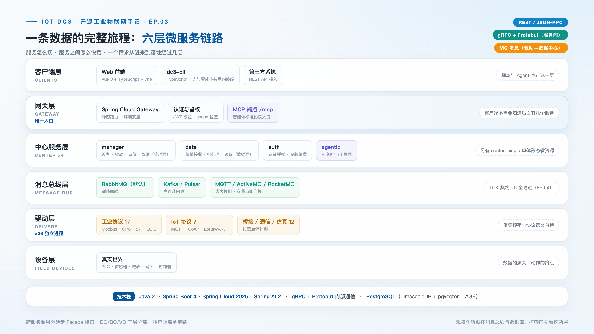
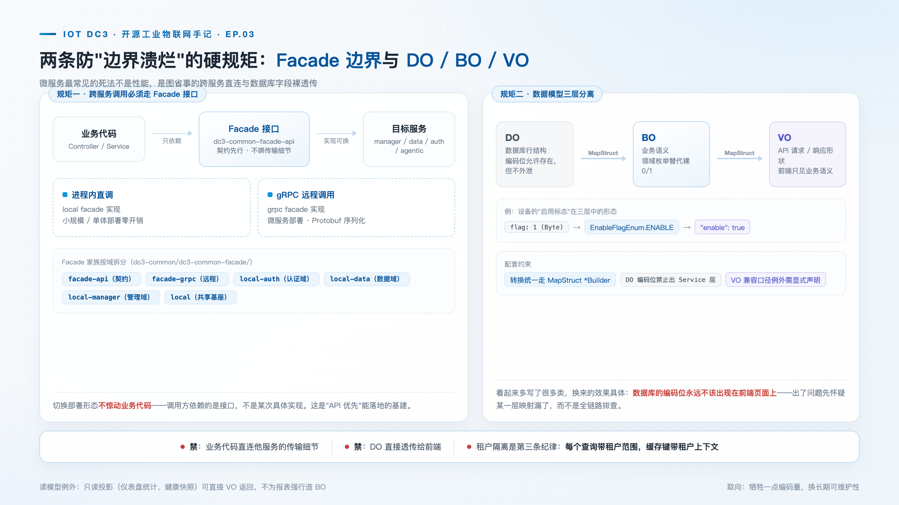

# 拆开一个开源工业物联网平台：六层微服务架构全解析

> **摘要**：开源项目的架构图谁都会画，值得看的是模块边界怎么切、跨服务调用怎么管、数据模型怎么分层。这篇把 DC3 的六层链路、gRPC 通信、Facade 边界与 DO/BO/VO 三层模型一次讲透，并沿着一次真实的设备新增请求，从网关一路走到数据库。

**热点挂钩**：云原生
**建议发布**：第 2 周二 20:00
**配图**：`images/cover.png`（封面）、`images/architecture.png`（六层架构总览）、`images/facade-layers.png`（Facade 边界与三层模型）

---

评估一个 IoT 平台的云原生程度，关键看三件事：**服务怎么切、服务之间怎么说话、一个请求从进来到落地经过几层**。这篇以 DC3 为样本拆一遍。与多数架构文章不同，本文的每个论断都能在仓库里找到对应的模块与配置——架构图之下是代码。

## 六层链路与各层职责

DC3 的运行时链路是清晰的六层。

**① 客户端层**：Vue 3 + TypeScript 的 Web 前端，以及独立的 TypeScript CLI（dc3-cli）——后者不只是运维工具，也是给智能体和脚本用的命令行客户端。两类客户端走同一套 REST 接口，平台对外因此只有一个契约需要维护。

**② 网关层**：Spring Cloud Gateway 作为唯一入口，静态路由 + 环境变量灵活配置。路由表本身就是架构证据：`/api/v3/auth/**` 指向认证中心，`/api/v3/manager/**` 指向管理中心，`/api/v3/data/**` 指向数据中心，`/api/v3/agentic/**` 指向智能体中心，每条业务路由统一挂认证过滤器；登录换令牌的公开路径单独成一条路由，且必须定义在通配路由之前——网关按定义顺序匹配，顺序一错，登录接口就会静默地要求认证。认证、限流、MCP 端点也挂在这一层。客户端永远不需要知道后面有几个服务。

为什么坚持唯一 HTTP 入口？价值不在"有个入口"，而在边界收敛：鉴权逻辑写一遍、审计埋点埋一处、对外暴露面收敛到一个端口。如果每个中心各自开 HTTP 口子，认证逻辑要么复制四份，要么每条内部链路都变成一条未经检验的信任假设。

**③ 中心服务层**：四个按职责拆分的微服务——dc3-center-manager 管设备、驱动、点位、模板、用户与权限，是平台的管理面；dc3-center-data 管位值数据的接收、批处理与读取，是数据面；dc3-center-auth 管认证授权与 token 签发校验；dc3-center-agentic 是 AI Agentic Center，管大模型接入与工具编排。拆分依据是变化节奏：管理面随业务频繁变更，数据面追求吞吐稳定，认证面要求改动最小化——变化节奏不同的东西分开部署，互不牵连。也有把多服务合并部署的 center-single 形态，将认证、数据、管理三个中心装进同一个 JVM，给小规模场景省资源——形态切换不动业务代码，这正是下文 Facade 设计的直接收益。

**④ 消息总线层**：驱动采集到的数据不直写数据库，而是发到消息总线（默认 RabbitMQ，可换 Kafka、Pulsar、MQTT、ActiveMQ、RocketMQ，第 04 篇专门讲）。削峰、解耦、驱动与数据中心互不拖累，全靠这一层。

**⑤ 驱动层**：36 个驱动作为独立微服务运行，各自连接各自的设备，采集频率与协议语义自持。

**⑥ 设备层**：现场的真实世界。

**服务之间用 gRPC + Protobuf 通信**。中心之间不走 HTTP，理由有二。其一是效率：二进制序列化在高频的设备元数据查询场景比 JSON 更省，gRPC 通道自带 keepalive 的长连接，省掉的是每次调用的连接建立开销。其二是契约：接口契约由 proto 文件管理，消费方与提供方在同一份契约上编译，"改了接口忘了通知调用方"这类问题在编译期就暴露——这也是"API 优先"能落地的基建。

## 请求走查：新增一台设备的完整链路

空谈分层不如走一个请求。以"新增一台设备"为例。

前端或 CLI 发出 `POST /api/v3/manager/device/add`。网关按路径匹配到管理中心路由，认证过滤器先校验登录令牌，再剥掉两段路径前缀转发到管理中心。设备控制器收到请求，请求体是一个 DeviceVO：设备名必须非空且匹配格式正则，驱动与模板的关联标识必填——这些校验注解按"新增/更新/导入"分组，在进入业务层之前就挡掉非法输入。VO 经 MapStruct 构建器转为 DeviceBO，转换时显式忽略租户字段——设备归属哪个租户，来自登录上下文，而不是客户端申报，这是一处不起眼但关键的安全设计。业务层完成校验后，BO 再转为 DeviceDO，落到 PostgreSQL 的设备表。读取路径同理反向：DO 不直接吐给前端，逐层转回 BO 与 VO，数据库的编码细节留在服务内部。

数据的另一半旅程在数据面：驱动按调度读到设备值，经 SDK 的发送服务发布到消息总线；数据中心从总线消费，批处理后写入时序存储，告警引擎与前端曲线读的是同一份存储。控制指令沿相反方向，经命令链路下发到驱动，全程留有命令与事件历史可查。

## Facade 边界与 DO/BO/VO 三层模型

微服务架构的常见退化原因不是性能，而是边界失守：跨服务直连、数据库字段直接透传前端，最终导致模块难以变更。DC3 以两条硬性规则约束。

**第一，跨服务调用必须走 Facade 接口。** 以设备查询为例，调用方依赖的是 DeviceFacade 这样的协议无关接口，返回业务对象与分页类型，调用代码不 import 任何 gRPC 或 Protobuf 类——传输细节被压在实现层。接口背后有两套实现：进程内直调与 gRPC 远程调用，由配置项选择，默认远程。Facade 模块本身按域拆分：接口定义、gRPC 实现、本地实现（认证/数据/管理三个域各一份）。于是部署形态成为可切换项而非架构分叉：center-single 的单 JVM 里用本地实现进程内直调，微服务栈里同一个业务类换成远程实现，业务代码一行不改；网关配置里三个域的调用模式各自独立可配，就是形态切换在部署侧的入口。

**第二，数据模型三层分离：DO / BO / VO。** DO 对应数据库行结构，BO 承载业务语义，VO 是 API 的请求响应形状，三者之间用 MapStruct 做映射。以设备实体为例：DO 层的启用标志是一个 0/1 的 Byte，扩展字段是未经约束的 JSON；到 BO 层，标志位换成领域枚举，裸 JSON 换成有类型的扩展对象，并显式声明租户归属接口；到 VO 层，字段面向 API 文档与分组校验（新增/更新/导入各一套规则）。收益是明确的：数据库编码位不泄漏到前端，前端拿到的是枚举名而非魔数；出现问题时可先检查单层映射，而非全链路排查。

加上全链路的租户隔离（每个查询带租户范围，缓存键带租户上下文），这套架构的取向很明确：**以适当的编码成本换取长期可维护性。**

## 适用范围与限制

- **能扩不等于随便扩。** 无状态设计支持水平扩展，但消息总线与 PostgreSQL 才是规模化时的真正瓶颈，扩容前先看这两层；
- **不是所有场景都值得跑全量微服务。** center-single 单体形态是给资源受限场景的选项，开发测试与小规模边缘部署用它更省心；
- **完整规格以文档为准。** 完整规格以 [docs.dc3.site](https://docs.dc3.site) 的 Architecture 章节为准，本文基于当前仓库快照。

## 结语

拆到最后会发现，六层链路、gRPC、Facade、三层模型，做的其实是同一件事：把不同种类的变化关进各自的笼子——协议变化关进驱动进程，部署形态变化关进 Facade 实现，存储与 API 形状的变化分别关进 DO 与 VO。云原生架构的价值不在架构图上方框的数量，而在每一次调整方框的代价是否足够小。这套拆法未必是最优解，但十年演进下来，它至少经受住了从单机形态到微服务、再到智能体接口叠加的多次形态变化。

> **仓库**：GitHub [pnoker/iot-dc3](https://github.com/pnoker/iot-dc3) · Gitee [pnoker/iot-dc3](https://gitee.com/pnoker/iot-dc3)（GVP）
> **文档**：[docs.dc3.site](https://docs.dc3.site)（Architecture / Modules and Dependencies）· [book.dc3.site](https://book.dc3.site) · [demo.dc3.site](https://demo.dc3.site)
