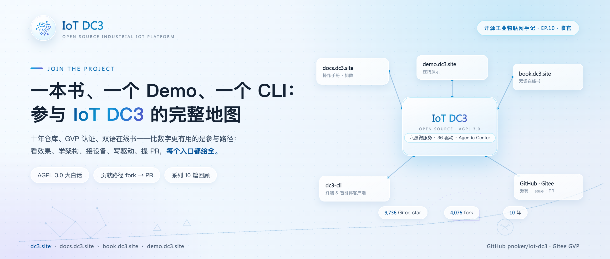
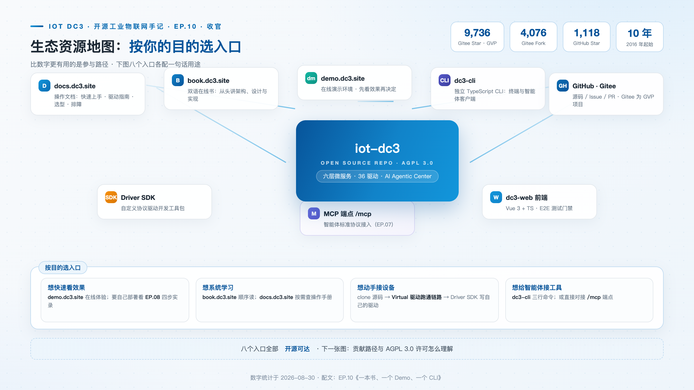
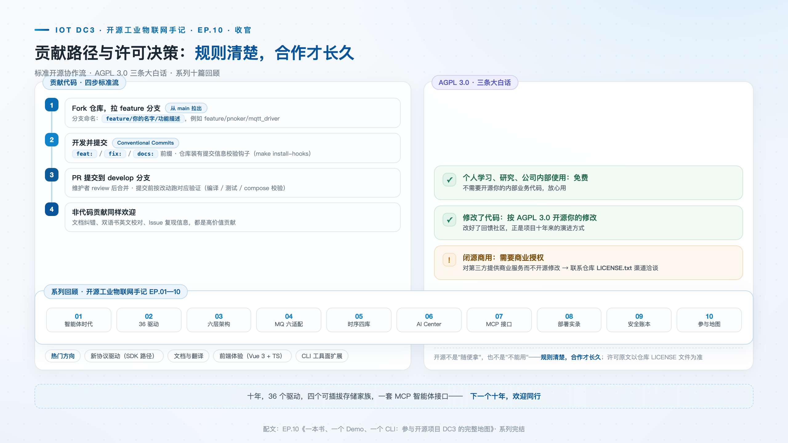

# 一本书、一个 Demo、一个 CLI：参与开源项目 DC3 的完整地图

> **摘要**：十年仓库、9,700+ Gitee star、GVP 认证。本文按目的整理 IoT DC3 的完整参与路径：在线演示、双语在线书、操作文档、CLI、源码贡献五个入口各自的定位与适合人群，提交第一个 PR 的具体步骤与规则，以及 AGPL 3.0 许可在三种使用场景下的边界。

**热点挂钩**：开源生态 · Gitee GVP
**建议发布**：第 5 周五 20:00
**配图**：`images/cover.png`（封面）、`images/ecosystem-map.png`（生态资源地图）、`images/contribution-flow.png`（贡献路径与许可决策）

---

本文回答一个实际问题：**使用、学习、参与 IoT DC3 分别从哪里入手？** 十年项目积累的入口不少——文档站、在线书、演示环境、CLI、源码仓库——价值在于按目的选对第一个。选错入口的代价并不直观：想看效果的人从读架构书开始，半小时后失去耐心；想写驱动的人在演示环境里找不到 SDK 文档。以下按"看效果、学架构、接设备、写驱动、提 PR"五种目的分别对应。

## 社区规模与活跃度

DC3 始于 2016 年，到今年整整十年；2018 年 8 月 28 日在 GitHub 开源。目前 Gitee 9,736 star / 4,076 fork（GVP 项目），GitHub 1,118 star / 236 fork。star 数反映关注度，fork 数更能说明实际使用——四千余次 fork 表明大量团队实际拉取并运行过代码。对一个部署环节客观存在的工业平台，"拉下来跑过"是比"点过 star"硬得多的信号。Gitee 的 GVP 认证则从平台侧提供了另一个参照：它意味着项目在活跃度、维护质量与社区规范上通过了持续评估，而不是一次性冲刺的结果——对十年项目而言，"还活着且活得规范"本身就是关键信息。

## 五个参与入口

**看效果，去 [demo.dc3.site](https://demo.dc3.site)。** 在线演示环境提供先行查看界面与功能的入口，适合选型阶段的快速判断：界面组织、功能完整度、数据呈现方式是否值得投入部署时间，几分钟可以得出初步结论，不必先搭环境。

**学架构，去 [book.dc3.site](https://book.dc3.site)。** 双语在线书，按章节讲解架构、设计与实现，适合想理解"为什么这样设计"的读者。系列第 03 篇拆解过的六层微服务架构、第 04/05 篇的可插拔存储与消息层，在书里有更系统的推导过程。

**排障与上手，去 [docs.dc3.site](https://docs.dc3.site)。** 操作手册定位：快速上手、技术栈说明、故障排查（支持按报错关键字检索，第 08 篇部署实录中的常见问题多数能在这里按关键字命中）。文档站同时承载仓库内的选型指南——关系库、时序存储、消息中间件三个维度的部署决策文档。

**接设备与写驱动，从 Virtual 驱动跑通链路。** clone 源码后，先从 Virtual 虚拟驱动跑通"驱动 → 消息 → 数据中心 → 存储"的完整链路，再基于 Driver SDK 开发自定义协议驱动并注册进运行平台——配套教程见 docs 站 Driver Authoring Guide。这条路径绕不开源码，但第一步有模板可抄：仓库里三十六个既有驱动就是三十六份不同复杂度的参考实现。

**终端与智能体接入，用 dc3-cli。** 独立 TypeScript CLI，`npm install -g dc3-cli` 后三步接入：`dc3 config set gateway` → `dc3 auth login` → `dc3 tools call`。设备、点位、告警、仪表盘都有对应命令面（`dc3 device list`、`dc3 point read`、`dc3 dashboard health`），凭据可存入操作系统钥匙串，多套环境用 profile 切换；`dc3 chat` 把自然语言查询带进终端，可指定模型与多轮会话。加 `--format json` 后，任何能执行 shell 的 AI 编码工具都能直接消费输出；也可将 MCP 兼容的工具直接指向网关的 `/mcp` 端点，让智能体自动发现平台全部工具。CLI 是把平台能力带进终端与智能体工作流的那一环。

## 贡献流程：提交第一个 PR

DC3 走标准开源协作流，步骤以仓库 [贡献指南](https://github.com/pnoker/iot-dc3/blob/main/CONTRIBUTING.md) 为准：先 Fork 仓库，从集成分支拉出 `feature/你的名字/功能描述` 命名的特性分支；开发与提交遵循 Conventional Commits（`feat:` / `fix:` / `docs:` …），仓库装有提交信息校验钩子，类型与格式不符会在提交时被拦下——因为发布说明直接从提交历史生成，含糊的提交信息最终会污染每一份 changelog；PR 提到 `develop` 分支，完整 CI（lint / test / build / e2e）在这里运行，维护者 review 后合并；验证通过的工作经 PR 晋级到 `main`，随版本标签发布，生产修复则从 `main` 切 `hotfix` 分支。发布本身同样是流程化的一环：版本号与生成的变更日志先行提交，匹配的版本标签创建后，镜像构建与发布由流水线自动完成——贡献者的代码从合并到可拉取的镜像，中间没有手工搬运环节。热门贡献方向：新协议驱动（第 02 篇讲过 SDK 路径）、文档与翻译（根 README 已维护七种语言且要求结构对齐，双语书长期需要英文校对）、前端体验（Vue 3 + TypeScript）、CLI 工具面扩展。

## AGPL 3.0：三种使用场景的边界

许可问题放到最后，因为它决定前述所有入口的长期性质。AGPL 3.0 的要点可以按三种场景展开。**个人学习、研究与内部使用**：免费，这也是 demo、book、docs 三个入口的全部前提。**修改代码**：需按 AGPL 3.0 开源修改部分——包括其第 13 条网络条款：修改后的版本通过网络向用户提供服务时，须向这些用户提供对应源码；选择这条路径的修改是受欢迎的贡献。**想闭源商用**——对第三方提供商业服务而不开源修改：需要商业授权，联系仓库 LICENSE.txt 里的渠道，商业许可只覆盖许可条款本身，不改变社区版的任何权利。

明确的许可规则是长期协作的基础：贡献者知道代码将以何种方式被使用，使用者知道义务边界在哪里，商业需求有正式出口而不是灰色地带。

## 结语

从十年定位、36 个驱动、六层架构，到可插拔的消息与存储、智能体中心与 MCP 接口，再到部署与安全——理解 IoT DC3 的路径，最终都通向同一处：亲手参与。看效果、学架构、接设备、提 PR，每个入口在上文都给出了地址。

十年，36 个驱动，三个可插拔存储家族，一套 MCP 智能体接口。下一个十年，欢迎同行。

> **仓库**：GitHub [pnoker/iot-dc3](https://github.com/pnoker/iot-dc3) · Gitee [pnoker/iot-dc3](https://gitee.com/pnoker/iot-dc3)（GVP）
> **文档**：[docs.dc3.site](https://docs.dc3.site) · [book.dc3.site](https://book.dc3.site) · [demo.dc3.site](https://demo.dc3.site) · 贡献指南 [CONTRIBUTING.md](https://github.com/pnoker/iot-dc3/blob/main/CONTRIBUTING.md)
