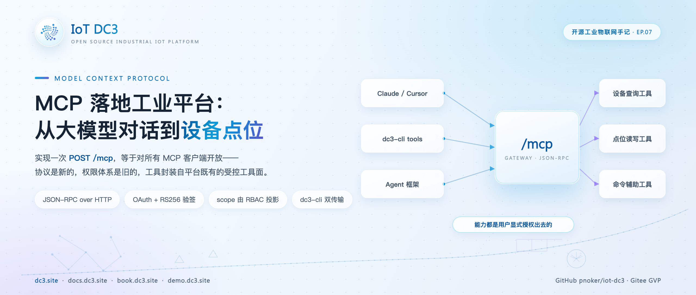
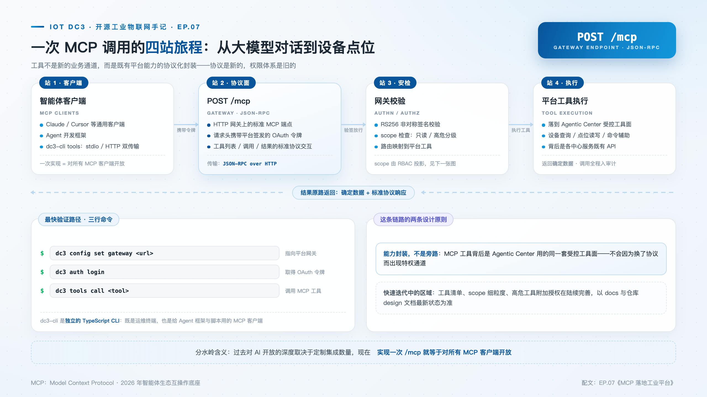
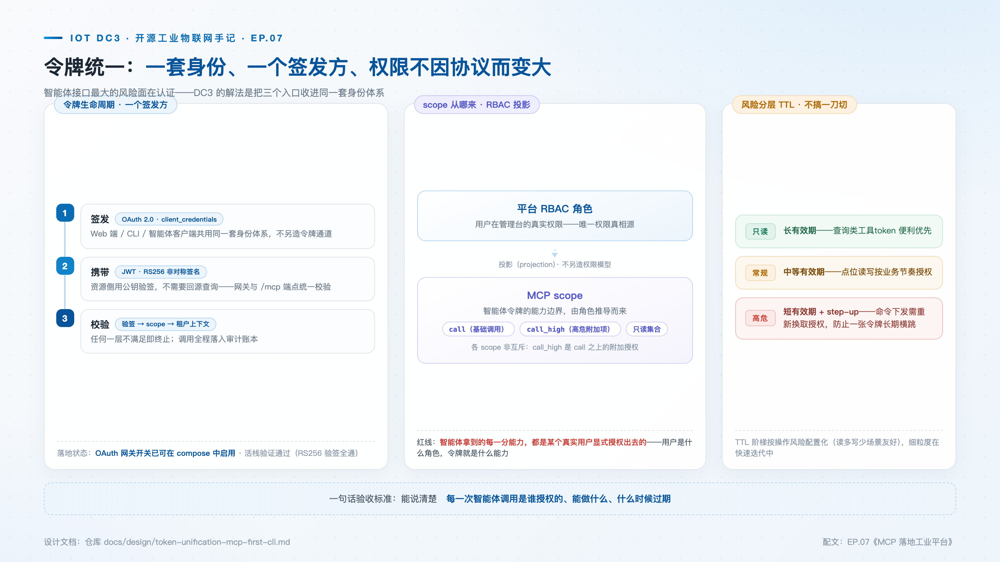

# MCP 落地工业平台：从大模型对话到设备点位的一次调用

> **摘要**：MCP（Model Context Protocol）在 2026 年成了智能体互操作的事实标准。DC3 的 HTTP 网关提供了 `/mcp` 端点：Claude、Cursor 等智能体客户端，或者一行 `dc3 tools` 命令，都能按标准协议调用平台工具。本文把一次 MCP 调用逐站拆开——令牌怎么来、网关怎么验、scope 怎么从既有权限投影、工具怎么落回既有 API——以及令牌统一背后的设计动机。

**热点挂钩**：MCP 成为智能体互操作事实标准 · 网信办智能体治理框架（2026-05）
**建议发布**：第 4 周二 20:00
**配图**：`images/cover.png`（封面）、`images/mcp-pipeline.png`（端到端调用链）、`images/mcp-token.png`（令牌统一与 scope 分层）

---

MCP（Model Context Protocol）由 Anthropic 于 2025 年开源，到 2026 年已成为智能体生态的互操作基础——Claude、Cursor 及各类 Agent 开发框架均以 MCP Server 作为工具暴露的标准形态。

对工业软件而言，这意味着集成成本结构的根本变化。过去接一个 AI 客户端就要定制一次集成：适配它的认证方式、它的工具描述格式、它的调用约定；每多支持一个客户端，集成工作量线性增长。MCP 把这个曲线压平了：**平台只需实现一次 MCP 端点，即可对所有 MCP 客户端开放**。但"实现端点"四个字里藏着真正的工作量——认证怎么做、权限怎么收口、一次调用经过哪些站。本文拆开这条链路。

## 一次调用的完整链路

DC3 的 MCP 面落在 HTTP 网关上，`POST /mcp`，协议是 JSON-RPC 2.0，支持 initialize、ping、tools/list、tools/call 四类方法。以一次"查询 3 号车间在线设备"的 tools/call 为例，逐站看下去。

**第一站，客户端发现与注册。** MCP 客户端先从网关的 RFC 9728 保护资源元数据端点（`/.well-known/oauth-protected-resource`）拿到授权服务器地址、支持的 Bearer 传递方式与 scope 清单——不需要任何文档，标准客户端自动完成发现。随后客户端向授权端点注册（`/oauth2/register`），平台支持授权码（含 PKCE）、client_credentials、refresh token 三种许可类型；机器智能体通常走 client_credentials，从 `/oauth2/token` 换取一张 RS256 签名的访问票据。

**第二站，请求到达 /mcp。** 客户端把工具名与参数装进 JSON-RPC 请求体，Authorization 头携带 Bearer 票据。网关先做票据校验：RS256 签名按票据头里的 key id 对照密钥验证，签发方与受众声明逐一核对，时间声明由解析器处理；网关侧的公钥从授权中心的 JWKS 端点（`/oauth2/jwks`）以带缓存的短周期拉取——私钥从不离开授权中心。票据缺失或无效时返回 401，挑战头里带着元数据端点地址，把客户端引回正确的取票路径。

**第三站，可见性与授权。** 校验通过后，授权中心按票据解析主体上下文，检查 scope：tools/call 要求调用类 scope，tools/list 要求列表类 scope；工具可见性按连接与权限双重过滤——同一张目录，不同连接看到的工具集合可以不同。高风险工具还带确认门槛（风险分低、中、高三档：低档只读常显，中档默认隐藏需显式开启，高档必须确认后才可调用）。

**第四站，工具执行。** 这是最容易被误解的一站：**MCP 工具不是新的业务通道，而是既有平台能力的协议化封装**。平台的工具目录由聚合器从各中心服务的 REST 接口快照合成——设备查询、点位读写、上一篇文章里的分析九端点，都是既有的、带访问控制的 REST 控制器；tools/call 解析出目标工具后，网关把参数转发到对应后端端点执行。协议是新的，权限体系与业务实现是既有的，这是有意的设计。

**第五站，审计。** 每次调用落一条审计记录，成功与失败都记；审计写入失败不会把一次已执行的成功调用伪装成客户端错误——职责边界是明确的。

## 令牌统一：一套身份，三个入口

智能体接口最大的风险面在认证，而认证的问题出在历史上平台跑着**两套互不相认的令牌体系**：Web 与 CLI 用的登录令牌是 HS256 共享密钥签名、固定 12 小时有效期，只在 `/api/v3` 各路由上校验；MCP 的 OAuth 令牌是 RS256 非对称签名、15 分钟有效期加 30 天可轮换刷新，只在 `/mcp` 上校验。同一个智能体要持有两套身份；两套体系各自演进，随时可能漂移。

统一的设计原则是不发明新令牌类型、不新建权限存储，而是把每个维度归到既有的最优所有者上，再把验签收敛到网关一个裁决点：

- **一个签发方**：OAuth 流程统一签发，Web 端、CLI、智能体客户端用同一套身份体系；浏览器会话保留 httpOnly Cookie 形态，但共享同一个验签器与权限真源；
- **一套验签**：网关的令牌解析链按序尝试——HS256 登录票据与 RS256 OAuth 票据各有一个解析器，先到先得，未知算法立即拒绝；两者产出同一种扩展主体头，下游服务信任这个头部，**下游零改动**；
- **风险分层 TTL**：只读操作长有效期，可调用操作短有效期，高危操作走确认换取——把"令牌有效期"从一刀切变成按能力爆炸半径分级。

设计原则一句话：**智能体获得的每一项能力均来自真实主体的显式授权，权限不因协议切换而扩大。**

## scope 投影：RBAC 权限的受控收缩

MCP 对外的 scope 词表是四个：工具列表、工具调用、高危工具调用、资源读取。容易走错的一步是为这四个 scope 单独建一套配置——两套并行的权限存储，一个发布周期内必然漂移。

DC3 的做法是投影：**scope 在授权时从主体既有的 RBAC 绑定计算出来**，有可读权限绑定才有读 scope，有可调用的工具绑定才有调用 scope。投影规则是按风险档累加、只收不放——一个混合了低风险与高风险绑定的主体，不会因为存在高危项而失去普通工具的访问；没有绑定记录的主体降级到最小集而不是清零。网关与 MCP 授权用同一口井取水，给 CLI 发令牌和给 MCP 连接授权永远一致。

## CLI 的双传输

dc3-cli 围绕这套凭据模型重构了接入方式。`dc3 auth login --oauth` 走动态客户端注册与授权，之后**同一张 OAuth 票据服务两条通道**：常规命令（device、point、dashboard 等）以 Bearer 票据访问 REST 接口；`dc3 tools list` 与 `dc3 tools call` 则以同一张票据对 `/mcp` 发 JSON-RPC——这是 CLI 的双传输设计，命令面直接读机器可读的工具目录，而不是为每个领域硬编码后端路径。退出码语义也随凭据体系对齐：认证类错误统一映射到独立退出码，方便脚本与 Agent 框架消费。

通用智能体客户端接入是同一件事的另一面：在 Claude Code 的配置里指向网关的 `/mcp` 地址，智能体即可自动发现平台全部工具。验证路径：`dc3 config set gateway <url>` → `dc3 auth login --oauth` → `dc3 tools call ...`。

## 适用范围与限制

- MCP 接口处于快速迭代阶段，工具清单与 scope 细粒度持续完善，以 docs 与仓库 design 文档为准；
- MCP 解决的是智能体对工业平台的标准调用，不涉及模型推理质量——调用链路的确定性与回答的质量是两个问题；
- 经典登录票据在 `/mcp` 不被接受，MCP 端点要求 OAuth 票据——两条体系的互通在网关解析链上完成，而不是在端点上放宽。

## 结语

把整条链路串起来看：MCP 给了工业平台一个标准化的智能体接口，而真正决定这条接口能不能用在生产环境的，是它背后的三件事——统一的凭据体系、投影自既有权限的 scope、复用既有业务实现的工具执行。协议负责互操作，工程负责安全与确定。前者由标准解决，后者每个平台都要自己做一遍。

> **仓库**：GitHub [pnoker/iot-dc3](https://github.com/pnoker/iot-dc3) · Gitee [pnoker/iot-dc3](https://gitee.com/pnoker/iot-dc3)（GVP）
> **文档**：[docs.dc3.site](https://docs.dc3.site) · [book.dc3.site](https://book.dc3.site) · [demo.dc3.site](https://demo.dc3.site) · CLI 手册 [dc3-cli/README.md](https://github.com/pnoker/iot-dc3/blob/main/dc3-cli/README.md)
