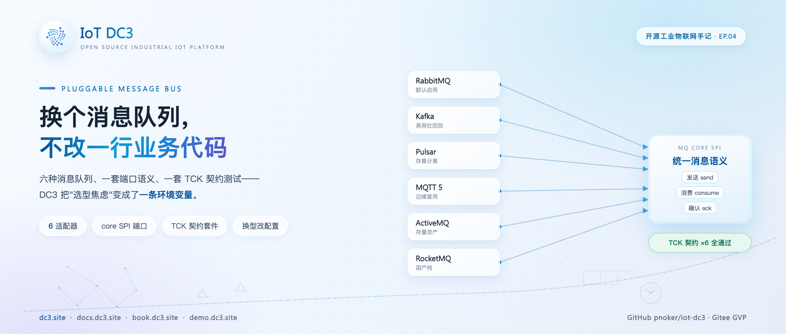
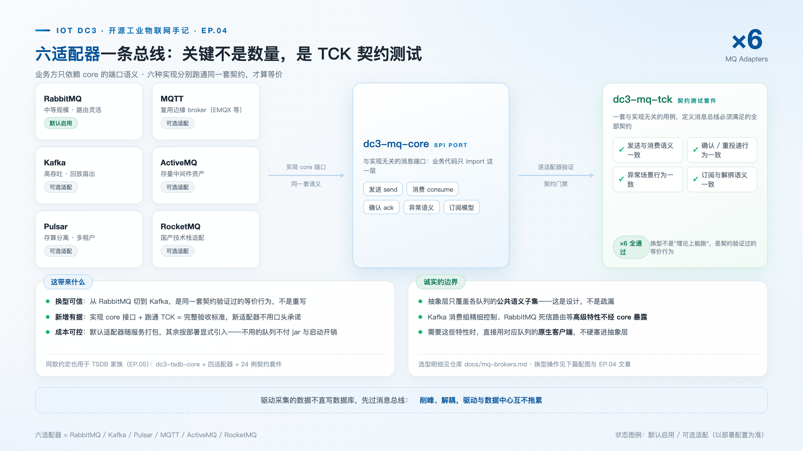
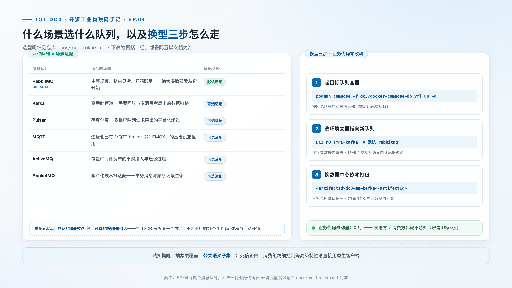

# 换个消息队列，不改一行业务代码：DC3 的六适配器实践

> **摘要**：RabbitMQ、Kafka、Pulsar、MQTT、ActiveMQ、RocketMQ——DC3 的消息总线支持六种消息队列，切换只改一条配置。本文讲这个抽象层的完整设计：消息语义如何定义、TCK 契约测试如何证明六种实现行为一致、换型具体操作三步，以及哪些能力刻意留在了抽象之外。

**热点挂钩**：架构解耦 · 国产中间件适配（RocketMQ / ActiveMQ）
**建议发布**：第 2 周五 20:00
**配图**：`images/cover.png`（封面）、`images/mq-family.png`（六适配器与 TCK 认证）、`images/mq-swap.png`（换型操作与选型指引）

---



消息队列的选型成本，大头不在中间件本身，而在**耦合**。当业务代码直接依赖某一家的客户端 SDK 时，发送调用、消费回调、确认语义、重连与序列化逻辑会散落到各个服务里；一旦绑定形成，"换队列"就不再是改一行配置的事，而是一次牵动所有服务的大规模重构。许多团队因此陷入两难：明知道当前队列不合适，也只能继续用下去。

自建"统一消息层"是常见的出路，但多数尝试失败在同一个地方：**无法证明多种实现行为等价**。六套适配器各自能收发消息，不等于语义一致——负载均衡是恰好一次还是至少一次？消费失败走重投还是死信？实例下线后订阅还存活多久？这些差异平时不可见，故障时才以丢数、重复、积压的形式暴露。

DC3 把这两件事一起解决了：消息总线是一个可替换层，且配备一套契约测试套件作为行为等价的证据。本文展开这个设计的三个部分：端口定义、契约验证、换型操作。

## 端口：消息语义先于中间件

在模块布局上，`dc3-mq/` 是一个独立的家族：`dc3-mq-core` 定义端口与消息语义，六个适配器模块（`dc3-mq-rabbitmq`、`dc3-mq-kafka`、`dc3-mq-pulsar`、`dc3-mq-mqtt`、`dc3-mq-activemq`、`dc3-mq-rocketmq`）各自对接一种消息队列，`dc3-mq-tck` 是契约测试套件。数据中心等业务方只依赖 core 的接口，不感知底层是哪家。



端口的核心是一组**刻意分层可靠性**的发送语义。以 core 的 `MessageSender` 接口为例，它提供三个方法，对应工业数据链路里三种真实需求：

- **`send`：即发即忘，但不放弃确认。** 面向设备数据上报这类高吞吐路径；在支持 publisher confirm 的 broker 上仍然开启确认，失败通过适配器的确认日志暴露——不因追求吞吐而变成黑盒。
- **`sendAsync`：每条消息一次确认回调。** `confirmed=true` 表示 broker 已接受**且已路由**。驱动侧的持久化外发箱（v2026.8.19 引入的 SQLite durable outbox）正是依据这个回调决定删除还是重发——可靠性决策建立在明确的信号上，而不是超时猜测。
- **`sendConfirmed`：阻塞等待路由证据。** 带超时参数，nack、不可路由或超时抛出异常；面向命令下发这类低流量、绝不能丢的状态机路径。在不支持发布确认的 broker 上，这个调用如实降级为普通发送——降级是显式声明的能力差异，不是被掩盖的缺陷。

这三种语义说明了"公共子集"的确切含义：**不是把六家 API 求并集，而是定义工业场景真正需要的三档可靠性，让每家 broker 在自己的能力范围内兑现它。**

消费侧同样由 core 统一：`MqListener` 与 `MqBatchListener` 覆盖单条与批量消费，`Acknowledgment` 支持确认、拒绝重投与拒绝转死信三种处置；订阅的生命周期与实例绑定，实例下线后订阅自动过期，不留孤儿队列。

## 证据：一套 TCK，六次通过

实现六个适配器并不难，难的是回答那个关键问题：**如何证明六个适配器行为一致？**

DC3 的做法借鉴自数据库世界的 TCK（Technology Compatibility Kit，技术兼容性套件）：`dc3-mq-tck` 中的 `AbstractMqContractTest` 定义了 13 个与实现无关的契约用例，六个适配器分别继承同一套用例运行，全部通过才算合格。用例覆盖的是语义而非功能，几个代表性的例子：

| 契约用例 | 验证的行为 |
| --- | --- |
| `loadBalanceDeliversEachMessageExactlyOnceAcrossInstances` | 负载均衡模式下，多实例消费每条消息**恰好一次**——不丢、不重 |
| `broadcastDeliversToEveryInstance` | 广播模式下每个实例都收到 |
| `burstOfMessagesIsNotLost` | 突发流量下消息不丢失 |
| `batchDeliveryCommitsTheWholeBatch` | 批量消费整批提交，不存在半批 |
| `retryExhaustionDeadLettersInsteadOfDropping` | 重试耗尽后进死信，**而不是静默丢弃** |
| `rejectWithoutRequeueRoutesToTheDeadLetter` | 拒绝不重投时路由到死信 |
| `rejectWithRequeueRedelivers` | 拒绝重投时重新投递 |
| `messagesSurviveWhileNoConsumerIsRunning` | 无消费者期间消息存活，不因无人消费而丢失 |
| `perInstanceSubscriptionExpiresAfterInstanceStops` | 实例停止后订阅过期 |
| `sendAsyncConfirmationFires` | 异步确认回调必达 |
| `roundTripPreservesEnvelopeHeadersAndPayload` | 往返后消息信封头与载荷完整 |

这张表本身就是选型时最该问供应商的问题清单。对 DC3 而言，它带来两个实际收益：

**换型可信。** 从 RabbitMQ 切到 Kafka，得到的不是"理论上应该能跑"，而是 13 条语义被同一套用例验证过的等价行为——上表中的每一条，在两种队列上都有测试通过记录。

**新增适配器有据可依。** 接入一种新队列的验收标准是明确且可执行的：实现 core 的接口，跑通同一套 TCK。合格与否不依赖代码评审的主观判断，而依赖契约套件的红绿灯。

## 换型流程

适配器的装配由 Spring 条件注解驱动：每个适配器的配置类标注 `@ConditionalOnProperty(prefix = "dc3.mq", name = "type", havingValue = "...")`，只有 `dc3.mq.type` 匹配时才装配。RabbitMQ 适配器额外设置了 `matchIfMissing = true`——不配置时默认启用，与官方 compose 栈开箱即用一致。

以从 RabbitMQ 切换到 Kafka 为例，操作共三步，全部在部署侧完成：

**第一步，启动目标消息队列容器。** 在 compose 栈中启用 Kafka 服务。

**第二步，修改类型变量。** 在 `dc3/env/dev.env`（或部署环境的等价位置）中：

```bash
DC3_MQ_TYPE=kafka        # 默认 rabbitmq；另可选 pulsar / mqtt / activemq / rocketmq
```

**第三步，提供适配器连接参数。** 每个**非默认**适配器有自己的连接配置，仅在类型匹配时生效：

```bash
DC3_MQ_KAFKA_BOOTSTRAP=kafka:9092
```



重启后，`dc3.mq.type=kafka` 使 Kafka 适配器装配生效，业务服务与数据中心的依赖没有任何变化。整个过程不涉及一行业务代码，回退同理——把变量改回 `rabbitmq` 即可。

## 六种队列的选型

抽象层保证"换得起"，选型仍要回答"该选哪个"。官方文档 [docs/mq-brokers.md](https://github.com/pnoker/iot-dc3/blob/main/docs/mq-brokers.md) 给出了完整的选型指南，概括如下：

| 队列 | 适合的场景 |
| --- | --- |
| **RabbitMQ**（默认） | 中等规模、路由灵活、开箱即用——绝大多数部署从这里开始 |
| **Kafka** | 高吞吐、需要回放与多消费者扇出的数据管道 |
| **Pulsar** | 存算分离、多租户需求突出的场景 |
| **MQTT** | 边缘侧已有 MQTT broker（如 EMQX）时的基础设施复用 |
| **ActiveMQ / RocketMQ** | 存量中间件资产的延续，与国产化技术栈的适配 |

一个务实的建议：没有明确理由时保持默认。换型的价值在于**当约束出现时（吞吐上限、存量资产、合规要求），退出成本接近零**，而不是为了换而换。

## 适用范围与限制

抽象层覆盖的是各队列的公共语义子集，范围边界如下：

- **公共语义子集之外的能力不经 core 暴露。** Kafka 的消费组精细控制、RabbitMQ 的死信路由配置等高级特性，属于各队列的专有能力；需要时应直接使用对应队列的原生客户端，而非等待抽象层扩展。
- **能力差异如实降级。** 如 `sendConfirmed` 一节所述，不支持发布确认的 broker 上该调用降级为普通发送——这类行为差异在适配器文档中显式声明，不假装所有 broker 能力等同。
- **依赖按需打包。** 默认适配器（RabbitMQ）随服务打包，其余适配器在部署显式指定类型时才引入，避免不必要的依赖开销。

## 结语

回到开头的问题。抽象层的价值不在于"支持六种消息队列"这个数字，而在于它把两个工程问题转化成了已解决的问题：把"换队列"从一次大规模重构降级为一次运维操作；把"行为是否一致"从代码评审的主观判断升级为 13 条契约的机器验证。当消息基础设施的退出成本趋近于零，选型才真正回归业务约束本身。

> **仓库**：GitHub [pnoker/iot-dc3](https://github.com/pnoker/iot-dc3) · Gitee [pnoker/iot-dc3](https://gitee.com/pnoker/iot-dc3)（GVP）
> **文档**：[docs.dc3.site](https://docs.dc3.site) · 选型指南 [docs/mq-brokers.md](https://github.com/pnoker/iot-dc3/blob/main/docs/mq-brokers.md) · [book.dc3.site](https://book.dc3.site) · [demo.dc3.site](https://demo.dc3.site)
