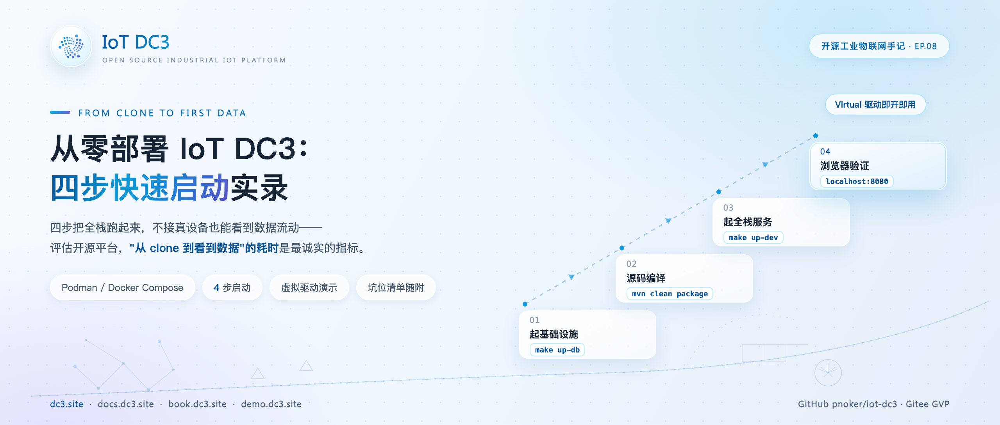
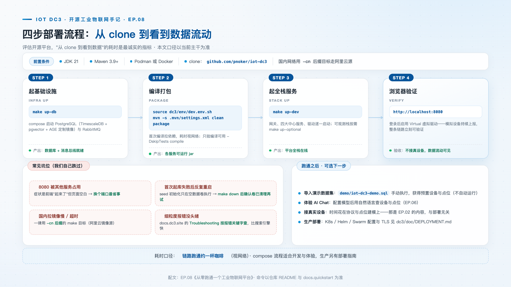
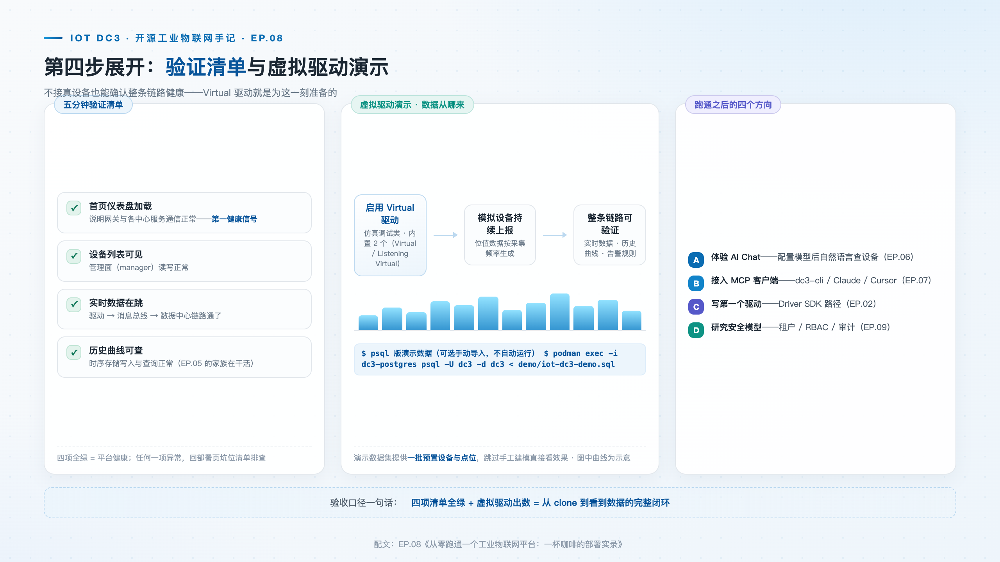

# 从零部署 IoT DC3：四步快速启动实录

> **摘要**：部署是开源平台的第一道使用门槛，也是多数项目被放弃的地方。本文基于当前主干完整记录 DC3 的启动流程：起基础设施、源码编译、全栈启动、浏览器验证四个步骤，每步附真实命令与预期结果；并解释虚拟驱动为何不接真实设备也能验证完整数据链路，末尾附实测确认的常见问题清单。

**热点挂钩**："开源项目部署劝退"长期痛点 · 快速上手转化
**建议发布**：第 4 周五 20:00
**配图**：`images/cover.png`（封面）、`images/deploy-flow.png`（四步部署流程）、`images/deploy-verify.png`（验证清单与虚拟驱动演示）

---



评估一个开源平台，功能列表与 star 数都容易修饰，**"从 clone 到看到数据"的耗时是最诚实指标**：它把文档质量、依赖管理、启动编排一次性摊在桌面上。工业物联网平台的部署门槛又格外高——数据库要带扩展、消息队列要预配置、服务之间存在启动顺序，任何一环缺失，首次体验就停在报错页。本文基于 DC3 当前主干完整走一遍流程：四步，每一步给出实际执行的命令与应当看到的结果。

前置条件以仓库 [贡献指南](https://github.com/pnoker/iot-dc3/blob/main/CONTRIBUTING.md) 为准：JDK 21、Maven 3.9+、Podman 或 Docker，以及可联网环境；浏览器验证环节另需 Node.js 与 pnpm。容器编排不绑定具体运行时——Makefile 会先探测 Docker Compose，不可用则回落到 Podman Compose，两条路径命令一致。

## 第一步：启动基础设施

```bash
git clone https://github.com/pnoker/iot-dc3.git
cd iot-dc3
make up-db
```

`make up-db` 背后是 `dc3/docker-compose-db.yml` 这份编排，启动两个容器：`dc3-postgres` 与 `dc3-rabbitmq`。前者不是官方 PostgreSQL 镜像，而是分层构建的定制镜像——在基础镜像之上叠加 TimescaleDB、pgvector、AGE 扩展与全部初始化脚本，容器内 5432 映射到宿主机 35432。首次以空数据卷启动时，入口脚本按文件名顺序执行 initdb 目录下的建库脚本，从扩展安装、公共表、认证数据一直到观测性表，菜单、默认租户与账号都在这一步写入——这也是后文"seed 仅在空数据卷执行"的由来。两个容器均配置健康检查（PostgreSQL 用 `pg_isready`，RabbitMQ 用 `rabbitmq-diagnostics ping`），`make ps` 看到 healthy 即告完成。国内网络环境可使用 `make up-db-cn`（阿里云镜像源）。

## 第二步：源码编译

```bash
source dc3/env/dev.env.sh
mvn -s .mvn/settings.xml clean package
```

`dev.env.sh` 把本地源码运行所需的变量灌入当前 shell——数据库指向 `localhost:35432`、消息队列指向 `localhost:35672`，与第一步映射出来的端口一一对应。随后 Maven 按仓库自带的 settings.xml 拉取依赖并全量打包；首次编译需拉取依赖，视网络情况约 5–15 分钟。仅需验证编译时可改用 `mvn -s .mvn/settings.xml -q -DskipTests compile`，输出安静、结论不变。

这一步与容器路径的关系值得说明：根目录的统一 Dockerfile 在构建镜像时会在 builder 阶段内部自行执行 Maven 打包，纯容器部署并不依赖宿主机编译；宿主机这一步服务于源码级开发——IDE 中逐服务运行（`make run SERVICE=gateway`）与断点调试都以它的产物为基础。两条路径并存，编译结论可互为印证。

## 第三步：启动全栈服务

```bash
make up-dev
```

`make up-dev` 对应 `dc3/docker-compose-dev.yml`：网关（8000）、认证中心（8300）、管理中心（8400）、数据中心（8500）、智能体中心（8600）与全部驱动容器逐一启动。服务不是并排拉起——编排中每个服务都声明了带健康条件的依赖：网关要等四个中心全部健康才启动，数据中心要等管理中心就绪。就绪探针统一指向各服务的 `/actuator/health/readiness` 端点，比"进程活着"更接近"能接流量"的真实状态。首次执行会构建全部镜像，多阶段 Dockerfile 使多个服务镜像共享同一次 Maven 构建，不会每个镜像都重跑编译；`make logs` 可跟踪启动过程。可选观测组件（EMQX、ELK、Prometheus、Grafana）通过 `make up-optional` 启动，与核心链路无关，不影响后续验证。



## 第四步：浏览器验证



后端就绪后，在 `dc3-web` 目录执行 `pnpm dev` 启动前端开发服务器，浏览器打开 `http://localhost:8080`，页面请求由开发服务器代理到网关 8000。登录使用种子数据内置的默认账号 `dc3` / `dc3dc3dc3`——由 initdb 脚本以 BCRYPT 哈希写入，首次启动即存在。

登录之后，验证不是"页面能打开"，而是按数据链路逐段确认：

| 验证项 | 链路上的含义 |
| --- | --- |
| 首页仪表盘正常渲染 | 网关 → 认证中心 → 各中心服务的调用链畅通 |
| 设备列表与实时数据持续变化 | 虚拟驱动 → 消息总线 → 数据中心的采集链路在工作 |
| 点位历史曲线有数据 | 数据中心 → 时序存储的写入与查询链路在工作 |
| 配置模型后用 AI Chat 自然语言查询设备与点位 | 智能体中心的工具调用链路在工作 |

## 虚拟驱动：无设备环境的链路验证

第一次部署就能看到数据在动，靠的是 Virtual 虚拟驱动，但它验证的东西并不"虚"。从源码看，虚拟驱动的读方法按点位类型生成数据：字符串点位返回固定样例值 `abcd1234`，布尔点位返回随机真假，数值点位返回 0 到 100 之间的随机值。真正的关键在框架侧：驱动框架用 Quartz 定时任务周期性对启用设备的点位发起读取，读到的值经消息总线送入数据中心、写入时序存储，前端的实时数据与历史曲线读的都是这条链路的产出；驱动自身的调度还会周期性上报设备事件。换句话说，页面上的每一个数字都完整走过了"采集 → 传输 → 入库 → 查询"的路径，与接入真实设备的差别只在最前端的"读"这一环——换成 Modbus 或 OPC UA 驱动，链路其余部分原样复用。这正是虚拟驱动的价值：把部署验证与设备接入解耦，让"从 clone 到看到数据"不必等待硬件到位。

若想获得更完整的业务画面，可导入演示数据集：`podman exec -i dc3-postgres psql -U dc3 -d dc3 < dc3/dependencies/postgres/demo/iot-dc3-demo.sql`。这份脚本可重复执行——每次先清理固定 ID 段再插入，内容是一个园区冷站的完整场景：冷冻水泵、空调机组等设备分属 Modbus TCP、OPC UA、MQTT、S7 与 Virtual 五个驱动，首页仪表盘、事件看板、列表与详情页随之都有数据可看。

## 常见问题

8080 端口被其他服务占用时前端页面空白，更换端口即可；首次建库失败多与数据卷状态有关——seed 初始化仅在空数据卷时执行，失败后需 `make down` 确认卷已清理再重试（涉及删卷的 `make reset` 设有确认开关，防止误删）；国内镜像拉取慢，统一使用 `-cn` 后缀的 make 目标；其余问题建议直接查 [docs.dc3.site](https://docs.dc3.site) 的 Troubleshooting 章节，支持按报错关键字检索。

## 适用范围与限制

本流程覆盖部署与数据链路验证；接入真实设备的时间取决于协议适配与点位建模，属于部署之后的另一件事，与本文四步无关。生产部署请看 [dc3/doc/DEPLOYMENT.md](https://github.com/pnoker/iot-dc3/blob/main/dc3/doc/DEPLOYMENT.md)：K8s / Helm / Swarm 配置、TLS、容量规划都在那里，本文的 compose 流程适合开发与体验。

## 结语

从 clone 到登录页看到第一条实时数据，实质命令不超过五条。部署体验是开源平台的门面，也是工程质量的直接投影——initdb 脚本是否可重复执行、健康检查是否真实、启动顺序是否由编排保证，这些细节比任何宣传页都更能说明一个项目处于什么水位。

> **仓库**：GitHub [pnoker/iot-dc3](https://github.com/pnoker/iot-dc3) · Gitee [pnoker/iot-dc3](https://gitee.com/pnoker/iot-dc3)（GVP）
> **文档**：[docs.dc3.site](https://docs.dc3.site)（Quickstart / Troubleshooting）· [book.dc3.site](https://book.dc3.site) · [demo.dc3.site](https://demo.dc3.site)
