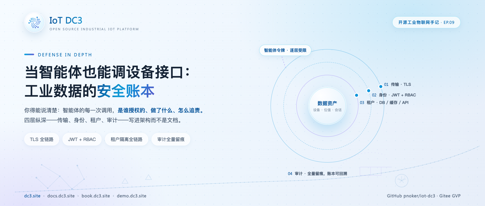
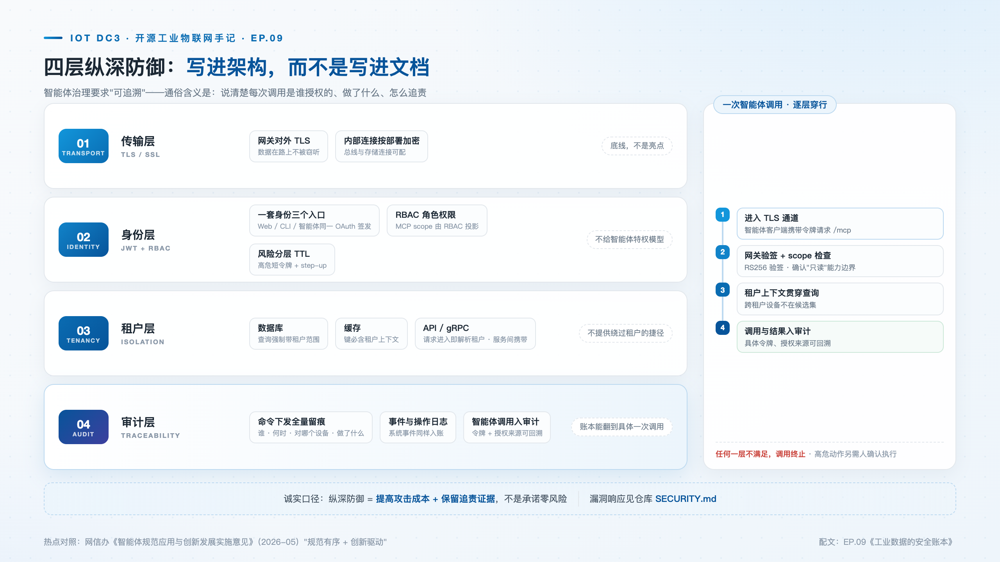
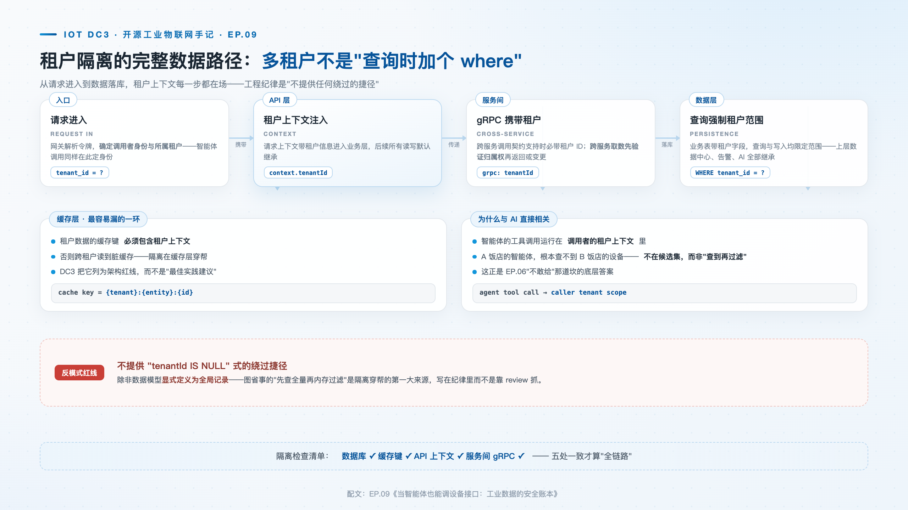

# 当智能体也能调设备接口：工业数据的安全账本

> **摘要**：2026 年 5 月网信办《智能体规范应用与创新发展实施意见》把智能体安全提上治理议程——而工业场景里，智能体能触达的是真实的设备与产线。这篇拆 DC3 的四层安全纵深：传输加密、身份与 RBAC、租户隔离、审计追踪，逐层给出落地细节，包括 MCP 智能体接口如何以 scope 投影与风险分层 TTL 被约束在这套体系之内。

**热点挂钩**：网信办《智能体规范应用与创新发展实施意见》（2026-05）· 数据安全
**建议发布**：第 5 周二 20:00
**配图**：`images/cover.png`（封面）、`images/security-layers.png`（四层纵深防御）、`images/tenant-path.png`（租户隔离的数据路径）

---

传统工业平台的安全模型以人为用户主体：权限、会话、审计口径都围绕"人"设计。智能体接口引入了新的调用方——持有用户签发令牌的程序客户端，可查询设备、读写点位。它的调用频率、行为模式、重试方式都与人不同，但它行使的仍然是人的权限的延伸。2026 年 5 月，网信办《智能体规范应用与创新发展实施意见》发布，"规范有序"与"创新驱动"并重成为智能体落地的治理基调。对工业软件来说，该文件对工业软件的要求可以概括为一个工程命题：**平台必须能说明智能体每次调用的授权来源、操作内容与追责路径**——是谁授权的、做了什么、怎么追责。

DC3 的回答是把答案写进架构而不是文档：四层纵深防御，自外向内依次为传输、身份、隔离、审计。

## 传输层：TLS 加密

最外层解决最原始的威胁。网关对外支持 TLS/SSL 加密通信，内部消息总线与存储连接按部署配置加密。以消息层为例，`dc3-rabbitmq` 定制镜像预置了 TLS 监听器——AMQP 流量走 5671、MQTT 走 8883，协议版本限定 TLS 1.2 与 1.3，证书与密钥随镜像配置分发。这一层保障传输保密性，是纵深的地基：上层的权限做得再细，明文链路上的令牌与设备数据照样能被截获。

## 身份层：JWT 认证与 RBAC 权限投影

Web 端用户、CLI、智能体客户端，签发走同一个 OAuth 令牌体系（JWT + Spring Security）。内部服务令牌以 HS256 签名，subject 绑定主体 ID、issuer 携带租户 ID——租户身份随令牌本身传递，不依赖请求方自觉申报；智能体侧的 OAuth 票据采用 RS256 非对称签名，网关通过认证中心的 JWKS 端点验签，私钥不出认证中心。角色权限（RBAC）决定"谁能做什么"。

MCP 接口的 scope 从 RBAC 投影而来，不为智能体建立独立特权模型。平台只有四个预设 scope：`mcp:resources:read`、`mcp:tools:list`、`mcp:tools:call` 与 `mcp:tools:call:high`，分别对应资源读取、工具列表、标准工具调用与高危工具调用；授权时按主体实际具备的权限绑定对 scope 做收缩——只收不放，一个在 RBAC 中没有高危权限的主体，不可能通过 MCP 拿到高危 scope。两套权限模型若各自维护，一个版本周期内就会漂移；投影机制从结构上消除了这个漂移。

高危操作在令牌层做风险分级：只读访问令牌的有效期为一小时，具备工具调用能力的令牌仅十五分钟——时间窗口随操作的可伤害半径伸缩，而不是随入口伸缩。更高风险的调用在此基础上保留人工确认环节作为第二因子，确认记录与具体调用绑定。

## 隔离层：fail-closed 租户拦截

多租户不是"查询时加个 where 条件"那么简单。DC3 把租户隔离做成全链路约束：每张业务表带租户字段，查询强制带租户范围；租户数据的缓存键必须包含租户上下文，防止跨租户读到脏数据；请求进入即解析租户身份，服务间 gRPC 调用携带租户信息；跨服务取数先验证归属权，再返回或变更。

这套约束的关键机制是 fail-closed 的租户行级过滤（v2026.7.2 引入，v2026.7.3 扩展到 gRPC 服务端路径）：租户上下文缺失时，查询直接被拒绝并抛出专用异常，而不是照常执行；少数合法的无租户路径——登录时尚未解析出租户、跨租户的内部编排——必须显式登记在白名单中，以受控的例外作用域执行，结束自动恢复，泄漏不到同一线程池里的下一个任务。数据访问层则把约束做进类型系统：业务 CRUD 接口的每个方法都以租户范围对象为第一个参数，该对象构造时校验租户标识非空且有效，不满足立即抛错——"忘记传租户"在第一道运行关口就被拦下。

为什么 fail-closed 比 fail-open 安全？fail-open 的隔离建立在"每一处查询都记得带租户条件"之上，代码库越大、参与人越多，漏掉一处只是时间问题，而漏掉的那一处就是横向渗透的入口。fail-closed 把默认值反转：没有上下文即拒绝，例外走显式白名单。此后新增代码若遗漏了租户处理，结果是调用失败、问题立刻暴露，而不是静默越权。**失败会报警，越权不会**——这是两种默认值最本质的差别。同一原则也用于权限装配：服务在缺少权限提供者时回落到默认拒绝，方法级安全返回 403，而不是回落到不安全的默认链。工程约束因此可以一句话说清：不提供绕过租户范围的路径，除非数据模型显式定义为全局记录。

## 审计层：全量留痕与追责

命令下发、事件上报、用户操作全量入库：谁在什么时候对哪个设备做了什么。落到表结构上，这本账由两类记录构成。身份与授权类记录身份动作——登录、创建、更新、授权、回收——连同资源类型与标识、结果状态、错误码，扩展字段明确约定不包含凭据与机密。智能体调用类记录则为每一次 MCP 工具调用单独留痕：

| 要素 | 记录内容 |
| --- | --- |
| 谁 | 租户、主体（区分用户与服务账号）、OAuth 客户端、来源 IP |
| 何时 | 调用时间与耗时 |
| 做了什么 | 工具、权限码、参数摘要、幂等键 |
| 按什么权限 | 关联的 scope 与风险等级（低/中/高） |
| 结果如何 | 调用状态与错误码 |
| 授权链 | 确认记录 ID、追踪 ID（贯通一次调用的全部四层日志） |

智能体的工具调用与人的操作落在同一条审计链路里——这正是智能体治理要求"可追溯"的工程落地形态。出了问题，账本能翻到具体的一次调用、具体的令牌、具体的授权来源。

## 四层协同：一次 /mcp 调用的完整链路

智能体客户端拿着 OAuth 票据调用 `/mcp` 查询设备 → 网关经 JWKS 验签（身份层）→ scope 检查确认"只读"，该 scope 由 RBAC 投影而来（身份层）→ 请求携带租户上下文进入数据中心，租户过滤 fail-closed（隔离层）→ 查询结果与调用记录入审计（审计层），全程走 TLS 链路（传输层）。任何一层不满足即终止调用，且这次被拒绝的尝试本身也会留下审计记录。

## 适用范围与限制

安全机制持续演进，渗透测试与漏洞响应流程以仓库 [SECURITY.md](https://github.com/pnoker/iot-dc3/blob/main/SECURITY.md) 为准——漏洞经 GitHub Security Advisory 私有渠道报告，不在公开 issue 披露；审计可追溯不等于零风险——纵深防御的目标是提高攻击成本并保留追责证据；智能体的高危操作（命令下发）始终需要人工确认，辅助分析与自主处置的边界由平台代码约束，不依赖提示词。

## 结语

监管文件给出的是目标：可说明、可追溯、可追责。开源平台要给出的是实现。当这四层作为默认结构存在，而不是安全白皮书里的一章，智能体接入工业系统才具备工程意义上的前提。

> **仓库**：GitHub [pnoker/iot-dc3](https://github.com/pnoker/iot-dc3) · Gitee [pnoker/iot-dc3](https://gitee.com/pnoker/iot-dc3)（GVP）
> **文档**：[docs.dc3.site](https://docs.dc3.site) · 仓库 [SECURITY.md](https://github.com/pnoker/iot-dc3/blob/main/SECURITY.md) · [book.dc3.site](https://book.dc3.site) · [demo.dc3.site](https://demo.dc3.site)
