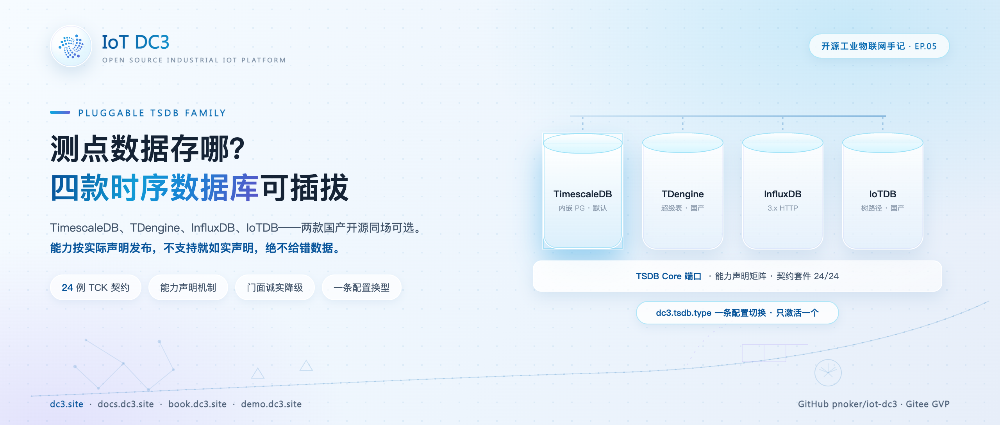
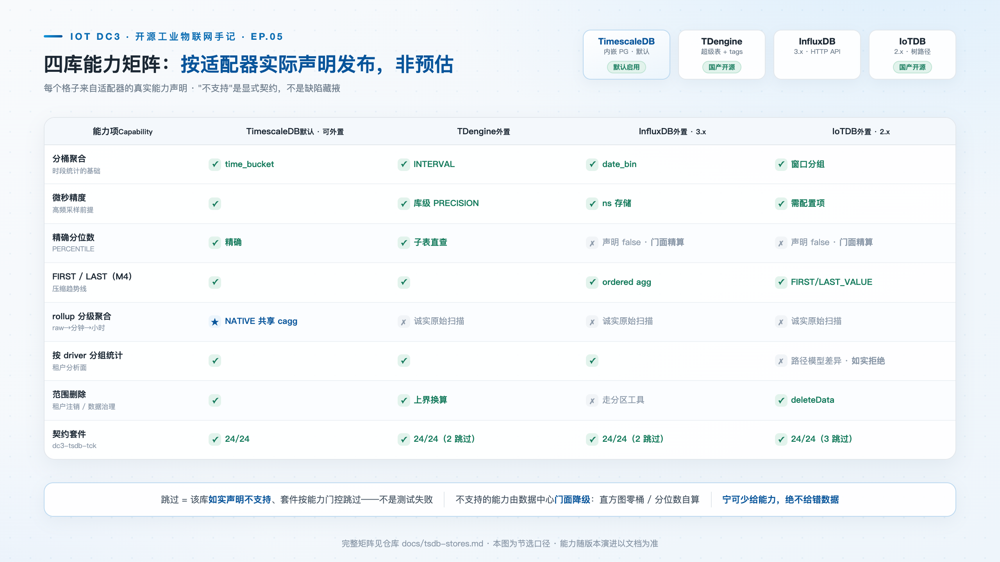
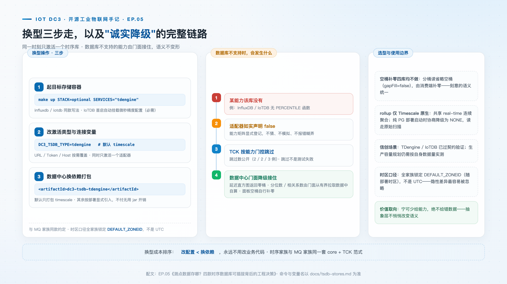

# 测点数据存哪？四款时序数据库可插拔背后的工程决策

> **摘要**：位号历史数据是 IoT 平台体积增长最快、查询模式最固定的数据。DC3 把时序存储做成与消息总线同构的可插拔家族：TimescaleDB（默认）、TDengine、InfluxDB、IoTDB 四款适配器，共用一套 24 例契约套件认证。本文讲端口承载了哪些语义、能力声明与诚实降级如何运作、换型三步怎么走，以及四库各自的定位与取舍。

**热点挂钩**：信创与国产数据库（TDengine / IoTDB）· 时序数据库选型长尾搜索
**建议发布**：第 3 周二 20:00
**配图**：`images/cover.png`（封面）、`images/tsdb-matrix.png`（四库能力矩阵）、`images/tsdb-swap.png`（换型路径与诚实降级）

---



时序数据库的选型讨论，多数聚焦在写入吞吐与压缩比的对比上。但对平台工程而言，存储选型的核心问题是另一个：**数据将以什么模式被查询**——按设备取最近趋势、跨设备做时段聚合，还是分析时多序列对齐。答案不同，合适的数据库就不同；而比"选错"更贵的，是"选完之后换不起"。

DC3 曾经就处在"换不起"的状态。抽象化改造之前，看板侧有十条语句直查 TimescaleDB 超表 SQL，其中一条还跨 schema 引用——任何换库动作都会让看板静默崩掉，因为 SQL 方言与存储细节从端口里泄漏得到处都是。改造后的时序层与消息总线（本系列上一篇）同构：`dc3-tsdb-core` 定义端口，`dc3-tsdb-timescale`、`dc3-tsdb-tdengine`、`dc3-tsdb-influxdb`、`dc3-tsdb-iotdb` 四个适配器各自对接一款数据库，`dc3-tsdb-tck` 是契约套件；配置项 `dc3.tsdb.type` 做选择，同时只激活一个。

## 端口：时序语义先于数据库

`dc3-tsdb-core` 里的 `TsdbStore` 接口是整个家族唯一的依赖入口，几个值得展开的设计决策都藏在它的方法签名里。

序列标识是一个三元组 `SeriesKey(tenantId, deviceId, pointId)`，只用数字 ID，名称在应用层富化。写入侧只有一个批量方法 `append`：存储级按（序列，时间戳）upsert，重复策略由适配器声明；**整批成功或整批失败，不存在部分接受**；超过适配器声明的 `maxAppendBatch` 由端口自动分块。而写入编排——schema 校验、摄入幂等窗口、最新值的关系 upsert——刻意留在数据中心，TSDB 适配器只负责历史数据。这一刀把"最新值"这个最难跨库统一的 OLTP 语义整个切出了抽象层。

每条样本携带**双时间戳**：设备采集时间与服务端接收时间。两者都存，接收延迟才可计算——延迟直方图不是靠事后猜的。样本还携带整型质量位（OPC UA 风格，0 为 GOOD），驱动可以标注 BAD 或 UNCERTAIN，历史查询按质量过滤留给应用层。

读取侧统一成一个过滤器形状：单序列、序列集合、全租户是同一形状的三个特例，不需要两套读原语。范围历史用游标分页，锚点是全局的（时间戳、序列、消息 ID）三元组，降序翻页不重不漏。所有读操作携带 deadline，超时抛出而非挂死——防的是失控扫描。

## 证据：24 例契约，四库同测

四款适配器要回答与消息队列家族同一个问题：**如何证明行为一致？** 答案也相同——`dc3-tsdb-tck` 中的 `AbstractTsdbContractTest` 定义 24 个与实现无关的契约用例，四个适配器分别继承同一套用例运行（每库一个 Testcontainers 实例）。几个有代表性的用例：

| 契约用例 | 验证的行为 |
| --- | --- |
| `appendReadbackPreservesEveryField` | 一条样本写入读回后**全字段逐位一致**：双时间戳、raw/cal/数值三元组、质量位、消息 ID、fencing token |
| `historyCursorPagesWithoutSkipOrDuplicate` | 游标翻完整窗口，不重不漏、时间降序 |
| `duplicateSeriesTimestampUpsertsLastWrite` | 同一（序列，时间戳）重复写入按声明策略去重，计数仍为 1 |
| `crossTenantReadsSeeNothing` | 向 A 租户的序列查询**绝看不到** B 租户写入的数据——租户隔离的反向测试 |
| `fiveThousandSampleBurstLandsComplete` | 5000 样本突发写入后计数精确等于 5000 |
| `bucketedAggregateAlignsEpochAnchoredBuckets` | 分桶按 epoch 整点对齐，不是按首样本对齐 |
| `rollupTierReadsStayConsistentWithRawScans` | 从 rollup 层读出的 COUNT/AVG/LAST 与原始扫描**逐位一致** |
| `percentileWithinDeclaredTolerance` | 声明支持 PERCENTILE 的库，P50 必须落在容差内 |
| `correlationDetectsKnownRelationships` | 完全相关序列 r > 0.99、无关序列 r < 0.5——相关系数不能"看起来对" |
| `deadlineGuardDoesNotHang` | 亚秒 deadline 下读取要么超时要么快速返回，绝不挂死 |

## 能力声明与诚实降级

时序抽象层最大的风险不是"功能缺失"，而是**抽象层隐式改变语义**——消息丢了肉眼可见，数字错了看起来仍然像对的。DC3 用一套三层的机制把这个风险变成显式契约。

第一层，适配器声明。每个适配器通过 SPI 的 `capabilities()` 返回一条 `TsdbCapabilities` 记录，十二个字段覆盖分桶补零、全租户扫描、精确分位数、延迟直方图、rollup 支持档位、范围删除、时间戳精度、乱序回填、相关系数等，启动时以能力协商日志打印成一行——与 MQ 端口同一个约定。

第二层，契约按能力门控。TCK 中依赖可选能力的用例用 `Assumptions.assumeTrue` 做前置检查：数据库不支持时用例**跳过而非失败**。当前的成绩单是 TimescaleDB 24/24 全过，TDengine 与 InfluxDB 各跳过 2 例，IoTDB 跳过 3 例——跳过数在选型文档（docs/tsdb-stores.md）里如实列出。跳过不是缺陷被掩盖，而是声明被验证。



第三层，门面诚实降级。数据库不支持的能力，由数据中心门面兜住而不是硬算：延迟直方图声明 false 时面板返回零桶；精确分位数与相关系数由门面从有界拉取的数据中自算，而不是逼适配器在 SQL 里凑一个不精确的近似值。

一句话概括这套机制的价值取向：**宁可少给能力，绝不给错数据。**



## 换型流程

适配器的装配由 Spring 条件注解驱动：每个适配器标注 `@ConditionalOnProperty(prefix = "dc3.tsdb", name = "type", havingValue = "...")`，只有 `dc3.tsdb.type` 匹配时才装配；TimescaleDB 适配器额外设置 `matchIfMissing = true`，不配置时默认启用。以切到 TDengine 为例：

**第一步，启动目标存储。** `make up STACK=optional SERVICES="tdengine"`（或 influxdb / iotdb）。IoTDB 首启会自动挂载微秒精度配置文件——这一步是必需的，不是可选项。

**第二步，改环境变量。** 在部署环境中：

```bash
DC3_TSDB_TYPE=tdengine        # 默认 timescale；另可选 influxdb / iotdb
DC3_TSDB_TDENGINE_URL=jdbc:TAOS-RS://dc3-tdengine:6041/   # 按需覆盖
```

InfluxDB 对应 `DC3_TSDB_INFLUXDB_URL` / `DC3_TSDB_INFLUXDB_TOKEN`，IoTDB 对应 `DC3_TSDB_IOTDB_HOST` / `DC3_TSDB_IOTDB_PORT`。

**第三步，Maven 侧把所选适配器加入数据中心依赖。** 与 MQ 家族同一个约定：默认适配器随服务打包，其余按需引入——没人应该为不用的存储付出 jar 体积与启动开销。回退同理，把变量改回 `timescale` 即可，业务代码零改动。

## 四款时序数据库的选型

抽象层保证"换得起"，选型仍要回答"选哪个"。四个适配器在序列模型上的差异，本身就是定位差异的缩影：

| 数据库 | 序列模型与定位 |
| --- | --- |
| **TimescaleDB**（默认） | 行列模型内嵌于主 PostgreSQL，与平台主库同源，运维成本最低；原生连续聚合支撑三级生命周期（原始 30 天 → 1 分钟层 1 年 → 1 小时层永久），Grafana 与平台读同一份物化 |
| **TDengine** | 超级表加 tags 加确定性子表（一个点位一张子表），压缩比与写入吞吐见长；时间戳全程走 epoch 微秒整数字面量——字符串形态会因时区解析漂移，这是适配器开发中实测踩过并锁死的坑 |
| **InfluxDB**（3.x） | v3 HTTP API 直连，行协议写入加 SQL CSV 读取，零客户端依赖；无行级删除，租户注销走分区工具，能力如实声明为 false |
| **IoTDB**（2.x） | Apache 顶级项目，树形路径模型与工业层级天然契合；driver 不是路径层，按驱动分组统计如实声明为不支持 |

一个务实的建议与 MQ 篇相同：没有明确理由时保持默认。当约束出现——信创要求、存量中间件资产、查询模式变化——退出成本接近于一次运维操作。

## 适用范围与限制

- 空桶补零四库均不支持，统一由消费端补零——这是有意的语义统一，不是遗漏；
- 能力矩阵以适配器声明为准，随版本演进更新，以 docs/tsdb-stores.md 为准；
- TDengine 与 IoTDB 适配已通过契约验证，生产规模的容量规划仍需按实际数据量测试；
- PERCENTILE 不进 rollup 层物化，永远走原始路径——分位数无法从分位数重组，这是数学边界而非工程取舍。

## 结语

回到开头的问题。这套抽象的价值不在于"支持四款时序数据库"这个数字，而在于它把两个工程风险转化成了已解决的问题：把"换库"从一次看板全崩的大规模迁移降级为一条环境变量；把"抽象层会不会悄悄给错数据"从评审时的主观担忧升级为 24 条契约加能力声明的机器验证。当"不支持"被如实声明而不是被近似值掩盖，存储选型才真正回归查询模式本身。

> **仓库**：GitHub [pnoker/iot-dc3](https://github.com/pnoker/iot-dc3) · Gitee [pnoker/iot-dc3](https://gitee.com/pnoker/iot-dc3)（GVP）
> **文档**：[docs.dc3.site](https://docs.dc3.site) · 时序选型 [docs/tsdb-stores.md](https://github.com/pnoker/iot-dc3/blob/main/docs/tsdb-stores.md) · [book.dc3.site](https://book.dc3.site) · [demo.dc3.site](https://demo.dc3.site)
