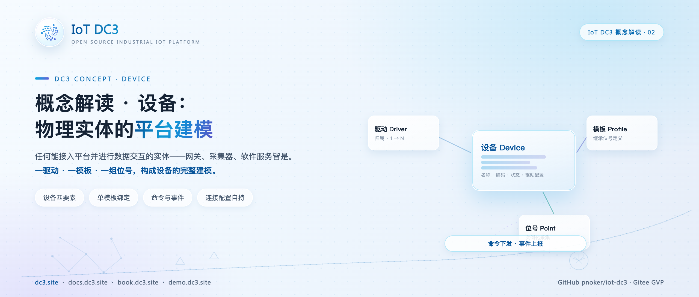
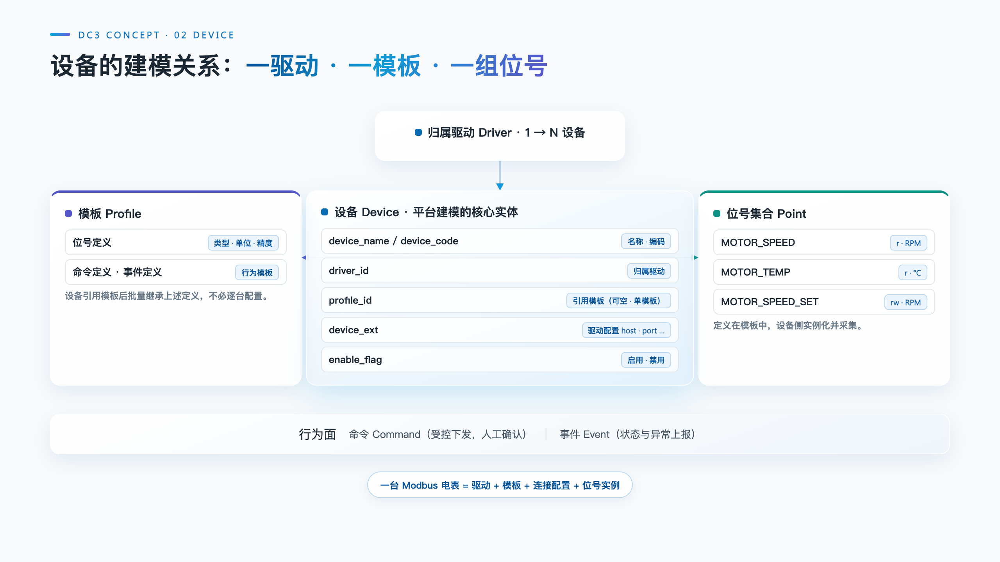

# IoT DC3 概念解读：设备——物理实体的平台建模

> **摘要**:设备(Device)是 DC3 四个核心实体中唯一对应现实世界具体物件的概念:现场一台 PLC、一个温控器、一块电表,接入平台后各自对应一个设备。本文拆解这一概念的建模方式——设备的定义与"镜像"本质、四要素(归属驱动、驱动配置属性、位号集合、命令与事件)、设备与驱动模板位号的关系、启用禁用与在线离线两类生命周期状态,并以一台 Modbus 电表为例走完建模全程。

**热点挂钩**:DC3 概念解读系列(与手记系列互补)
**建议发布**:概念解读系列,可单独发布
**配图**:`images/cover.png`(封面)、`images/device-model.png`(设备的建模关系)

---

接入平台的最终目的,是让现场那台机器的数据可以被平台读写。驱动解决了"怎么连"——协议通道在驱动里;但要连的对象,必须先在平台里有一个身份,这个身份就是设备。DC3 的四个核心实体中,驱动、模板、位号都是平台侧的构造,唯独设备对应现实世界里一件件具体存在的东西。本文是概念解读系列的第二篇,讲设备这一层建模。

## 设备的定义:现场实体的平台镜像

设备是现场一台具体设备在平台里的镜像。这个定义包含两层限定。

其一,设备是具体的。某型号温控器"应该有温度、湿度两个位号"是模板的事;车间里编号 TC-001 的那一台、此刻在线、刚上报 25.3 摄氏度的温度读数,才是一个设备。设备不是类型定义,也不是数据本身,而是"那一台"在平台里的数字化身份。

其二,镜像不挑剔形态。接入平台并进行数据交互的实体,都可以建模为设备——除了硬件,网关、软件程序乃至数据库都可以。数据桥接类驱动接入的对象就是 MySQL、PostgreSQL 这样的既有数据源:把它们建模为设备之后,"从哪台机器采数"与"从哪个库取数"在平台里是同一种管理动作。判断标准不是物理形态,而是是否作为一个独立的数据交互单元被平台管理。

落到存储上,设备是 `dc3_device` 表的一行:设备名称与设备编码在租户内唯一,归属驱动 `driver_id`,归属模板 `profile_id`,外加启用标志、JSON 扩展字段与租户标识。

## 设备的四要素

一台设备要在平台里完成建模,需要四样配置:归属驱动、驱动配置属性、位号集合、命令与事件。这套结构在设备编辑页上对应设备信息、驱动属性、位号属性、命令能力、事件能力五个配置页签。

**归属驱动**回答"怎么通信"。`driver_id` 把设备挂到唯一一个驱动下,由这个驱动完成全部协议读写。模板决定"有哪些能力",驱动决定"怎么通信",两者缺一不可。

**驱动配置属性**保存连接参数。驱动注册时声明自己需要哪些配置项——Modbus TCP 驱动声明 host 与 port;设备按这份声明填入自己的取值,host 填电表地址,port 默认 502。声明属于驱动,取值属于设备:一百台同型号设备共享同一份声明,各存各的地址。

**位号集合**来自模板。设备不逐个新建位号,而是引用一个模板,批量继承模板下的位号定义——数据类型、读写标志、单位、精度、倍率;位号级的协议配置(从站号、功能码、寄存器偏移)再逐点位保存在设备上。

**命令与事件**同样定义在模板上:命令(Command)分自定义、配置、动作三类,事件分信息、告警、故障、生命周期四类;设备保存的,是执行命令、解析事件所需的驱动映射参数。

驱动侧的运行时元数据印证了这套结构:设备业务对象携带归属驱动、归属模板、位号标识集合、驱动属性配置映射、位号属性配置映射,以及命令与事件的运行定义——四要素在进程内被组装成同一份设备描述。

## 设备、驱动、模板、位号的关系

四个实体的关系可以概括成一条链:Driver(驱动)→ Device(设备)→ Profile(位号模板)→ Point(位号)。设备是链上的枢纽:向上挂在一个驱动下,取得通信通道;向下引用一个模板,取得能力模型。

模板与设备的关系近似类与实例:一个模板可被许多设备复用,一百台同型号温控器共用一个模板的位号定义;而一个设备只归属一个模板——早期的多模板绑定已在模板改造中收敛为单归属,`profile_id` 是单值而非集合。

定义与取值的分离贯穿这条链。模板定义"电压是什么"(类型、单位、精度、倍率),设备决定"电压从哪里读"(从站号、功能码、寄存器偏移);模板定义"分闸是哪个命令、带什么参数",设备决定"分闸映射到哪个寄存器"。由此得到直接的工程收益:同型号设备批量接入时,模板只建一次,每台设备只填自己的连接配置与位号地址;更换驱动时,模板与位号的语义定义可以保留,重填的只是驱动属性与位号属性。

设备在运行期产生的数据同样锚定在这条链上:位号值以设备标识与位号标识对来归属,命令与事件的执行、上报记录也落到具体设备。历史数据因此始终能追溯到"哪一台设备上的哪个位号",告警与控制随之有了明确的落点——这是设备作为镜像存在的最终意义。

## 设备生命周期:启用禁用与在线离线

设备有两类相互独立的状态。

一类是配置态的启用与禁用(`enable_flag`)。停用的设备保留全部配置与数据,但不参与采集:设备归属分配只统计启用的设备,停用即从采集范围摘除,重新启用即可恢复。这与运行态互不干扰——一台停用的设备同样可以被编辑、被查询。

另一类是运行态的在线状态,取值为在线、离线、维护、故障四档。它的设计要点在于状态与元数据分离:在线状态不是 `dc3_device` 表上的字段,而是一份独立的运行态租约,事实源在 `dc3_entity_state` 状态表。机制是心跳续租加超时维护——驱动按配置周期对设备做健康检查并上报,数据中心把租约期限顺延、租约版本递增;扫描器周期唤醒,把租约已过期却仍标记在线的设备批量判为离线。设备健康的判定以协议视角为准,例如 Modbus 驱动以连接是否完成初始化来判定设备在线与否。把心跳写进设备元数据表会污染配置数据,这正是分离的原因:查"这台设备是谁"看 `dc3_device`,查"它现在通不通"看状态表。进程崩溃来不及上报的设备,也会在租约过期后被扫描器翻为离线。设备的删除同样不物理清除数据,而是逻辑删除标记。

## 建模实例:一台 Modbus 电表

以一台支持 Modbus TCP 的电表为例,建模分三步。

第一步建模板:为这个型号建一个模板,定义位号——电压(FLOAT 型、单位 V、倍率 0.1)、电流(FLOAT 型、单位 A)、正向有功电能(LONG 型、单位 kWh);需要远程控制时定义命令,例如分合闸;需要被动感知时定义事件,例如失压事件。

第二步建设备:创建设备,归属 Modbus TCP 驱动、引用该模板,在驱动属性配置里填 host 为电表地址、port 为 502。至此设备完成身份声明:能力来自模板,通道来自驱动。

第三步配位号:在位号属性配置里逐点位填从站号、功能码与寄存器偏移——电压指向电压寄存器,电能指向电能寄存器;分合闸命令同理,映射到指定的保持寄存器。配置保存时,驱动侧的配置校验会检查必填项与取值范围:Modbus 驱动要求 slaveId、functionCode、offset 必填,功能码只接受 1 到 4,错误在保存阶段即被拦下,而不是留到采集阶段才暴露。

此后链路自动运转:驱动按调度周期(默认配置为 30 秒)读寄存器,SDK 按位号定义完成倍率换算与精度处理,以统一的位号值发往数据中心;设备健康检查按默认配置每 15 秒执行一次、租约 45 秒,持续维持在线状态。第二台同型号电表接入时,不再建模板,只重复第二、三步。

## 适用范围与限制

- **配置不跨驱动移植。**驱动属性与位号属性的取值都按驱动的声明结构存储,更换驱动意味着重填全部连接与位号配置,模板与位号的语义定义可以保留;
- **单模板归属。**一台设备只引用一个模板,型号混杂的现场应按型号分建模板;
- **命令与事件的定义在模板上。**设备只做参数映射,不经模板的设备私有命令不在当前建模口径内;
- **主动上报型设备需选服务端模式驱动。**设备主动接入平台(而非被轮询)的场景,应选择服务端模式运行的驱动,连接方向与客户端模式相反。

## 结语

设备建模的本质,是把"现场一台机器"翻译成"平台一行元数据、一份连接配置、一组从模板继承的位号语义"。四要素回答"一台设备由什么构成",两类状态回答"它是否被采集、此刻是否在线",模板与实例的分离则回答"一百台同型号设备为什么只需要建一次模板"。驱动给了设备通信的通道,模板给了设备能力的定义——模板与位号自身的概念,是本系列后续的主题。

---

PROMO_CARD

**IoT DC3** · [GitHub](https://github.com/pnoker/iot-dc3) | [Gitee](https://gitee.com/pnoker/iot-dc3) | [文档 docs.dc3.site](https://docs.dc3.site) | [在线书 book.dc3.site](https://book.dc3.site) | [演示 demo.dc3.site](https://demo.dc3.site) | [官网 dc3.site](https://dc3.site)
