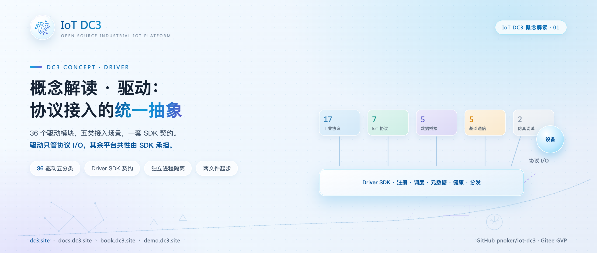
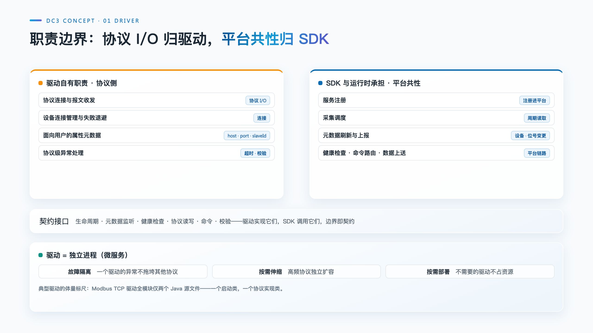

# IoT DC3 概念解读：驱动——协议接入的统一抽象

> **摘要**:驱动(Driver)是工业物联网平台里被引用最多、也最容易被误解的概念:它不是设备说明书,不是驱动安装包,更不是业务逻辑的容器。本文按 DC3 现行代码与文档拆解这一概念——驱动的定义、职责边界、36 个驱动的五分类组织、Driver SDK 的能力接口契约、独立进程的工程含义,以及新增一个驱动的完整路径。

**热点挂钩**:DC3 概念解读系列(与手记系列互补)
**建议发布**:概念解读系列,可单独发布
**配图**:`images/cover.png`(封面)、`images/driver-position.png`(驱动的职责边界)

---

"驱动"一词承自操作系统语境:一组面向特定硬件的软件,让上层程序不必关心硬件细节。工业物联网平台借用了这个比喻,却无法沿用其语境——设备不在机箱插槽里,而是散落在车间、管网与野外,说着几十种互不兼容的协议。于是在 IoT 平台里,"驱动"必须被重新定义一次,而这次定义的质量,决定了整个接入层的形态。

DC3 用四个核心实体组织接入层:Driver(驱动)→ Device(设备)→ Profile(位号模板)→ Point(位号)。驱动是这条链的起点,协议差异被封装在它之内;它之上的三个实体,看到的都是同一种抽象。本系列逐篇解读这四个概念,从驱动开始。手记系列第 02 篇曾从协议碎片化的实践角度拆解过驱动仓库;本文换一个视角,把"驱动"本身的定义、边界与契约讲清楚。

## 驱动的定义

通用意义上的驱动,是实现上层应用与物理设备交互的软件组件:负责一种(或一族)协议的连接建立、报文收发与异常处理,把设备侧的寄存器、点位与报文,翻译成平台侧统一的读写语义。

在 DC3 中,这个概念有一个精确的形态:**每个驱动是 `dc3-driver/` 目录下的一个 Maven 模块,打包为独立部署的微服务,一类协议对应一个模块**。以 Modbus TCP 驱动为例,整个模块只有两个 Java 源文件——一个 Spring Boot 启动类,一个实现驱动能力接口的协议服务类;启动类不含协议代码,协议类不含平台代码。

驱动同时存在于两个层面。在管理中心的数据库里,它是 `dc3_driver` 表的一条记录:驱动名称、驱动编码、服务名、服务地址、类型标志、归属租户,其中驱动编码在租户内唯一。在运行环境里,它是一个进程:持有设备连接、响应读写调度、上报健康状态。**一行元数据加一个进程,构成 DC3 语境下驱动的完整定义。**由此也引出驱动与设备的分工:设备只描述"接入了什么",真正握着协议会话、按周期采集的,是驱动这个进程。一个 Modbus TCP 驱动可以同时承载一个车间的全部 Modbus 仪表——驱动是一对多的协议网关,设备是挂在它下面的接入点。

## 驱动的职责边界

DC3 对驱动的约束写在驱动仓库的说明里:**驱动只拥有协议 I/O 与面向用户的属性元数据,其余一概不属于它。**属性元数据指的是"这个驱动能接受哪些配置项"的声明——Modbus TCP 驱动声明它需要 host 与 port,这是配置项的定义;某台设备具体填什么地址,由设备侧的连接配置承载,与驱动无关。

反过来逐项排除,驱动的"不是"包括:

- **不含业务逻辑。**告警判定、规则计算、数据存储、面向数据的 AI 赋能分析,都在平台侧服务中,驱动进程里没有这类代码;
- **不做数据加工。**驱动读回的是原始值,位号定义中的倍率与基值换算、精度处理,由 SDK 在数据送出前统一完成;
- **不管理租户与权限。**SDK 调用驱动读写之前,已经解析完元数据、配置与租户范围,驱动收到的是"读这台设备的这个位号";
- **不自建调度。**采集周期、健康检查、命令接收,全部由 SDK 的定时任务与消息接收器驱动。

这条边界是结构必需:36 个驱动若各自携带调度、消息与租户逻辑,就是 36 个维护分叉;边界收得越窄,驱动的数量才可以越多。

## 五分类:36 个驱动的组织方式

`dc3-driver/` 下的 36 个驱动模块按接入场景分五类:**工业协议 17、IoT 协议 7、数据桥接 5、基础通信 5、仿真调试 2**。工业协议面向存量现场——Modbus TCP / Modbus RTU、OPC UA / OPC DA、西门子 S7、BACnet/IP、EtherNet/IP、欧姆龙 FINS、三菱 MELSEC、IEC 60870-5-104、IEC 61850、DNP3、DLMS、DLT645、KNX、M-Bus、SL651。IoT 协议面向无线低功耗的新增部署——MQTT、CoAP、LwM2M、HTTP、BLE、Zigbee、LoRaWAN。数据桥接接入的是既有数据源而非设备——MySQL、PostgreSQL、Oracle、SQL Server、Redis。基础通信提供私有协议与网络管理的底座——TCP/UDP、Serial、SNMP、CAN、Kafka。仿真调试不接真设备——Virtual 与 Listening Virtual,按位号类型生成随机值,用于链路自测与上手练习。

分类之外另有一组工作模式的区分。驱动类型分四档:客户端模式(DRIVER_CLIENT)由驱动主动连接设备,Modbus TCP 的轮询采集属于此类;服务端模式(DRIVER_SERVER)由驱动监听、设备主动接入,MQTT 驱动即以服务端模式运行;另有网关(GATEWAY)与连接(CONNECT)两类。同一个"驱动"概念覆盖两种相反的连接方向,这也是它被称为"统一抽象"而非"统一实现"的原因。

## Driver SDK:驱动与平台的契约

驱动与平台之间的全部关系,由 `dc3-common-driver` 模块的 Driver SDK 约定,契约可以概括为一句话:**驱动实现能力接口,平台共性由 SDK 承担。**

接口层面,SDK 提供聚合接口 `DriverCustomService`,组合了七个能力接口:生命周期(启动初始化与自定义周期任务)、元数据监听(设备与位号的增删改事件)、驱动健康与设备健康(两级健康检查)、协议读写(read / write)、命令执行、配置校验(校验属性配置并生成确定性仿真值)。功能完整的驱动实现聚合接口;只需要部分能力的驱动,可以只挑小接口实现——多数能力接口带有默认实现,最小驱动甚至只需实现读写。

SDK 承担的平台共性包括:启动注册,进程启动即携带身份与属性声明向管理中心登记,失败按指数退避自动重试;调度,采集、健康、自定义三类定时任务按配置周期驱动;元数据缓存,设备与位号的变化通过消息事件刷新驱动内存缓存;数据分发,读到的值经换算发往消息通道,断链时先落本地缓冲、恢复后续传;健康上报,驱动级与设备级状态周期续租,超时由数据中心扫描兜底。

Modbus TCP 驱动是这份契约的现成标尺:两个源文件之外再无其他 Java 代码。协议实现类维护设备连接缓存,校验 host、port 与 slaveId、functionCode、offset 配置,按功能码 1–4 读线圈与寄存器、按功能码 1 / 3 写线圈与保持寄存器;一个务实的细节是,同一设备连续 3 次连接失败后进入 60 秒退避,避免一台不可达设备拖垮整个调度周期。

## 独立进程:故障隔离与按需伸缩

"每个驱动是独立部署的微服务"包含两层工程含义。第一层是故障隔离:一个驱动进程里的连接泄漏、内存异常或协议栈崩溃,被限制在自己的进程内,不会顺着调用链拖垮其他协议的采集,最坏结果是这一种协议的设备离线。第二层是按需伸缩:同一驱动可以多副本部署,`dc3_driver_instance` 表记录每个运行副本的节点标识、租约期限与心跳时间,设备按租约分配给唯一的副本,租约附带单调递增的 fencing token,防止已失联的旧副本继续读写设备。容量因此可以按协议分配:Modbus 设备多的现场多起几个 Modbus 副本,其余协议不受影响;不参与部署的驱动不占任何运行资源。

驱动自身的在线状态遵循同一套租约逻辑:心跳在 `dc3_entity_state` 状态表中续租,到期未续即判定离线,状态取值为在线、离线、维护、故障四档。在线状态从不写进 `dc3_driver` 元数据表——进程崩溃或网络断开后,租约自然过期翻为离线,不需要任何进程"善后"。

## 新增一个驱动的路径

协议世界永远比驱动仓库长得快,"长出一个新驱动"的成本因此是接入层设计的关键指标。在 DC3 中,路径固定为三步:

1. **实现协议 I/O。**新建依赖 Driver SDK 的模块,实现聚合接口(或只挑需要的能力接口),完成连接管理与报文解析;
2. **声明元数据。**在模块配置文件中声明驱动编码、类型、驱动级与位号级属性(编码、类型、默认值)以及调度与健康的默认周期;
3. **打包部署。**打成容器镜像、启动进程,驱动自动向管理中心注册,属性声明随注册入库,立即可被统一管理。

三步之内,不碰调度器、不碰消息发送、不碰租户逻辑,工作量边界回到协议本身。需要留意:驱动编码是元数据与消息路由的锚点,投入使用后变更编码需要同步迁移元数据与路由。

## 适用范围与限制

- **成熟度有差异。**仓库说明中标注"进行中"的八个驱动(CAN、DLMS、EtherNet/IP、IEC 104、LwM2M、MQTT、OPC DA、Zigbee)协议 I/O 尚不完整,生产使用前需核对实现;选型时先用 Virtual 驱动验证链路,再接真实设备;
- **SDK 不消除协议复杂度。**加密规约、私有扩展与厂商方言仍是驱动开发者的工作,SDK 解决的是工程结构问题;
- **清单以仓库为准。**驱动清单以 `dc3-driver/` 目录为准,新驱动持续增加,36 这个数字会过时。

## 结语

驱动概念的要义可以收拢为三条不变量:统一的抽象,只做协议 I/O 与属性元数据;独立的进程,兑现故障隔离与按需伸缩;清晰的契约,能力接口之外皆由 SDK 承担。协议会继续碎片化,驱动清单会继续变长,但这三条让"第 37 个驱动"始终只是一个协议实现的工作量。驱动回答了"怎么连";连进来的对象如何被平台建模,是本系列下一篇"设备"的主题。

---

PROMO_CARD

**IoT DC3** · [GitHub](https://github.com/pnoker/iot-dc3) | [Gitee](https://gitee.com/pnoker/iot-dc3) | [文档 docs.dc3.site](https://docs.dc3.site) | [在线书 book.dc3.site](https://book.dc3.site) | [演示 demo.dc3.site](https://demo.dc3.site) | [官网 dc3.site](https://dc3.site)
