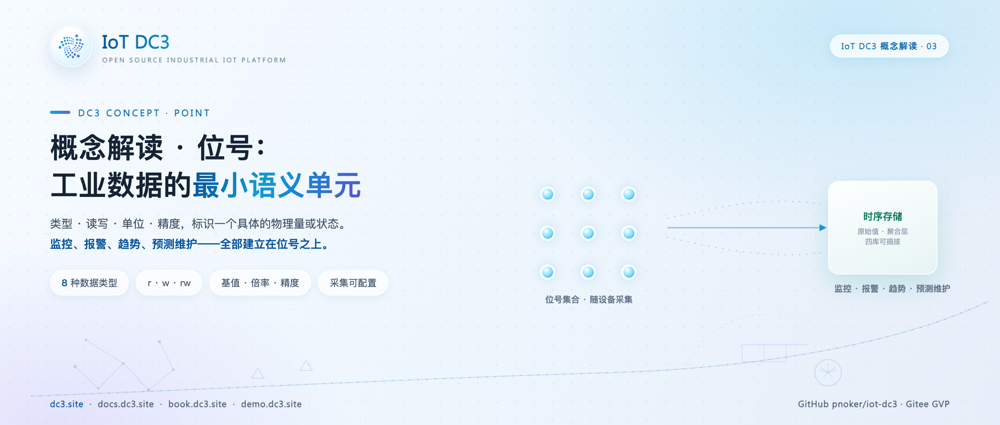
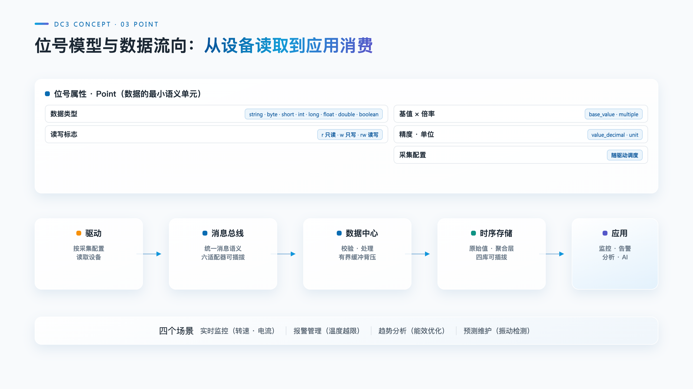

# IoT DC3 概念解读：位号——工业数据的最小语义单元

> **摘要**：转速、电流、温度、振动，设备产生的一切数据在平台里都落到同一个概念上：位号（Point）。本文给出位号的定义与各系统的别称，划清位号与位号值、位号与命令的边界，拆解数据类型、读写标志、单位与换算、采集配置四个构成要素，沿"驱动读取、消息总线、数据中心、时序存储、应用消费"还原一个位号值的完整旅程，并以一台电机的位号表收束。

**热点挂钩**：DC3 概念解读系列（与手记系列互补）
**建议发布**：概念解读系列，可单独发布
**配图**：`images/cover.png`（封面）、`images/point-model.png`（位号模型与数据流向）

---

一台电机接入平台之后，被订阅、被计算、被存储的并不是"这台电机"本身，而是它的转速、电压、电流、温度、振动这一组量。平台要管理这些量，需要一个最小单元：既标识"这是哪类设备的哪个量"，又携带"这个量怎么读、怎么算、怎么存"的全部约定。在 IoT DC3 中，这个单元叫位号（Point），表 `dc3_point` 中的一行记录就是一个位号。

## 位号的定义与别称

位号是一类设备身上要采集或写入的一个具体的量，是平台中数据的最小语义单元。一个位号对应设备的一个可读或可写的参数，携带名称、编码、数据类型、读写标志、单位与换算、采集配置，定义归属于某个模板与租户。

这个概念在不同系统里各有名字：SCADA 与 DCS 称 Tag（标签），PLC 编程语境称 Variable（变量），OPC UA 称 Node（节点），信号处理语境称 Signal（信号）；中文资料里常见数据点、测点、点位。名称不同，所指一致：设备数据世界里不能再细分的那一格。DC3 统一用 Point。

两个边界需要先划清。其一，位号不等于位号值（PointValue）。位号是定义，回答叫什么、什么类型、能不能写、单位是什么，稳定不变；位号值是某台设备某时刻的瞬时取值，随采集不断变化。借用官方文档的类比：模板是一张表格的表头，位号是其中一列，位号值是某台设备填进这一列的单元格。其二，位号不等于命令（Command）。位号是"量"，命令是"动作"，重启、校准、切换模式属于命令；一个位号能不能写，唯一取决于它自身的读写标志，与命令表无关。

## 位号的四要素

一个位号的语义由四组字段决定，均取自 `dc3_point` 的实际结构。

**数据类型（pointTypeFlag）。** 八种：string、byte、short、int、long、float、double、boolean，不显式配置时默认 string。类型不是展示格式，而是读取管线的转换契约：驱动读到原始字节或字符串后，按声明类型换算与校验，类型不匹配在读取阶段报错，不会把脏值送进存储。

**读写标志（rwFlag）。** 三档：r 只读（默认）、w 只写、rw 读写。转速反馈是 r，目标转速给定是 w，既可读回又可下发的量是 rw。这一标志是写路径的闸门：写命令下发前要经过读写标志校验，只读位号收到的写请求会被直接拒绝。

**单位、精度与换算（unit、valueDecimal、baseValue、multiple）。** unit 是工程单位的自由文本；valueDecimal 声明小数位数，浮点值按此保留，默认 6 位；baseValue（基值，默认 0）与 multiple（倍率，默认 1）构成线性换算：工程值 = 原始值 × multiple + baseValue。现场仪表上报的常是裸值：温度变送器寄存器读数 2531，配 multiple = 0.01、valueDecimal = 2，存入的就是 25.31 ℃。换算配置在位号上，调整量程不必改任何驱动代码。

**采集配置。** 位号本体回答"是什么"，怎么读由驱动的位号级属性与配置值共同决定：驱动在 `dc3_point_attribute` 表声明需要哪些位号级属性（编码、类型、默认值），具体值存在 `dc3_point_attribute_config` 表，粒度为"租户 + 设备 + 位号 + 属性"。以 Modbus TCP 驱动为例，每个位号需配 slaveId（从站号）、functionCode（功能码）、offset（偏移量）：功能码 1–4 分别读取线圈、离散输入、保持寄存器、输入寄存器，写入走功能码 1 与 3。另有 pointExt 扩展字段，承载协议映射、约束、采集策略等附加配置。

四要素凑齐，一个位号才真正可用：类型与换算让它成为数，读写标志决定方向，采集配置告诉驱动去设备上的哪里取。

## 数据流向：从设备读取到应用消费

一个位号值的旅程是一条单向链路，各段职责分明。

**驱动按调度读取。** 驱动服务内的定时任务周期扫描设备，设备内逐位号串行、设备之间并行；一台设备可读的条件是已启用、已绑定模板、位号集合非空、驱动级与位号级配置齐全。Virtual 仿真驱动是这条链路的最小演示：字符串位号产生随机串，布尔位号产生随机真假值，数值位号在 0 到 100 之间取随机数。类型决定值的形态，其余链路完全一致。

**读取结果经换算后进入消息总线。** 位号值以统一语义发布到消息主题，由驱动发往数据中心；消息中间件本身可插拔，六种适配器支撑同一套消息语义，更换 broker 不改业务代码。

**数据中心批量消费。** 数据中心按吞吐导向的批量模式消费位号值，完成校验处理后保存，消费受阻时按缓冲与背压机制处理，不无限堆积。

**时序存储。** 位号值最终写入时序数据库，四款适配器可插拔（手记系列第 05 篇）。历史表 `dc3_point_value` 同时保留 raw_value（原始值）与 cal_value（换算后的工程值），以"设备 + 位号 + 时间"组织，历史查询按位号检索。

**应用消费。** 监控看板按位号实时展示，告警规则挂在位号上，趋势分析与 AI 赋能的分析工具同样以位号为句柄访问数据。

写路径与读路径对称：应用的写命令经数据中心校验读写标志后下发到驱动，驱动按采集配置写入设备。位号定义本身变更时，元数据变更事件经消息总线广播到各驱动实例，驱动刷新本地缓存，采集端与应用端始终面对同一个定义。

## 四个应用场景

**实时监控。** 电机的转速与电流持续刷新到看板，操作人员看到的是有名称、有单位、有精度的物理量，而非一串寄存器地址。类型与换算配置保证了上屏的数可以直接读。

**报警管理。** 温度位号挂上阈值规则，超过 100 ℃ 触发高温报警。规则只需声明"哪个位号、什么条件"，不必关心这个位号来自 Modbus 还是 OPC UA。报警语义建立在位号层，与协议解耦。

**趋势分析。** 转速位号的历史曲线用于分析工况与优化控制：升速阶段的爬坡形态、稳态时的波动幅度，都来自同一位号的时序数据。分析结论落到控制上，目标转速位号的写值就是执行通道。

**预测维护。** 振动位号的采样数据用于检测轴承磨损：磨损加剧时，振动幅值的变化先于停机故障出现。预测模型的输入是位号历史序列，输出是维护建议。AI 辅助分析，处置仍需人工确认。

四个场景分别对应展示、告警、分析与预测四类消费方式，共同点是只面对位号，不面对设备与协议细节。

## 一台电机的位号表

以编号 MOTOR_001 的电驱动机为例，一组典型位号定义如下：

| 位号编码 | 名称 | 类型 | 读写 | 单位 | 用途 |
| --- | --- | --- | --- | --- | --- |
| MOTOR_001_SPEED | 转速 | float | r | RPM | 运行转速反馈 |
| MOTOR_001_TARGET_SPEED | 目标转速 | float | w | RPM | 控制给定值 |
| MOTOR_001_VOLTAGE | 电压 | float | r | V | 端电压 |
| MOTOR_001_CURRENT | 电流 | float | r | A | 定子电流 |
| MOTOR_001_TEMPERATURE | 温度 | float | r | ℃ | 绕组温度 |
| MOTOR_001_VIBRATION | 振动 | float | r | mm/s | 轴承振动速度 |
| MOTOR_001_FAULT_CODE | 故障代码 | string | r | — | 变频器故障码 |

七个位号构成这台电机的完整数据面：监控看板订阅前六个，报警规则挂在温度与振动上，趋势分析消费转速历史，预测维护聚焦振动，故障代码支撑停机归因。若设备经 Modbus TCP 接入，每个位号再各自配上从站号、功能码、偏移量。语义与连接至此分离：换成另一种协议的同型电机，位号表原样保留，只有采集配置换一套。这正是手记系列第 02 篇"协议可以碎，接入模型不能碎"落到单个位号上的形态。

## 适用范围与限制

- **位号必须归属于模板。** `dc3_point` 的 profileId 为必填，不存在脱离模板的位号；位号编码在租户与模板内唯一，跨模板可重名（模板机制见本系列下一篇）；
- **换算只覆盖线性关系。** 基值与倍率仅做线性映射，查表、分段、曲线标定类的量需在设备侧或自定义驱动内完成；
- **字符串位号不参与数值换算。** 精度与换算仅作用于数值与布尔类型，字符串位号原样透传，不适用于趋势图等数值消费场景；
- **默认类型是字符串。** 新建位号不配置时按 string、只读、无换算处理，采集数值量需显式改为对应类型并配置换算，否则按字符串原样存储。

## 结语

工业数据的价值不在数量，而在每个数都有确切的语义。位号把"是什么、什么类型、什么方向、什么单位、去哪里读"压缩进一个可管理的单元，让监控、报警、分析与预测维护建立在同一个句柄之上。理解位号，就理解了 DC3 数据链路的起点；位号如何被批量定义、一次变更全局生效，答案在模板——本系列下一篇的主题。

---

PROMO_CARD

**IoT DC3** · [GitHub](https://github.com/pnoker/iot-dc3) | [Gitee](https://gitee.com/pnoker/iot-dc3) | [文档 docs.dc3.site](https://docs.dc3.site) | [在线书 book.dc3.site](https://book.dc3.site) | [演示 demo.dc3.site](https://demo.dc3.site) | [官网 dc3.site](https://dc3.site)
