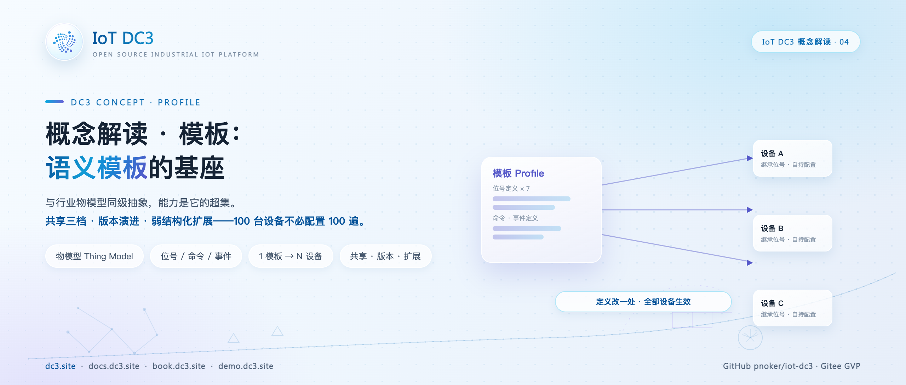
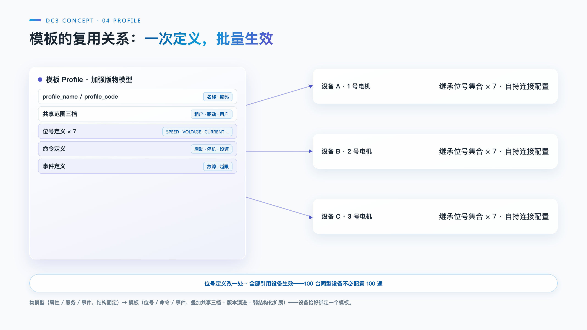

# IoT DC3 概念解读：模板——语义模板的基座

> **摘要**：接入 100 台同型号传感器，不该把能力定义重复配置 100 遍。模板（Profile）是 IoT DC3 对"一类设备有哪些能力"的回答：与行业通行的物模型同级，但能力更强——三类能力聚合、三档共享范围、显式版本演进与弱结构化扩展。本文从复用问题出发，拆解模板承载的位号、命令与事件，对比"大而全"与"按关注点拆分"两种建模思路，并澄清一个关键约束：一台设备恰好绑定一个模板。这套以模板为骨架的完整建模体系，DC3 命名为语义模板（Semantic Profile）。

**热点挂钩**：DC3 概念解读系列（与手记系列互补）
**建议发布**：概念解读系列，可单独发布
**配图**：`images/cover.png`（封面）、`images/profile-reuse.png`（模板的复用关系）

---

任何一个设备管理平台都要回答同一个问题：一类设备能采什么、能控什么、会报什么。行业的通行答案是物模型（Thing Model），以产品为单位聚合属性、服务与事件。IoT DC3 的答案是模板（Profile），表 `dc3_profile` 中的一行记录就是一份能力模板。两者是同级抽象，但模板是加强版：物模型能表达的，模板都能表达，反之未必。这一以模板为骨架、聚合位号/命令/事件、由设备单一绑定构成的完整建模体系，DC3 命名为语义模板（Semantic Profile）。

## 为什么需要模板

想象接入 100 台同型号的温湿度传感器 ZS-100。如果每台设备都单独配置温度位号、湿度位号、校准命令（Command）与故障事件（Event），那就是 100 份重复劳动，修改一处要改 100 次。模板把能力定义从设备实例中抽出来，沉淀成一份可复用的模型：位号、命令、事件定义在模板上，设备只引用模板。100 台传感器共享同一份定义，能力变更只发生在模板这一处。

类比产品与实物：模板像产品说明书、出厂规格，设备像按这份规格出厂的实物。说明书写一遍，实物可以造很多台；规格升级，后续出厂的实物自然带着新规格。

## 模板与物模型：同级抽象，更强能力

模板与物模型都回答"一类设备有哪些能力"，差异在平台化能力的叠加：

| 维度 | 物模型（行业通用） | 模板 Profile（DC3） |
| --- | --- | --- |
| 能力聚合 | 属性 / 服务 / 事件，结构固定 | 位号 / 命令 / 事件 |
| 复用范围 | 通常按产品固定 | 共享范围三档：租户 / 驱动 / 用户 |
| 版本演进 | 一般无显式版本 | version 显式版本，可查询、随更新递增 |
| 扩展方式 | 结构相对固定 | profileExt 弱结构化扩展 |
| 创建来源 | — | 系统 / 驱动 / 用户三档 |
| 设备绑定 | 视实现而定 | 恰好绑定一个（单一外键） |

几个"更强"都有对应的字段支撑。共享范围（profileShareFlag）分三档：tenant 租户内共享、driver 驱动内共享、user 用户私有，一份模板能被谁复用由此控制，而不是被产品边界锁死。创建来源（profileTypeFlag）分三档：system 系统内置、driver 驱动创建、user 用户创建，驱动注册时可以自带模板。version 随每次更新自动递增，并作为乐观并发控制的条件，并发修改冲突会被拒绝，版本号本身还可作为查询条件。profileExt 是 JSON 弱结构化扩展字段，可承载类别、标签等附加信息，不必为每类新诉求改表结构。

## 模板承载的三类能力

模板聚合位号、命令、事件三类能力，分别回答"能采什么、能控什么、会报什么"。

位号是数据面的能力，挂在 `dc3_point` 表，归属字段 profileId 必填，位号编码在租户与模板内唯一。命令是动作面的能力，挂在 `dc3_command` 表，分自定义、配置、动作三类，调用分同步与异步，超时以秒为单位，默认 30 秒；输入输出参数在 `dc3_command_param` 表单独定义，包括方向（输入/输出）、类型、是否必填与默认值。事件是上报面的能力，挂在 `dc3_event` 表，分信息、告警、故障、生命周期四类，级别分低、中、高、严重四档；事件参数在 `dc3_event_param` 表定义。三类能力的编码都在"租户 + 模板"范围内唯一。

需要澄清的是聚合与拥有的区别：模板不存储任何一类能力的数据，它只是归属根——位号、命令、事件都是独立实体，靠各自的 profileId 外键挂回模板。模板对象上没有位号列表这类字段，查询"这个模板有哪些能力"要分别查三张表。位号的运行态数据更与模板无关：位号值按设备与位号落库，属于设备实例（本系列位号篇）。

## 两种建模思路

模板该建多大，是设备建模的第一个设计决策。仍以电驱动机为例，两种典型思路如下。

**方案一：大而全模板。** 一个电驱动机模板装下全部七个位号：

| 位号编码 | 名称 | 单位 | 额定值 |
| --- | --- | --- | --- |
| MOTOR_SPEED | 转速 | RPM | 3000 |
| MOTOR_VOLTAGE | 电压 | V | 400 |
| MOTOR_CURRENT | 电流 | A | 150 |
| MOTOR_TEMPERATURE | 温度 | ℃ | 85 |
| MOTOR_TORQUE | 扭矩 | Nm | 250 |
| MOTOR_VIBRATION | 振动 | mm/s | 3 |
| MOTOR_FAULT_CODE | 故障代码 | — | E101 |

再配上启动、停机、设速三条命令与故障、越限两类事件，一台设备绑定即得全量能力。代价在设备异构时显现：经济型电机不带扭矩传感器，模板中的扭矩位号对它是永远读不到值的冗余定义，看板上多出一列空数据。

**方案二：按关注点拆分模板。** 为不同关注点各建一个小模板：监控类装转速、温度、振动；能耗计量类装电压、电流、扭矩；安全类装故障代码位号与紧急停止命令；状态类装累计运行时间与最近维护日期。每类模板只含该视角需要的能力，定义精确、无冗余。

| 维度 | 大而全模板 | 按关注点拆分 |
| --- | --- | --- |
| 绑定成本 | 一次绑定，全量继承 | 按设备角色选模板 |
| 冗余风险 | 异构设备背上无用位号 | 基本无冗余 |
| 能力组合 | 天然齐备 | 一台设备只能选其一 |
| 定义数量 | 模板少、单模板大 | 模板多、单模板小 |

取舍的关键约束是单绑定：现行模型中一台设备恰好归属一个模板，能力不能跨模板叠加。按关注点拆分的正确用法是为不同关注点建不同的小模板、每台设备按自身角色选绑其一，而不是给一台设备叠加多个模板。既有监控需求又有能耗需求的设备，要么回到一个更大的模板，要么在设备组织层面用分组与标签承载视角差异。早期版本曾支持设备绑定多个模板的多对多关系，现行模型已收敛为单一外键：位号集合只来自所绑定的模板，不跨模板混取。这换来的是能力来源的确定性——看到设备，就知道它的全部能力从哪里来。

## 模板与设备的关系

模板与设备是类与实例的关系：模板定义一遍，设备接入多台。绑定通过 `dc3_device` 表的 profileId 单一外键完成，设备的位号、命令、事件集合经模板联接解析——查一台设备的能力，平台按"设备.模板 = 能力.模板"的路径取出该模板下的全部定义。100 台设备指向同一个模板，共享同一份能力定义。

连接与语义在模型上是正交的两层。模板描述设备有什么能力，驱动描述用什么协议怎么连接；同一份模板下的设备可以分别接 Modbus 与 OPC UA 驱动。连接参数按设备自持：驱动级属性（地址、端口）与位号级采集配置（从站号、功能码、偏移量）都挂在设备维度，模板对这些一无所知。

改一处、全局生效由此成立：位号定义是模板上的单行记录，所有引用设备共享。给 ZS-100 模板的温度位号加一个上限约束，只需修改模板这一处，100 台传感器同时生效，模板版本随之递增；定义变更以元数据事件广播到各驱动实例，驱动刷新本地缓存后按新定义采集。删除同样受引用保护：仍有设备引用的模板，删除请求会被拒绝，避免引用它的设备在一夜之间失去能力定义。

## 适用范围与限制

- **单绑定是硬约束。** 一台设备恰好归属一个模板，跨模板组合能力不可行；确有组合需求时，应把能力收敛进一个模板，或按角色拆分设备；
- **模板变更影响全部引用设备。** 位号定义修改对所有引用设备立即生效，生产环境变更前需评估影响面，并以版本号记录演进轨迹；
- **新增能力需要逐设备补配置。** 模板新增位号后，每台设备还要补齐该位号的采集配置，否则新位号不参与采集。定义继承是批量的，连接配置始终是设备级的；
- **模板不承载运行态数据。** 位号值、命令历史、事件历史都按设备维度落库，模板上只有定义；跨设备的聚合统计需要按位号编码自行组织。

## 结语

物模型解决了"一类设备的能力说一遍就够"，模板在此基础上叠加共享范围、版本演进与弱结构化扩展，把一份能力定义变成可治理的资产：谁可复用、改到第几版、还有哪些设备在引用，都有明确答案。理解模板是类、设备是实例、单绑定保证能力来源确定，DC3 的设备建模即可展开：建一份模板，接百台设备，改一处定义，全局生效。模板与位号、命令、事件共同构成的这套体系，即 DC3 的语义模板（Semantic Profile）。

---

PROMO_CARD

**IoT DC3** · [GitHub](https://github.com/pnoker/iot-dc3) | [Gitee](https://gitee.com/pnoker/iot-dc3) | [文档 docs.dc3.site](https://docs.dc3.site) | [在线书 book.dc3.site](https://book.dc3.site) | [演示 demo.dc3.site](https://demo.dc3.site) | [官网 dc3.site](https://dc3.site)
