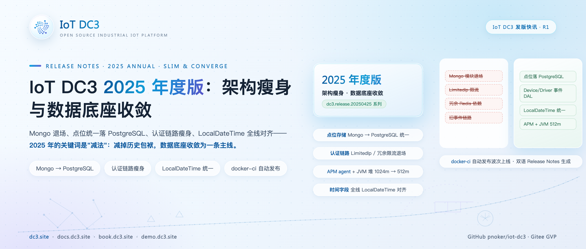
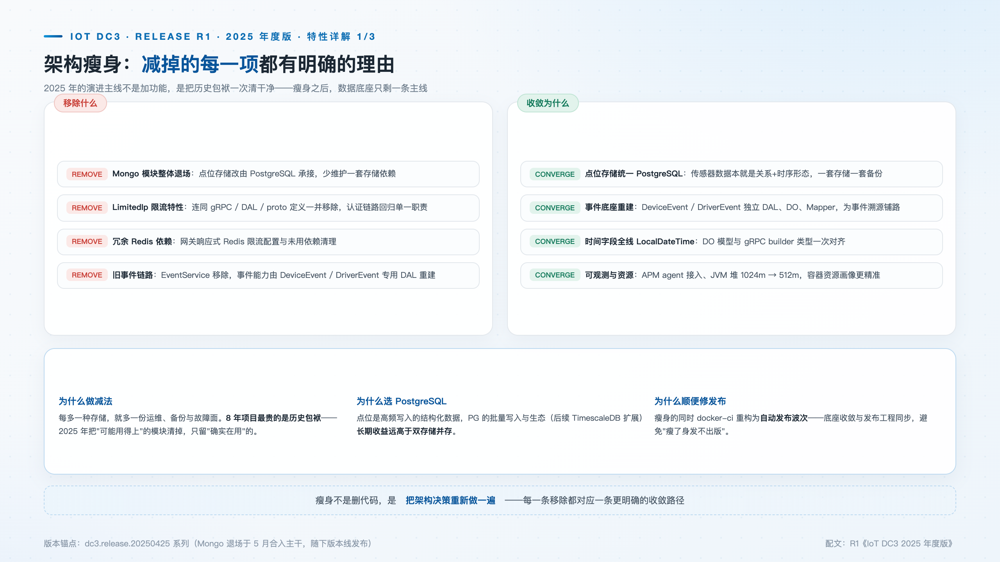
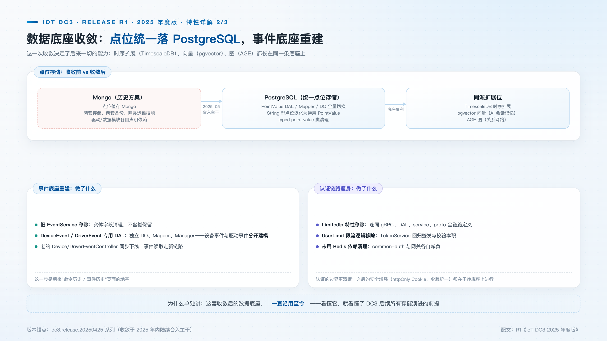
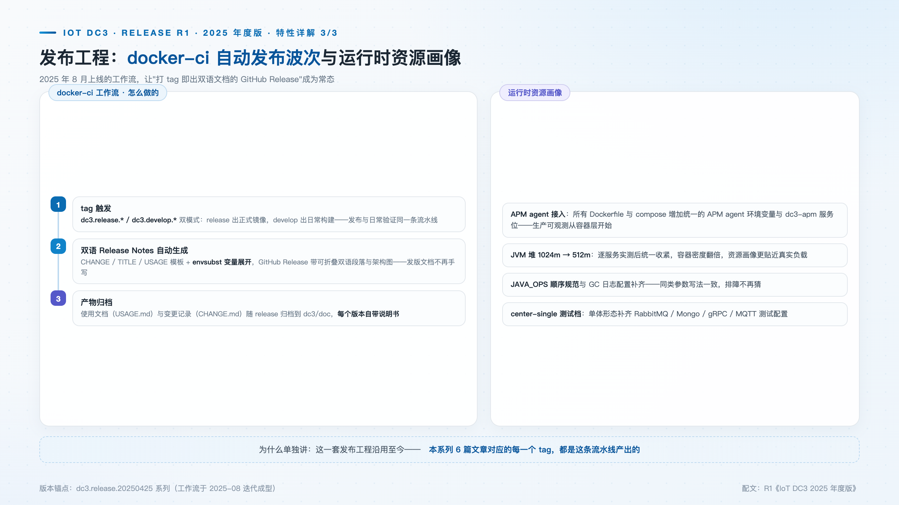

# IoT DC3 2025 年度版：架构瘦身与数据底座收敛

> **发版档案**：R1 · 2025 年度版 · 锚点 dc3.release.20250425 系列（2025 年唯一正式发布波）
> **发布渠道建议**：开源中国 / InfoQ / CSDN / 掘金
> **配图**：`images/cover.png`（封面）、`images/slimdown.png`、`images/data-foundation.png`、`images/release-eng.png`

---

IoT DC3 是多协议接入、云原生、AI 赋能的开源工业物联网平台（AGPL 3.0，Gitee GVP，项目始于 2016 年）。2025 年的演进主线与往年不同：不是叠加功能，而是**架构收缩**——Mongo 退场、认证链路精简、事件底座重建、时间字段对齐、发布工程自动化。这些减法指向同一个终点：数据底座收敛为 PostgreSQL 单一主线。后续的主要特性（时序扩展、AI 会话记忆、可插拔存储家族）均建立在这条底座上。

版本口径需要如实说明：2025 年唯一的正式发布波是 4 月下旬的发布窗口（锚点为 dc3.release.20250425 系列）；此后全年的收敛工作——5 月的存储统一与认证瘦身、8 月的发布工程——均直接合入主干，随下一个版本线发布。这份年度版记录的是一整年架构决策的收拢，而非一次孤立的发版事件。

## 新特性速览

- **Mongo 模块退场**：点位存储统一 PostgreSQL
- **认证链路瘦身**：LimitedIp 限流特性与冗余限流逻辑移除
- **事件底座重建**：DeviceEvent / DriverEvent 独立 DAL
- **时间字段全线 LocalDateTime**：DO 模型与 gRPC 契约一次对齐
- **发布工程**：docker-ci 自动发布波次 + 双语 Release Notes 自动生成
- **运行时资源画像**：APM agent 接入、JVM 堆收紧至 512m

## 架构瘦身：每一项减法都有明确的工程理由

先看退场的 Mongo。2025 年 5 月 14 日，两笔提交先后落地：点位值存储从 MongoDB 整体切换到 PostgreSQL（`169a3142e`），PointValue 的 DAL、Mapper、DO 全量重写，String 型点位泛化为通用 PointValue，typed point value 类随之清理；紧接着 Mongo 模块从工程中整体移除。顺序值得注意——这是一次**替换而非删除**：存储路径先切换到 PostgreSQL 并验证可行，Mongo 模块才退场，中间不存在两套存储并存的不确定状态。

Mongo 必须退场，根本原因在路线图。平台的存储演进方向——时序的 TimescaleDB、承载 AI 会话记忆的 pgvector、图查询的 AGE——全部属于 PostgreSQL 扩展家族。数据底座收敛后，一套存储、一套备份、一条运维主线即可承载全部存储形态；保留 Mongo，则后续每一个存储特性都要维护两套实现。对长期项目而言，"可能用得上"的模块每多留一年，每年的升级与运维成本就要多付一次。2025 年重新执行了一遍这个判断：只保留实际使用的部分。

认证链路的减法同样具体。5 月 12 日的几笔提交分别处理了 LimitedIp 与 UserLimit：前者连同 gRPC、DAL、Service、proto 定义整链删除；后者让 TokenService 回归签发与校验的本职，用户级限流逻辑与冗余的 Redis 依赖一并清出。清理并未止步于认证服务——网关的响应式 Redis 限流配置与相关依赖在同一波提交中移除。至此，散落在认证与网关两侧的冗余限流实现全部退场：限流作为部署侧诉求，交给网关层按需选择方案，而不是由平台内置一套冗余的默认实现。认证服务从此不再背负与身份管理无关的能力。同期下线的还有旧 EventService，它的替代者正是下一节的独立事件建模。

## 数据底座收敛：一次决定，长期复利

点位值是高频写入的结构化数据，PostgreSQL 的批量写入能力让"一套存储、一套备份"从愿望变成事实。这次收敛中更具前瞻性的是事件底座：5 月 14 日，DeviceEvent 与 DriverEvent 各自获得专用的 DAL——独立的 DO、Mapper 与 Manager（`a55e10373`）。设备事件与驱动事件的生命周期、消费方与追溯需求并不相同，合并建模会持续产生"共用字段不够用、专有字段没处放"的妥协；分开建模则为事件溯源、历史查询页面与告警视图铺好了轨道。

时间字段的全线对齐则暴露过一次风险。DO 模型与 gRPC 契约的时间类型迁移曾出现一次回滚（`e86d3629b`，2025 年 5 月 8 日，revert DO 模型与 gRPC builder 中的 timestamp 类型变更）：局部推进的类型变更让两层时间语义短暂分叉。回滚之后，迁移以 LocalDateTimeUtil 统一时钟来源，一次完成全线对齐。跨层契约的变更必须一次做齐——这是那次回滚留下的工程结论。

## 发布工程：打 tag 即出双语 Release

2025 年 8 月，docker-ci 工作流完成了一轮密集迭代：仅 develop 分支当月就有 64 个提交，从 YAML 结构、分支触发条件到发布标题格式逐一打磨。成型后的流水线由 `dc3.release.*` / `dc3.develop.*` 双模式 tag 触发，`dc3/doc` 下的 TITLE、CHANGE、USAGE 等模板经变量展开注入版本号，自动生成带可折叠双语说明与架构图的 GitHub Release；使用文档与变更记录随版本归档，发布物从此完整且可追溯。

自动化针对的是"发版说明缺失"这个老问题：手写说明成本过高，结果往往是没有说明，用户无从得知版本之间发生了什么变化。流水线成型后，每个 tag 的发布文档由同一机制产出，说明文档从"负担"变成发版的"副产品"。

同窗口的运行时配套把资源画像也调准了。APM agent 的环境变量接入所有 Dockerfile 与 compose（`6898041ab`），JVM 堆经实测从 1024m 收紧到 512m（`88b90d65d`，全部 Dockerfile 与 jvm.config 同步调整）——单实例内存占用减半，同等宿主机资源下的容器密度随之翻倍，而 APM 数据让这次收紧有实测依据。资源画像从此贴近真实负载，而非预留出来的安全冗余。

## 升级与兼容性说明

- 点位存储迁移涉及数据搬迁，从旧版本升级请按 release notes 的迁移步骤执行；
- LimitedIp / UserLimit 相关配置项失效，限流诉求请走网关层方案；
- 时间字段契约变化影响直连数据库的下游消费方。

## 下载与文档

- 源码与 Releases：GitHub [pnoker/iot-dc3](https://github.com/pnoker/iot-dc3) · Gitee [pnoker/iot-dc3](https://gitee.com/pnoker/iot-dc3)（GVP）
- 文档：docs.dc3.site · 在线书 book.dc3.site

回看 2025 年，每个决策都在回答同一个问题：这个平台真正需要什么。答案是一条 PostgreSQL 数据主线、一个只做签发与校验的认证服务、一套自动产出文档的发布流水线，以及一个减半的运行时资源占用。减法做完之后，2026 年的版本线得以在这条底座上直接展开：时序扩展、AI 会话记忆、可插拔存储家族，都不再需要为第二套存储支付第二份成本。
