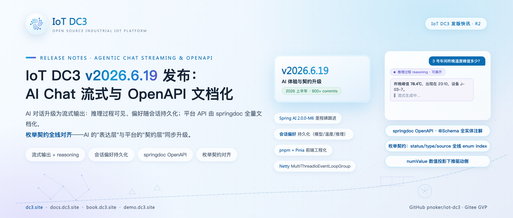
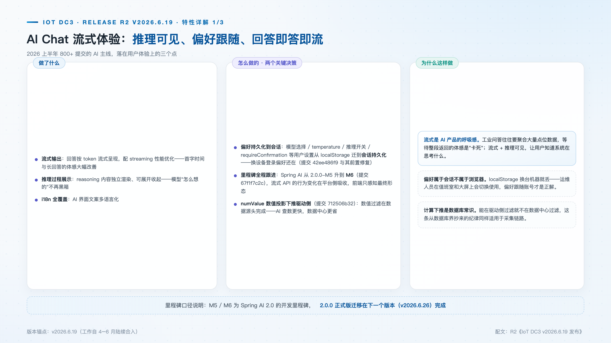
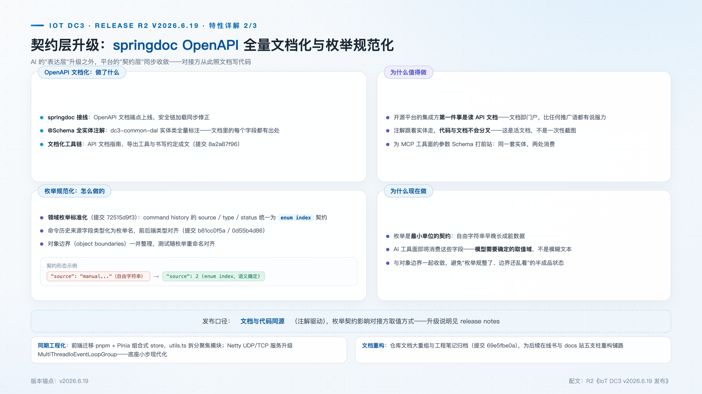
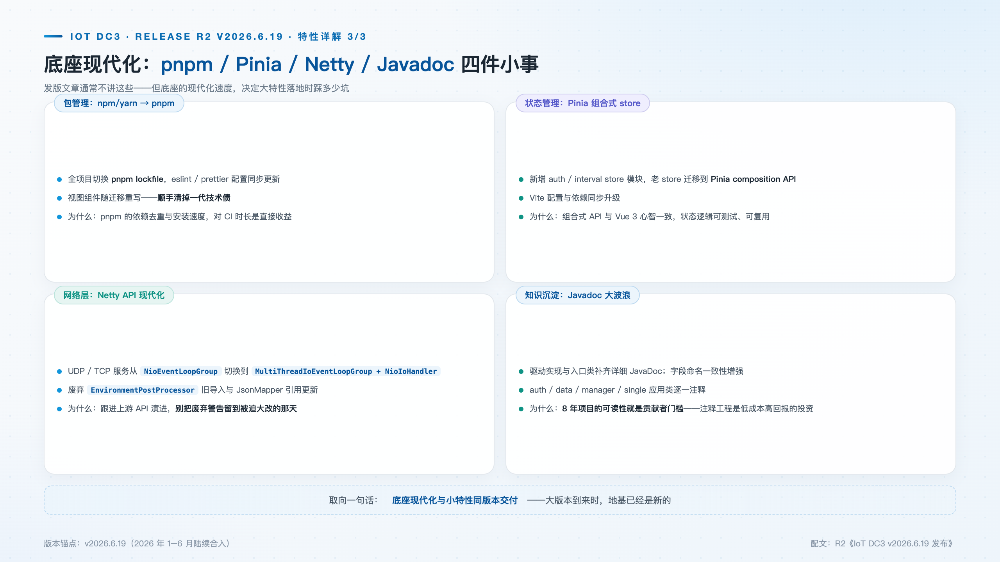

# IoT DC3 v2026.6.19 发布：AI Chat 流式体验与 OpenAPI 文档化

> **发版档案**：R2 · AI 体验与契约升级 · 2026 上半年主线（2026 年 4–6 月，800+ 提交）
> **发布渠道建议**：开源中国 / InfoQ / CSDN / 掘金
> **配图**：`images/cover.png`（封面）、`images/chat-streaming.png`、`images/openapi-enums.png`、`images/eng-modern.png`

---

2026 年上半年，IoT DC3 的主线是让 AI 能力真正"能用起来"。4–6 月的 800+ 提交分成两大块：一块落在 **AI Chat 的体验层**——流式输出、推理过程可见、会话偏好持久化；另一块落在**平台契约层**——springdoc OpenAPI 全量文档化、领域枚举规范化。两块同步推进并非巧合：表达层决定 AI 能力是否好用，契约层决定它是否可信；对以工具调用为骨架的平台而言，后者甚至是前者的前提。

## 新特性速览

- **AI Chat 流式输出**：回答按 token 流式呈现，streaming 性能优化
- **推理过程可见**：reasoning 内容独立渲染、可展开
- **会话偏好持久化**：模型 / 温度 / 推理开关随会话存储，不再困在 localStorage
- **springdoc OpenAPI**：文档端点上线 + @Schema 全实体注解
- **枚举规范化**：command history 的 source / type / status 统一 enum index 契约
- **底座现代化**：pnpm + Pinia、Netty API 现代化、numValue 数值投影下推驱动侧

## AI Chat 流式体验：等待本身就是问题

工业问答与消费级聊天不同：一次提问往往需要聚合大量点位数据、翻检设备台账、再组织成结论，回答的生成时间以十秒计。在此前的"整段返回"模式下，用户面对的是一段没有反馈的空白等待；流式输出上线后，回答按 token 逐步呈现，等待被切分成持续可感知的进程，配套的 streaming 性能优化与结构化渲染让表格与数据在流中直接成型，而不是以纯文本堆砌。

推理过程（reasoning）的独立渲染解决的是信任问题。推理内容与正式回答分层展示、可展开收起：运维人员能看到结论"是怎么得出来的"，判断它查阅了哪些对象、依据是什么。AI 界面文案的 i18n 全覆盖与这两项在同一次变更中落地（`22f1bf337`）。流式链路随 Spring AI 里程碑（2.0.0-M5 → M6）升级在平台侧吸收行为变化，前端只感知最终形态。

会话偏好持久化经历了一次典型的方案修正。5 月 15 日凌晨，偏好先落到了 localStorage（`cae8fe1b3`），七分钟后被重写为会话持久化（`42ee486f9`）：模型选择、temperature、推理开关、requireConfirmation 连同 maxTokens 上限随会话存储。差别在语义：localStorage 绑定"这台设备的这个浏览器"，会话绑定登录身份——运维人员在多终端之间切换时，配置不再丢失。

计算位置也做了一次下沉：numValue 数值投影从数据服务下推到驱动侧（`712506b32`），数值过滤在数据源头完成。这与数据库查询下推同理——数据在产生处被裁剪，数据中心不再为每个消费者重复投影。

## OpenAPI 文档化：文档由代码生成

API 文档是集成方的首要入口，长期却依赖口口相传。springdoc 接线看似只是"加一个依赖"，实际工作量在缝隙里：版本对齐（springdoc 3.x 面向 Spring Boot 4 / Spring Framework 7，并与 Spring AI 的依赖树解冲突）、四个中心服务各注册文档分组、网关聚合成统一的文档入口；安全链加载问题在接线过程中同步修正，文档端点接入鉴权体系而不是旁路它（`51a384720`）。

注解跟着实体走：@Schema 标注覆盖 VO、BO、Query DTO 与实体嵌套结构，连统一返回包装 R\<T\> 也一并标注。这就是"文档由代码生成、代码与文档不会分叉"的确切含义——**注解写在源码里，文档在启动时从注解生成，两者是同一份事实，不存在独立维护的文档文件，也就不存在分叉的可能**。API 文档指南与书写约定同步成文，`dc3/bin/export_openapi.sh` 可把运行中服务的 OpenAPI 规范导出为 JSON，供评审、比对或客户端生成使用。

同一份注解还有第二处消费：平台的 MCP 工具目录直接从 OpenAPI JSON 读取工具的参数 Schema。写一次注解，REST 集成方与 AI 工具面同时受益——这是把文档化列为契约层投入、而非门面工程的原因。

## 枚举规范化：最小单位的契约

枚举是契约的最小单位，也是最容易被轻视的单位。一个自由字符串字段，今天写入"web"，明天写入"WEB "、"console"，脏数据随之累积；而当 AI 工具面开始消费这些字段时，取值域不确定意味着工具无法可靠工作。本次规范化（`72515d9f3`）把 command history 的 source / type / status 统一为 enum index 契约，来源字段类型化为枚举名。

规范化的深度超出字段类型本身：24 个多值 FlagEnum 更名为 TypeEnum，闭合分类与 0/1 开关从命名上区分开；每个枚举统一 triplet 与 ofIndex / ofCode / ofName 换算；下划线代码统一为连字符风格；枚举与 index、code 的互转收敛到 MapStruct builder，服务层不再散落手工转换；历史查询服务不再向外泄漏 DO，统一以 VO 返回。对象边界（object boundaries）与枚举契约同步收敛，避免了"枚举改了、边界没改"的半完成状态，测试随枚举重命名同步对齐。

## 底座现代化

体验与契约之外，工程底座完成了一轮清理。前端从 npm/yarn 迁移到 pnpm lockfile，eslint / prettier 配置同步，视图组件随迁移重写；状态层引入 Pinia 组合式 store（auth、interval），状态逻辑从组件中剥离，变得可测试、可复用。Netty 侧将 UDP/TCP 服务切换到 MultiThreadIoEventLoopGroup 与 NioIoHandler，废弃 API 清零——虚拟驱动（listening-virtual）的 NettyTcpServer / NettyUdpServer 是这批改造的载体。Javadoc 补齐覆盖驱动实现、应用类与工具类，控制器注释在各服务统一规范化——对一个近十年的开源项目，注释密度就是贡献者的进入门槛。

## 升级与兼容性说明

- 枚举契约影响直连 API 的对接方：source / type / status 取值方式从字符串改为 enum index，见 release notes 对照表；
- 前端包管理切换 pnpm，贡献者请按 README 更新本地环境；
- 里程碑口径：Spring AI 2.0.0-M6 为开发里程碑，正式版迁移在下一个版本（v2026.6.26）完成。

## 下载与文档

- 源码与 Releases：GitHub [pnoker/iot-dc3](https://github.com/pnoker/iot-dc3) · Gitee [pnoker/iot-dc3](https://gitee.com/pnoker/iot-dc3)（GVP）
- API 文档：springdoc 端点随平台启动 · docs.dc3.site

v2026.6.19 的价值不在于单点功能，而在于它把 AI 能力的两层地基同时打牢：体验层让"用 AI"不再考验耐心，契约层让"信 AI"有了可校验的依据。当枚举取值域确定、文档与代码同源、偏好随身份流转，后续基于工具调用的自动化才有可靠的落点——这正是下一个版本继续推进的方向。
