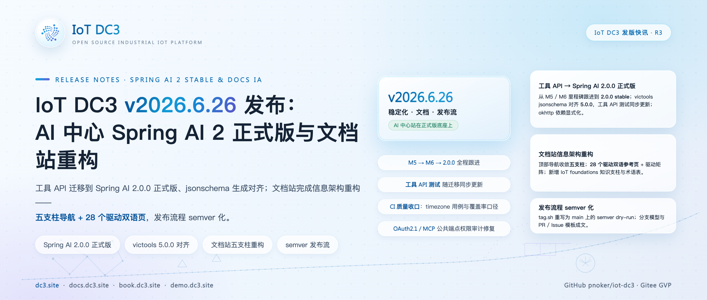
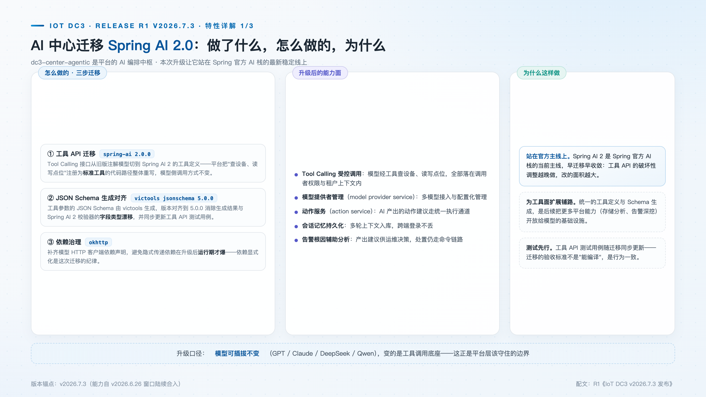
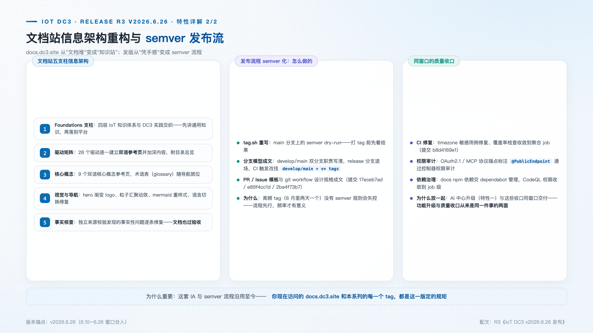

# IoT DC3 v2026.6.26 发布：AI 中心 Spring AI 2 正式版与文档站重构

> **发版档案**：R3 · 稳定化 · 文档 · 发布流 · 对应 2026-06-10 → 06-26 版本窗口
> **发布渠道建议**：开源中国 / InfoQ / CSDN / 掘金
> **配图**：`images/cover.png`（封面）、`images/agentic-springai.png`、`images/docs-ia.png`

---

本版本是 2026 上半年的阶段性收口：AI 中心迁移至 **Spring AI 2.0.0 正式版**，同期完成文档站信息架构重构（五支柱 + 28 个驱动双语页）与发布流程 semver 化。三件事分属依赖、文档与流程，指向的却是同一个主题——把上半年的快速演进沉淀为稳定、可预期、可信赖的形态。

## 新特性速览

- **AI 中心 Spring AI 2.0.0 正式版**：Tool API 全量迁移，victools jsonschema 对齐 5.0.0
- **文档站 IA 重构**：五支柱导航、28 个驱动双语参考页、IoT foundations 知识支柱、术语表
- **发布流程 semver 化**：tag.sh 重写为 main 上的 semver dry-run，分支模型与 PR / Issue 模板成文
- **质量收口**：CI 时区用例修复、覆盖率口径收敛、OAuth2.1 / MCP 公共端点权限审计修复

## AI 中心站上 Spring AI 2 正式版

dc3-center-agentic 的工具 API 迁移不是从里程碑到正式版的一跳，而是全程跟进的一串：5 月从 2.0.0-M5 升至 M6，6 月上旬跟进 M8 并迁移工具 API，6 月 23 日升到 2.0.0 正式版并移除里程碑仓库（`a620afb08`）。正式版切换的提交本身很小——改动的只是 pom.xml 里的版本号与仓库声明；真正的迁移工作量早已在各个里程碑节点被逐步吸收，平台把"查设备、读写点位"注册为标准工具的代码路径随每次 API 变化整体更新，不存在攒到最后的一次性大迁移。

正式版之后是两笔收尾对齐。victools jsonschema 对齐到 5.0.0，工具 API 测试用例随迁移同步更新（`6ecd91b1b`）——验收标准是行为一致，而不是"能编译"；schema 生成器版本对齐的同时消除了字段类型漂移。okhttp 客户端依赖补齐显式声明（PR #88，`a15795019`），工具调用链路的 HTTP 客户端不再依赖传递依赖的偶然存在。Spring AI 2 是官方 AI 栈主线，越晚迁移改动面越大；统一的工具定义与 Schema 生成是后续开放更多平台能力的基础设施，MCP 管理面随后即落地于主干。

## 文档站：从文档堆到知识站

文档是开源项目的核心交付物，而 docs.dc3.site 的这轮重构从一个诚实的自我诊断开始（IA 规格与 P0 计划，`1701413a4`）：站内顶层是 10 个并列栏目——介绍、快速开始、架构、驱动、AI、自动化、操作指南、开发、部署运维、社区——粒度参差不齐，"自动化"栏目下只有一篇 CLI 文档。重构把顶部导航收敛为**五支柱**（架构 / 驱动 / AI / 基础 / 开发）加社区入口，支柱内部再分组，阅读顺序天然成书。

28 个驱动逐一建立双语参考页并加深内容，按专业维度分组——工业总线（Modbus、OPC UA、S7、FINS、Ethernet/IP 等）、电力与 SCADA（IEC 104、BACnet、DLMS、SL651、SNMP）、物联网无线（MQTT、CoAP、LWM2M、BLE、ZigBee、CAN）、串口与网络、数据库、虚拟调试——并附驱动矩阵目录：用户选型时，目标协议的支持情况与配置方式一目了然。统一的参考页结构正是为此服务。

新增的 **IoT foundations 知识支柱**是这轮重构里分量最重的一块：按物联网四层参考架构（感知 / 网络 / 平台 / 应用，安全贯穿）组织的通用知识章节，每章都接回 DC3 的具体实现，知识体系与产品文档互相引用而非割裂。术语表同步上线，中英文逐页平行的双语结构在全站维持；hero 渐变 logo、语言切换修复、mermaid 重样式等细节同期打磨。导航、首页、侧栏、概念页、驱动页分批落地之后，整站过了一轮**独立来源事实核查**——文档错误比文档缺失更损害信任，文档页面也按验收标准走。

## 发布流程 semver 化：让版本号可预期

发布流程的重构解决的是"tag 频率高、规则跟不上"的问题——本项目 8 月期间平均两天一个 tag，若版本语义不明确，用户无法从版本号判断升级的影响面，semver 规则是 tag 流可控的前提。

改造后的 tag.sh 只在 main 分支上运行，且要求工作区干净、本地 main 与远端完全一致；版本号直接读取根 pom.xml，必须匹配 `YYYY.M.P` 的 semver 形态，tag 名即项目版本——代码里的版本与发布 tag 从机制上不可能分叉，本系列的每个版本号均可通过该流程追溯。`--dry-run` 参数让"打这个 tag 会发生什么"在执行前可见。这不是一个复杂的脚本，但每条约束都对应一类曾经真实出现过的问题。

流程的其余部分同步成文：分支模型（develop / main 职责）与 git workflow 设计规格先行、再动 tag 脚本——流程变更也走 review；PR / Issue 模板落地；release 分支退场，CI 触发改挂 develop / main 与 v* tags。

## 同窗口质量收口

质量层面完成了三件事。CI 修复了 timezone 敏感用例——涉及时区的测试在任何环境都应给出同一结果——并把覆盖率检查收敛到聚合 job，口径不再因 job 划分而漂移。权限审计修复了 OAuth2.1 与 MCP 协议端点的标注：这些端点必须匿名可达（协议握手的性质决定），但"匿名可达"必须通过 @PublicEndpoint 显式声明并通过控制器权限审计——公共端点是声明出来的，不是漏配之后"恰好"可达的。依赖治理上，docs 站 npm 依赖交由 dependabot 维护，CodeQL 权限收敛到 job 级。

## 升级与兼容性说明

- Spring AI 2 正式版 API 与里程碑版存在差异，自建模型接插的部署请核对工具注册代码；
- 文档站 URL 结构随 IA 重构有调整，旧链接见站内重定向。

## 下载与文档

- 源码与 Releases：GitHub [pnoker/iot-dc3](https://github.com/pnoker/iot-dc3) · Gitee [pnoker/iot-dc3](https://gitee.com/pnoker/iot-dc3)（GVP）
- 重构后的文档站：docs.dc3.site

## 版本路线

下一版本 `v2026.7.3`（619 commits 主干聚合）：前端入仓 monorepo、MCP 管理面与租户硬隔离。

v2026.6.26 作为上半年的收口，把三条线同时收拢：依赖停在正式版，文档站有了成书的信息架构，发布流有了可预期的版本语义。稳定化不是停止演进，而是让接下来的演进——MCP 管理面、租户硬隔离、前端 monorepo——站在确定的契约之上继续。
