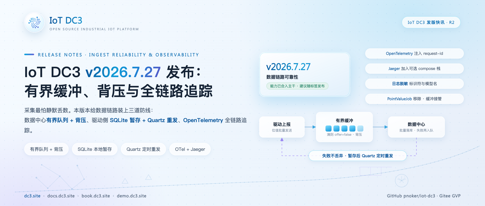
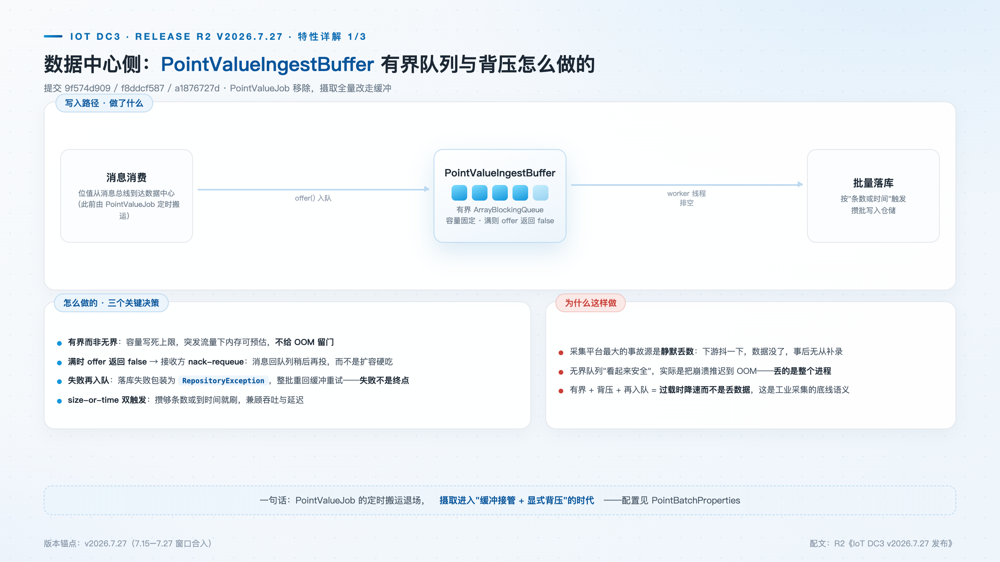
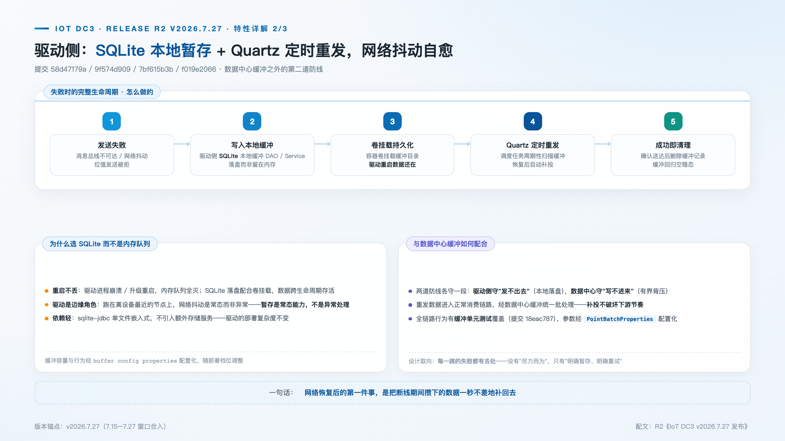
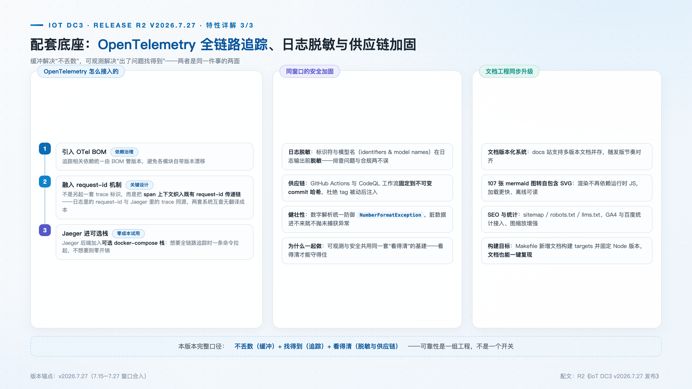

# IoT DC3 v2026.7.27 发布：有界缓冲、背压与全链路追踪

> **发版档案**：R5 · 数据链路可靠性与可观测性 · 对应 7 月中下旬版本序列（v2026.7.15 → v2026.7.27）
> **发布渠道建议**：开源中国 / InfoQ / CSDN / 掘金
> **配图**：`images/cover.png`（封面）、`images/ingest-buffer.png`、`images/driver-localbuffer.png`、`images/otel-observability.png`

---

采集平台最危险的不是宕机，而是**静默丢数**：下游一个瞬时故障，数据缺失一段且无法补录，直到报表对不上才被发现。继 `v2026.7.3` 完成底座聚合之后，`v2026.7.27` 版本序列（v2026.7.15 → v2026.7.27）专注一件事——把位值数据链路从"尽力而为"改造成"每一跳的失败都有去处"。这条链路上有三处需要各安一道防线：数据中心写入受阻时要降速而不是失忆；驱动到总线的发送受阻时要暂存而不是丢弃；故障发生时要能沿调用链定位而不是逐台机器翻日志。本版本的三组特性，分别对应这三道防线。

## 新特性速览

- **数据中心有界缓冲**：PointValueIngestBuffer（有界 ArrayBlockingQueue + 背压），PointValueJob 定时搬运退场
- **驱动侧本地暂存**：SQLite 本地缓冲 DAO/Service，容器卷挂载持久化
- **失败自动重发**：发送失败入缓冲，Quartz 定时补投，成功即清理
- **全链路追踪**：OpenTelemetry 注入 request-id 链路，Jaeger 加入可选 compose 栈
- **安全与质量配套**：日志脱敏、CI/CodeQL 固定不可变哈希、文档版本化系统

## 数据中心侧：有界缓冲与背压

数据中心此前的位值摄取走"速度阈值双路径"：低速时逐条落库，高速时攒进无界列表、由 `PointValueJob` 定时批量搬运。这条路径的问题在两端——逐条写在高频点位下产生大量小事务，而"无界列表"意味着过载时内存占用没有上界，崩溃只是被推迟到 OOM，损失的是整个进程。

本版本以 `PointValueIngestBuffer`（f8ddcf587）整体替换该路径，`PointValueJob` 退场。新路径的核心是一个有界 `ArrayBlockingQueue` 加一组 worker 线程：每条收到的位值进入队列，worker 以"条数或时间"双触发排空——攒满一批，或距首条到达超过刷新间隔，即整批写仓储。两个行为定义了它的失败语义：其一，队列满时 `offer()` 返回 false，接收方执行 **nack-requeue**，把压力原样还给 RabbitMQ——过载的表征是消费变慢，而不是内存耗尽；其二，落库失败时异常被包装为 `RepositoryException`，整批重回缓冲等待重试，仅当持续故障叠加持续流入、重入队也放不下时才逐条丢弃并计数，丢弃量可被监控捕获而非无声发生。进程正常停机时，缓冲中的剩余记录会被最后一次排空落库。

全部参数经 `PointBatchProperties`（前缀 `dc3.data.point.batch`）配置，默认值为队列容量 100000、批大小 1000、刷新间隔 500 毫秒、worker 4 个——开箱可用，压测后按吞吐调整。"有界"与"背压"在这里是一体两面：容量上限让突发流量下的内存占用可预估，降速语义让系统在过载时选择变慢而非崩溃，这是工业采集链路应有的基本品格。

## 驱动侧：SQLite 本地暂存与 Quartz 重发

数据中心缓冲应对"写入受阻"，驱动侧应对的是"发送受阻"：驱动运行在靠近设备的节点，与总线之间的网络波动是常态，断连期间采集到的读数若只留在内存里，进程一重启就归零。

本版本为驱动侧引入本地缓冲 DAO 与 Service（58d47179a）：发送失败（同步 `AmqpException` 或异步 publisher NACK）的位值写入 SQLite 本地文件——选择落盘而非内存队列，正是因为暂存要扛住的不只是发送失败，还有驱动进程自身的重启。缓冲数据库以 WAL 模式运行、配单连接 HikariCP 池（SQLite 是单写者数据库）；表结构刻意只用 epoch 秒整数存时间，规避时区与格式陷阱；`next_attempt_at` 与 `created_at` 建有索引，补投扫描与容量淘汰都走索引。失败的生命周期五步：发送失败 → 写入本地缓冲（落盘而非内存）→ 容器卷挂载持久化（Dockerfile 声明 `dc3/data` 为卷，compose 挂 `driver_data` 具名卷，**驱动重启数据还在**）→ Quartz 定时扫描补投（默认 cron `0/10 * * * * ?`，每 10 秒一轮）→ 确认送达后清理，缓冲回归空稳态。缓冲参数在 28 个驱动的 application.yml 中统一配置（7bf615b3b）。

补投的节奏有讲究：重试按指数退避，初始 10 秒、逐次翻倍、上限 600 秒；连续失败超过 maxRetry（默认 50 次）的记录作为毒丸丢弃并记 ERROR 日志；缓冲文件超过容量上限（默认 256MB）时按 created_at 淘汰最旧记录——容量优先于完整性，保证留下的是最新读数。补投消息经正常消费链路进入数据中心缓冲统一批处理，不另设旁路。

还有一个值得展开的幂等考量：缓冲记录的主键即消息的 correlation id，补投采用"乐观删除"——消息离开通道即从缓冲删除，若随后收到 NACK，确认回调以同一个 correlation id 把它重新写回缓冲。消息身份在整个生命周期保持不变，下游看到的是同一条消息的重复投递而非多条消息，这为下一版本的摄取幂等留出了干净的接口。

## 全链路追踪：request-id 与 trace 同源

缓冲解决数据不丢，可观测解决故障定位。微服务架构下单次采集要跨越驱动、总线、数据中心多层，没有链路级标识的日志排查，等于逐台机器翻文件。

本版本引入 OpenTelemetry BOM 统一追踪依赖，但做法不是另起一套 trace 标识，而是把 span 上下文**织入平台既有的 request-id 传递机制**：`RequestIdWebFilter` 的取值优先级为入站 `X-Request-Id` 头 → 当前 OTel Trace ID → 随机 UUID，并在响应头回显 `X-Request-Id`。结果是日志里的 request-id 与 Jaeger 里的 trace **同源**——从一条日志拿到 id，粘贴进 Jaeger 即得到完整调用链，两套系统互查零翻译成本。传递机制的实现考虑了 WebFlux 的线程切换：控制器业务跑在 boundedElastic 调度器上，与 Netty 事件循环不同线程，标识因此经由 Reactor Context 传播而非 ThreadLocal 的 MDC；gRPC 侧由客户端与服务端拦截器续传，RabbitMQ 侧由消息后处理器与监听适配器写入和还原。Jaeger 后端（bed0877e0）加入可选 docker-compose 栈——UI 端口 16686，OTLP gRPC/HTTP 接收 4317/4318——按需拉起，不需要全链路追踪的部署零开销。

同窗口完成两项配套加固。**日志脱敏**（741ad7cc4）引入 LogSanitizer，智能体会话的 conversationId 与模型名、虚拟驱动的设备名在输出前脱敏，排查与合规两不误；**供应链加固**（ad89fde9d）把 GitHub Actions 与 CodeQL 工作流固定到不可变 commit 哈希，杜绝 tag 被动后注入。

## 配套：文档工程同步升级

- **文档版本化系统**上线：docs 站支持多版本文档并存，随发版节奏对齐；
- 107 张 mermaid 图全部转为**自包含 SVG**——渲染不依赖运行时 JS，加载更快、离线可读；
- SEO 完善（sitemap / robots.txt / llms.txt）与统计接入；Makefile 新增文档构建 targets 并固定 Node 版本——文档也能一键复现。

## 升级与兼容性说明

- 缓冲参数经 `PointBatchProperties` 配置化，默认值可直接用，压测后按吞吐调整；
- 驱动镜像需更新以获得本地缓冲能力（挂载卷建议同步配置）；
- 行为验证：缓冲单元测试已覆盖（提交 18eac7871）。

## 下载与文档

- 源码与 Releases：GitHub [pnoker/iot-dc3](https://github.com/pnoker/iot-dc3) · Gitee [pnoker/iot-dc3](https://gitee.com/pnoker/iot-dc3)（GVP）
- 文档：docs.dc3.site · 选型与排查指南见 docs 站

## 版本路线

下一版本 `v2026.8.19`（当前最新发布版）：八个全新驱动、租约围栏的持久化遥测与部署矩阵——驱动矩阵 28 → 36，PostgreSQL 租约 + fencing + 强制 durable outbox，Compose / Swarm / Kubernetes / Helm 四种形态交付。

三道防线的共同点，是把失败当作常态来设计：写入受阻时降速，发送受阻时暂存，排障时有贯穿全链路的标识。数据链路的每一跳都有了去处，平台才谈得上"不丢"；而"不重"——重发天然引入的重复——留给了下一个版本，与租约、围栏和幂等摄取一起解决。
