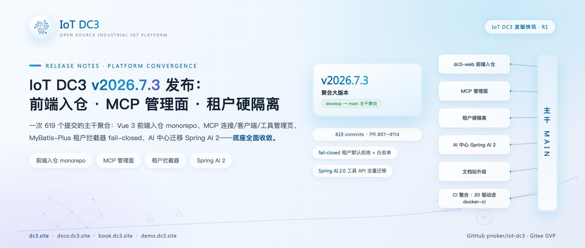
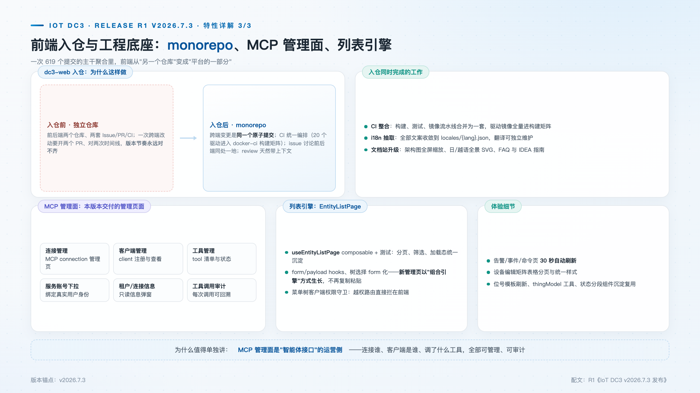
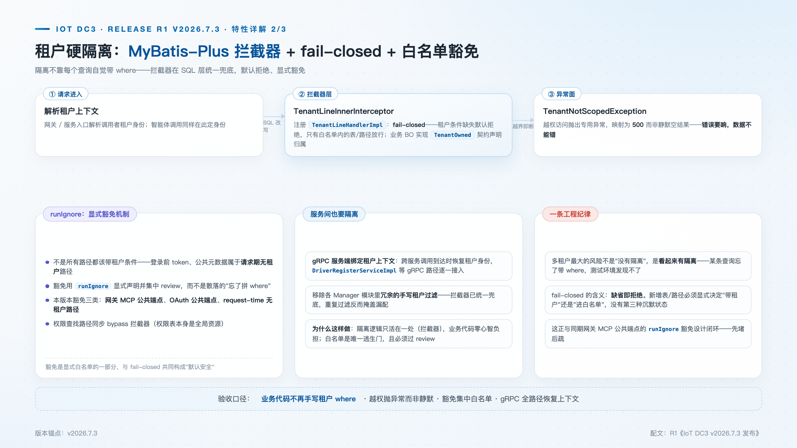

# IoT DC3 v2026.7.3 发布：前端入仓、MCP 管理面与租户硬隔离

> **发版档案**：R4 · 聚合大版本 · develop → main 主干聚合（619 commits，PR #87–#114）
> **发布渠道建议**：开源中国 / InfoQ / CSDN / 掘金
> **配图**：`images/cover.png`（封面）、`images/web-monorepo.png`、`images/tenant-interceptor.png`

---

IoT DC3 是多协议接入、云原生、AI 赋能的开源工业物联网平台（AGPL 3.0，Gitee GVP）。`v2026.7.3` 是一次底座收敛式的聚合大版本：619 个提交经 develop → main 主干一次合入，PR #87–#114 沿工程整合、安全机制、智能体接口三条线推进——Vue 3 前端并入 monorepo、MCP 开放接口补齐管理面、租户隔离从模块内的"自觉约定"升级为数据访问层的"拦截器强制"，AI 中心同步完成 Spring AI 2 迁移。这类版本没有单点的炫技特性，却决定此后所有特性生长的土壤质量，本文逐项展开其设计与取舍。

## 新特性速览

- **前端入仓**：dc3-web 并入 monorepo，前后端一套 Issue / PR / CI
- **MCP 管理面**：连接 / 客户端 / 工具三个管理页 + 工具调用审计页
- **租户硬隔离**：MyBatis-Plus 拦截器 fail-closed + 显式白名单 + gRPC 全路径上下文
- **感知与协议知识切片**：docs 站 sensing-layer / protocol-layer 切片合入
- **配套**：文档站 i18n 抽取与图库升级、CI 整合、20 个驱动进 docker-ci 构建矩阵

## 前端入仓：跨端变更是同一次提交

dc3-web（Vue 3 + TypeScript + Vite）此前独立成仓。分仓在项目早期足够轻量，代价却随协作规模递增：一次同时触及后端契约与前端页面的改动，需要向前端仓与主仓各提一个 PR、协调两条时间线；同一个问题的讨论分散在两处 issue，任何一侧的评审者都只看得到一半上下文；前后端的版本节奏对齐靠人工，错过一个窗口就要再等一轮。`v2026.7.3` 以 `merge iot-dc3-web frontend into monorepo`（2198d7fff）为锚点将前端整体迁入主仓，跨端变更自此成为同一个原子提交——契约与页面同生同灭，review 与 issue 讨论具备完整上下文，前端随主仓同节奏发版。

入仓不是搬运目录，配套的工程整合同步完成。构建、测试与镜像流水线在此窗口合并为一套，20 个此前缺席 docker-ci 的驱动模块进入构建矩阵（cfb2183bc，PR #101），CI 中的驱动服务自此达到 28 个——驱动镜像的产出从局部脚本回到统一流水线；文档站完成 i18n 抽取，全部文案进入 `locales/{lang}.json`，翻译得以独立维护，图库同步升级。

前端工程底座也借此沉淀。`useEntityListPage` 列表引擎统一了分页、筛选与加载态并配套测试，form/payload hooks 与树选择 form 化让新管理页以组合引擎的方式生长，而非复制粘贴既有页面；告警 / 事件 / 命令页加入 30 秒自动刷新，设备编辑的矩阵表格完成分页与样式统一。这些是入仓后第一批"搭底座便车"的可见改进，也验证了底座投资的回报路径。

## MCP 管理面：开放之前，先可运营

MCP 是平台对智能体开放的标准接口，而"开放"在工程上从来不只是开一个端点：连接方是谁、哪些客户端完成了注册、哪些工具可被调用、每次调用由哪个账号发起——当这些问题只能靠查配置与翻日志回答时，开放规模一大就会失去治理能力。

本版本在设置区新增 MCP 连接管理、客户端管理、工具管理三个页面，配套服务账号下拉、租户与连接信息只读弹窗，以及独立的 MCP 工具调用审计页。页面全部基于 `useEntityListPage` 引擎构建，管理对象是后端既有的 MCP 运行时：连接、客户端注册与工具目录此前只存在于服务端状态中，需要通过接口与数据核查，现在成为可操作、可授权、可审计的界面；审计页记录每一次工具调用，可回溯到发起的客户端与账号。管理面先于工具面铺开，是平台对开放节奏的明确表态——先证明开放是可治理的，再扩大开放的边界。

## 租户硬隔离：漏配的后果从"越权"变成"不可用"

多租户系统的安全底线是隔离，而隔离最脆弱的形态是靠自觉：每个业务模块在查询里手写租户条件，写漏一处就是一次静默越权。这类缺陷在测试环境几乎不可见——测试请求恰好总是带着正确的租户上下文——它更可能先被另一个租户发现，而不是被运维发现。

本版本注册 MyBatis-Plus `TenantLineInnerInterceptor`，由 `TenantLineHandlerImpl` 在 SQL 层统一改写查询：隔离逻辑只活在一处，业务代码不再手写租户 where，业务 BO 通过 `TenantOwned` 契约声明租户归属。关键在于该实现的 **fail-closed** 语义：当线程上没有绑定租户、也不处于显式豁免作用域时，`getTenantId()` 直接抛出 `TenantNotScopedException` 并映射为 500，而不是放行一条无租户条件的查询。漏配的安全后果因此从"越权读到他人的数据"变成"请求直接失败"——前者可以长期潜伏，后者在第一次联调就会暴露。新增表与新增路径必须显式二选一：带租户条件，或进入白名单。

白名单同样显式而集中。`IGNORE_TABLES` 收录 11 张不含 `tenant_id` 列的系统与字典表（租户、用户、菜单、API、MCP 工具目录等），拦截器对它们不注入条件——向不存在的列注入条件本身就是错误。需要无租户执行的路径通过 `TenantContextHolder.runIgnore` 显式声明豁免并集中评审，本版本豁免三类：网关 MCP 公共端点、OAuth 公共端点（登录令牌校验发生在租户解析之前）、以及请求期无租户的路径（实体状态过期扫描、按 recordId 查历史）。豁免机制的实现经得起推敲：租户状态保存在线程池化工作线程的 ThreadLocal 中，`runIgnore` 可嵌套、异常安全、总是恢复先前标志——泄漏的豁免不可能静默污染一个被复用的线程。gRPC 服务端则全路径绑定租户上下文（PR #114，覆盖驱动注册链路），微服务间的调用不再存在隔离盲区。与此同时，Manager / Data / DAL / Agentic 各模块中冗余的手写租户过滤被成批移除——拦截器已统一兜底，保留手写过滤反而会以"重复生效"掩盖漏配。

## 知识切片与 AI 中心换代

docs 站合入感知层与协议层两组知识切片（sensing-layer / protocol-layer），沉淀为 `docs/foundations/sensing.md` 与 `iot-protocols.md`：内容不是概念罗列，而是带可查证学术引用的知识条目，并附传感标定缺陷与协议实现缺陷的专题分析（PR #111、#113）。AI 中心整体迁移 Spring AI 2（`spring-ai` 2.0.0）：OpenAI 与 Anthropic 的模型接入、JDBC 会话记忆仓库均改由官方 starter 提供；面向模型侧的 AI 工具 API 调用方式保持不变，服务端实现完成换代。

## 升级与兼容性说明

- 前端自此随主仓发布，独立 dc3-web 仓库归档；
- 租户拦截器上线后，新增业务表默认强制租户条件——全局资源需显式进白名单；
- AI 工具 API 面向模型侧的调用方式不变，服务端实现已切换 Spring AI 2。

## 下载与文档

- 源码与 Releases：GitHub [pnoker/iot-dc3](https://github.com/pnoker/iot-dc3) · Gitee [pnoker/iot-dc3](https://gitee.com/pnoker/iot-dc3)（GVP）
- 文档：docs.dc3.site · 在线书 book.dc3.site · 演示 demo.dc3.site

## 版本路线

下一版本 `v2026.7.27`：数据链路可靠性——数据中心有界缓冲与背压、驱动侧 SQLite 暂存与 Quartz 重发、OpenTelemetry 全链路追踪。

聚合版本的价值不在提交数量，而在方向：前后端在同一原子提交里演进，开放接口与管理界面同步落地，隔离从自觉变成机制。底座收敛之后，后续版本得以把精力集中到链路可靠性与驱动生态上——那正是下一站的主题。
