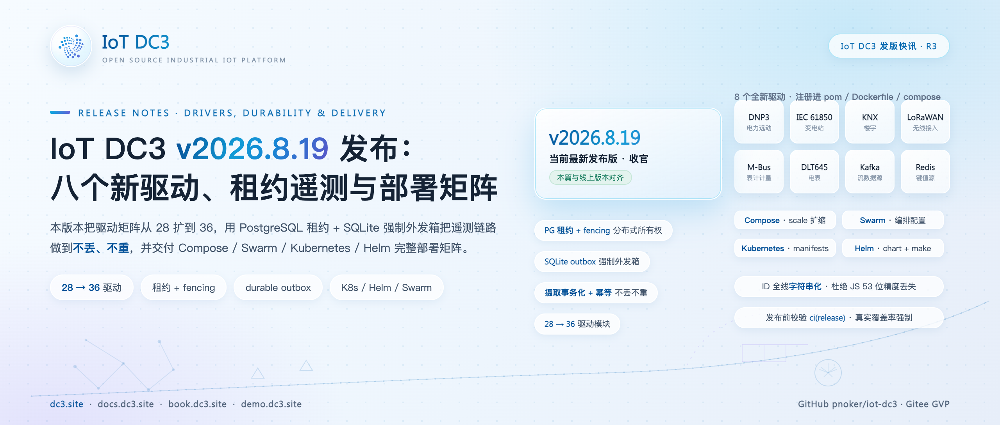
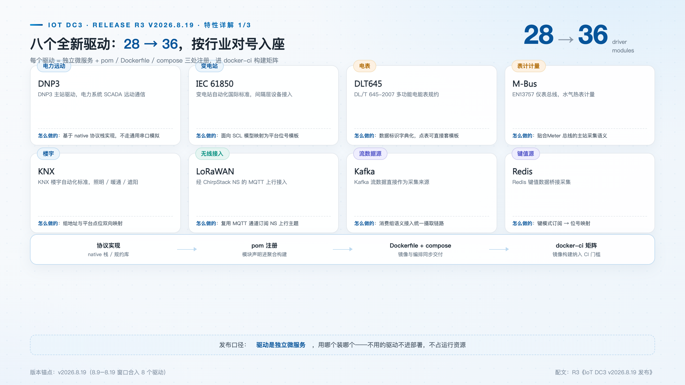
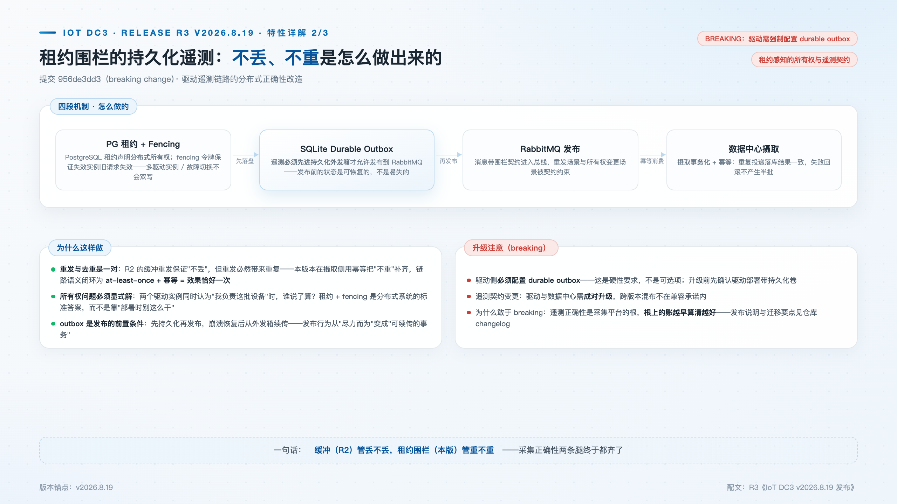
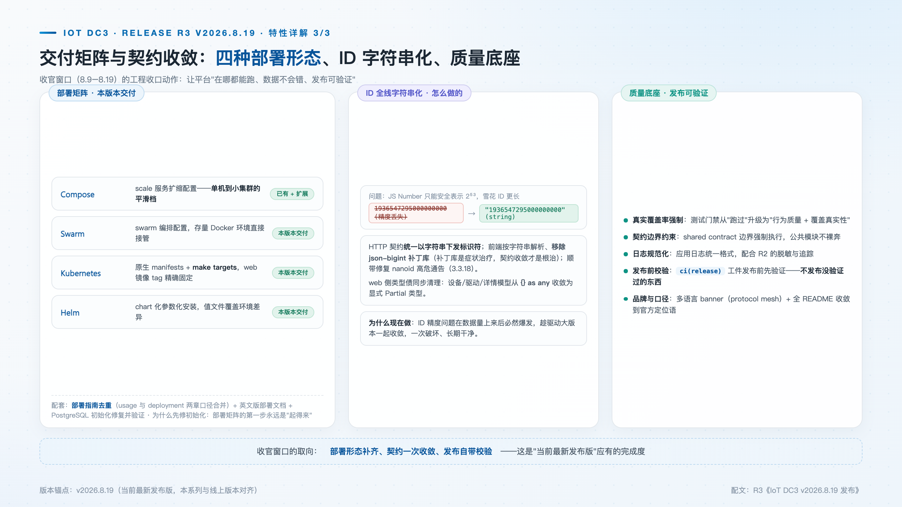

# IoT DC3 v2026.8.19 发布：八个新驱动、租约遥测与部署矩阵

> **发版档案**：R6 · 收官篇 · **当前最新发布版，与线上版本对齐**
> **发布渠道建议**：开源中国 / InfoQ / CSDN / 掘金
> **配图**：`images/cover.png`（封面）、`images/eight-drivers.png`、`images/lease-telemetry.png`、`images/deploy-contract.png`

---

`v2026.8.19` 是当前最新正式版本与本系列收官篇。它完成三项主要交付：**驱动矩阵从 28 扩到 36**，**遥测链路做到不丢不重**（PostgreSQL 租约 + fencing + 强制 durable outbox），**交付矩阵补齐四种部署形态**；另有一项契约收敛——ID 全线字符串化。这是"底座收敛、链路可靠"之后的第三步：把可靠性做成默认。

## 新特性速览

- **8 个全新驱动**：DNP3 主站、IEC 61850、KNX、LoRaWAN（ChirpStack）、M-Bus、DLT645-2007、Kafka、Redis
- **租约围栏的持久化遥测**（breaking）：PostgreSQL 租约 + fencing、SQLite durable outbox 强制、摄取事务化 + 幂等
- **部署矩阵**：Compose scale、Swarm、Kubernetes manifests、Helm chart + make targets
- **ID 全线字符串化**（breaking-ish）：HTTP 契约统一 string 标识符，前端移除 json-bigint
- **质量底座**：真实覆盖率强制、契约边界约束、日志规范化、发布前校验

## 八个新驱动：按行业对号入座

工业协议的碎片化没有通用解法，可行的路径是降低新增驱动的成本并标准化交付流程——实现协议、注册 pom、同步镜像与编排、纳入 CI 矩阵，四步走完即是一个可部署的微服务。本版本一次合入 8 个驱动并完成全流程注册（def5c3437），驱动总数 **28 → 36**：

| 驱动 | 行业 | 接入语义 |
| --- | --- | --- |
| DNP3 主站 | 电力远动 | 基于 native 协议栈实现的主站，不走通用串口模拟 |
| IEC 61850 | 变电站自动化 | 面向 SCL 模型映射为平台位号模板 |
| DLT645-2007 | 电表计量 | 数据标识字典化，点表直接套模板 |
| KNX | 楼宇自动化 | 组地址与平台点位双向映射 |
| M-Bus | 表计 | EN13757 仪表总线主站采集语义 |
| LoRaWAN | 无线接入 | 复用 MQTT 通道订阅 ChirpStack NS 上行主题 |
| Kafka | 流数据源 | 消费组语义接入统一摄取链路 |
| Redis | 键值数据源 | 键模式订阅 → 位号映射 |

按行业看，这是一次有意的覆盖：电力三件套从调度横跨到用户侧电表，楼宇、计量、低功耗无线各补一格；Kafka 与 Redis 则是另一类"数据源"——平台不只从设备采集，也消费既有的数据系统，能嵌进已经运转的数据管道而不必推倒重来。驱动均为独立微服务，按需部署。

## 租约围栏的持久化遥测：不丢之后，解决不重

上一版本的缓冲与重发解决了"不丢"，但重发天然引入重复；多实例部署又带来新问题——故障切换时，两个驱动实例可能同时认为自己拥有某台设备。本版本（提交 956de3dd3，**breaking change**）以四段机制一并回应，链路语义收敛为：**at-least-once 投递 + 幂等摄取 = 效果恰好一次**。

第一段，PostgreSQL 租约声明所有权。驱动实例定期续约（租期 10–120 秒可配），心跳与租约状态存于 PG；设备按 rendezvous hashing 分配给活跃实例，成员或设备清单一变即重新分配并推进分配版本——所有权从"谁连上了"变成"数据库记录了谁"。

第二段，fencing 令牌裁决分歧。每条设备租约携带一个单调递增的 fencing token，由 PG 序列发号，所有权一变即前进。它针对脑裂场景：旧实例在租约失效后仍可能持有未完成的发送，两份"自认合法"的遥测同时到达摄取侧时，令牌大小可以裁决——新所有者的令牌必然更大；裁决靠的不是信任，而是双方都无法伪造的数据库序号。

第三段，强制 durable outbox。遥测不再直接发布：每条位值先在源头盖章——messageId（UUID）、schema 版本、驱动节点、序号与 fencing token，无活跃设备租约的位值直接拒绝；随后整批**先写入 SQLite 外发箱**，再发送到 RabbitMQ。删除只发生在 broker 确认接受且未退回之后：回调里 ack 且无 return 才删除，同步异常、nack、退回等其余路径一律按指数退避标记重试；重发调度先认领记录再发送，重叠轮次不会重复发送同一条。outbox 配置由可选变为**必须**：未配置即启动失败，可靠性是默认而非选项。

第四段，摄取侧事务化 + 幂等。数据中心以 broker 批次消费，校验完整的消息契约后在**同一事务**内写入历史与最新值投影，事务提交后才确认整批；毒丸消息拒绝转死信。幂等做在数据库层：历史表按 `(message_id, create_time, device_id)` 冲突即忽略，重复投递落库结果一致；最新值投影按 `(租户, 设备, 位号)` upsert，但更新带围栏条件——`(fencing_token, create_time, sequence, message_id)` 元组比较胜出者才能覆盖，旧所有者的迟到写不挤掉新所有者的值；历史插入同时联查设备租约与实例租期，租约过期的消息整条拒绝。批内记录入库前按固定顺序排序，避免相反批次顺序在高并发摄取下互相持锁形成死锁；告警求值在落库之后且失败不回吐，重投不会重插已落库的行。

**升级注意**：驱动必须配置 durable outbox（硬性要求，升级前确认驱动部署带持久化卷）；驱动与数据中心需成对升级，跨版本混布不在兼容承诺内。引入 breaking change 的原因：遥测正确性是采集平台的地基，宜尽早确立。

## 部署矩阵：四种形态，一套基座

部署方式是这个项目的高频咨询问题，而诚意的标准是可直接运行的配置而非文档建议。本版本交付四种形态：Compose 新增 scale 服务扩缩配置（c1e30e574）、Swarm 编排配置、Kubernetes 原生 manifests 与 make targets、Helm chart（6e9c38d80）——chart 附带 HPA、PDB、Ingress 模板与生产 values 分档。

四种形态共用同一套服务定义基座，差异只在编排层——从单机 compose 到 k8s 集群，服务清单、环境变量、依赖关系保持一致；make targets 统一启动与验证入口。web 镜像 tag 在 k8s/helm 中精确固定（2a10b14d9）；部署指南合并 usage 与 deployment 两章口径并补齐英文版，入口收敛到 `dc3/doc/DEPLOYMENT.md`。同窗口修复并验证 PostgreSQL 初始化（fd159b7a3）。

## ID 全线字符串化：一次性的契约收敛

JS Number 只能安全表示 2⁵³ 以内的整数，而雪花 ID 更长——精度丢失随数据量增长必然出现。json-bigint 是前端的局部补偿，第三方客户端却没有这层保护。本版本把契约收敛为根本解：HTTP 契约统一以字符串下发标识符（c87f31be9），前端按字符串解析并**移除 json-bigint 补丁库**（b02d8f81f），消费 API 的第三方客户端同步按字符串处理。与驱动大版本同步交付，迁移一次到位。顺带修复 nanoid 高危通告（3.3.18），前端类型债同步清理。

## 质量底座

- 测试门禁升级为**真实覆盖率 + 行为质量**强制；
- 共享契约边界约束强制执行，公共模块不裸奔；
- 应用日志规范化（配合上一版的脱敏与追踪）；
- `ci(release)` 工件发布前先验证；
- 品牌收口：多语言 banner（protocol mesh）上线，全部语言 README 收敛到官方定位语。

## 升级与兼容性说明

- 两处破坏性变更：遥测 durable outbox 强制配置；ID 字符串化（消费 API 的第三方客户端需确认按字符串处理标识符）；
- 详细迁移要点见仓库 changelog 与 release 说明。

## 下载与文档

- 源码与 Releases：GitHub [pnoker/iot-dc3](https://github.com/pnoker/iot-dc3) · Gitee [pnoker/iot-dc3](https://gitee.com/pnoker/iot-dc3)（GVP）
- 部署：dc3/doc/DEPLOYMENT.md（Compose / Swarm / K8s / Helm）

## 发版系列回顾与前瞻

| 版本 | 主题 | 一句话 |
| --- | --- | --- |
| v2026.7.3 | 聚合大版本 | 前端入仓、MCP 管理面、租户硬隔离、Spring AI 2 |
| v2026.7.27 | 数据链路可靠性 | 有界缓冲 + 背压、SQLite 暂存 + 重发、OTel 追踪 |
| v2026.8.19（本文） | 驱动、持久性与交付 | 28→36 驱动、租约围栏与幂等摄取、四形态部署矩阵 |

**主干进展**：`v2026.8.19` 之后，主干已合入下一版本的主体内容——MQ / 时序 / 关系三大**可插拔存储家族**（同一套 TCK 契约背书）、**令牌统一**（OAuth + RS256 验签、scope 由 RBAC 投影、风险分层 TTL）、网关 **MCP 端点**与 **dc3-cli** 全命令面。上述能力已在 main 分支持续合入，可直接跟踪体验。

从底座聚合、链路可靠到驱动生态与交付形态，三个版本把"平台"落到了实处：一个能长出 36 个驱动、以四种形态部署、遥测不丢不重的底座。收官不是终点——主干上的存储家族与令牌统一已在路上。

> 问题反馈：GitHub Issues · 商用授权见仓库 LICENSE.txt（AGPL 3.0）
